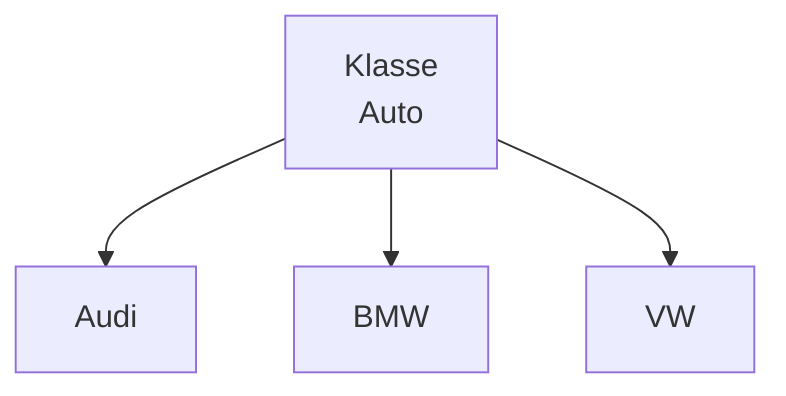
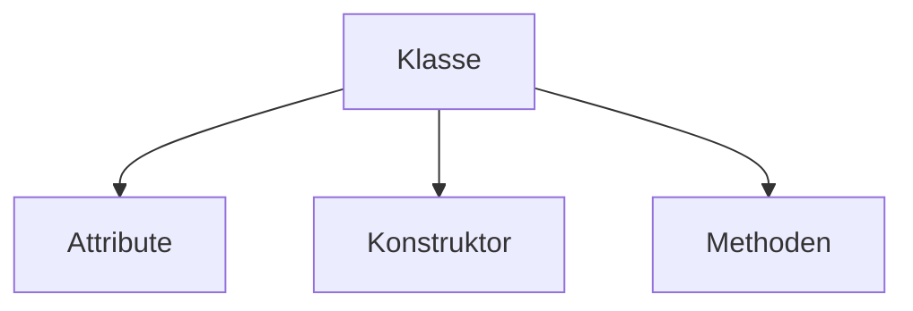
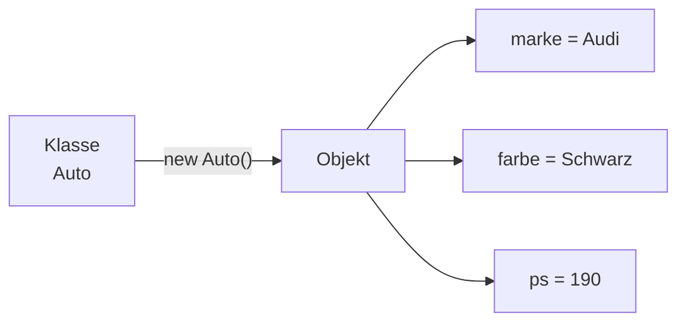

> [!info] Lernziel
> Nach diesem Kapitel weißt du:
> - Was eine Klasse ist.
> - Warum Klassen benötigt werden.
> - Wie man eine Klasse in Java erstellt.
> - Aus welchen Bestandteilen eine Klasse besteht.

---

# Was ist eine Klasse?

Eine **Klasse** ist der **Bauplan** eines Objekts.

Sie beschreibt:

- welche Eigenschaften (Attribute) ein Objekt besitzt.
- welche Fähigkeiten (Methoden) ein Objekt hat.

Eine Klasse selbst ist **noch kein Objekt**.

Sie dient lediglich als Vorlage, aus der später beliebig viele Objekte erzeugt werden können.

---

# Beispiel aus dem Alltag

Stell dir einen Bauplan für ein Haus vor.

Der Bauplan beschreibt:

- Anzahl der Zimmer
- Dachform
- Fenster
- Türen

Der Bauplan selbst ist jedoch **kein Haus**.

Erst wenn nach diesem Bauplan gebaut wird, entsteht ein echtes Haus.

Genauso funktioniert eine Klasse.

Die Klasse ist der Bauplan.

Die Objekte sind die fertigen Häuser.

---

# Beispiel Auto

Klasse:

```
Auto
```

Mögliche Objekte:

- Audi A4
- BMW M3
- VW Golf

Alle wurden nach demselben Bauplan erstellt.

Sie unterscheiden sich nur durch ihre Werte.

---

# Darstellung



---

# Eine Klasse in Java

```java
public class Auto {

}
```

Diese Klasse besitzt aktuell noch nichts.

Sie ist lediglich ein leerer Bauplan.

---

# Bestandteile einer Klasse

Eine Klasse besteht meistens aus:

- Attributen
- Konstruktoren
- Methoden



---

# Beispiel einer einfachen Klasse

```java
public class Auto {

    String marke;
    String farbe;
    int ps;

    void fahren() {
        System.out.println("Das Auto fährt.");
    }

    void bremsen() {
        System.out.println("Das Auto bremst.");
    }
}
```

---

# Erklärung

```java
public class Auto
```

Erstellt eine neue Klasse mit dem Namen **Auto**.

---

```java
String marke;
```

Ein Attribut.

Hier wird die Marke gespeichert.

---

```java
String farbe;
```

Ein weiteres Attribut.

---

```java
int ps;
```

Speichert die Motorleistung.

---

```java
void fahren()
```

Eine Methode.

Sie beschreibt das Verhalten des Autos.

---

```java
void bremsen()
```

Eine zweite Methode.

---

# Beziehung zwischen Klasse und Objekt



---

# Beispiel aus unseren Projekten

## 👻 Pac-Man

Klassen:

- Player
- Board
- Ghost
- Game

Jede dieser Klassen beschreibt einen bestimmten Teil des Spiels.

---

## 🚢 Schiffe versenken

Klassen:

- Ship
- Board
- Player
- Computer
- Game

Ohne Klassen müsste sich sämtlicher Code in einer einzigen Datei befinden.

---

# Warum Klassen?

Klassen sorgen dafür, dass Programme:

- übersichtlich bleiben
- einfacher erweitert werden können
- leichter zu warten sind
- wiederverwendbaren Code besitzen

---

# Häufige Fehler

❌ Eine Klasse mit einem Objekt verwechseln.

Eine Klasse ist **kein Objekt**.

---

❌ Denken, dass eine Klasse automatisch existiert.

Erst mit

```java
new Auto();
```

entsteht ein Objekt.

---

# Merksätze 💡

> Eine Klasse ist ein Bauplan.

> Eine Klasse beschreibt Eigenschaften und Verhalten.

> Aus einer Klasse können beliebig viele Objekte erzeugt werden.

> Eine Klasse selbst speichert noch keine konkreten Werte.

---

# Mini-Quiz

## 1.

Ist `Auto` eine Klasse oder ein Objekt?

<details>
<summary>Antwort</summary>

Klasse.

</details>

---

## 2.

Ist `Player` aus unserem Pac-Man-Projekt eine Klasse?

<details>
<summary>Antwort</summary>

Ja.

</details>

---

## 3.

Welche drei Bestandteile besitzt eine Klasse normalerweise?

<details>
<summary>Antwort</summary>

- Attribute
- Konstruktoren
- Methoden

</details>

---

# Übungsaufgaben

## Aufgabe 1

Überlege dir drei Klassen für eine Bibliothek.

---

## Aufgabe 2

Welche Objekte könnten aus der Klasse **Hund** entstehen?

---

## Aufgabe 3

Welche Klassen besitzt ein Online-Shop?

---

# Zusammenfassung

- Eine Klasse ist der Bauplan eines Objekts.
- Sie beschreibt Eigenschaften und Verhalten.
- Erst durch `new` entsteht später ein Objekt.
- Eine Klasse kann beliebig oft verwendet werden.

➡️ **Nächstes Kapitel:** [[02 Objekte]]