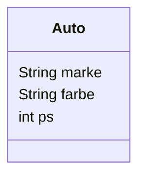
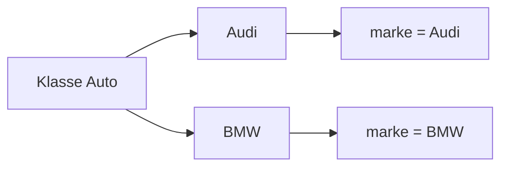

> [!abstract] Lernziel
> Nach diesem Kapitel weißt du:
>
> - Was Attribute sind.
> - Warum Attribute benötigt werden.
> - Wie Attribute in Java definiert werden.
> - Wie man auf Attribute zugreift.

---

# Was sind Attribute?

Attribute sind **Eigenschaften eines Objekts**.

Sie speichern Informationen über den aktuellen Zustand eines Objekts.

Ohne Attribute hätte jedes Objekt dieselben Eigenschaften und könnte keine individuellen Werte besitzen.

---

# Beispiel aus dem Alltag

Ein Auto besitzt Eigenschaften wie:

- Marke
- Farbe
- Baujahr
- PS

Diese Eigenschaften sind die **Attribute** des Autos.

---

# Beispiel

Klasse:

```java
public class Auto {

    String marke;
    String farbe;
    int ps;

}
```

Die Klasse besitzt drei Attribute.

---

# Darstellung



---

# Attribute besitzen Datentypen

Jedes Attribut besitzt einen Datentyp.

| Datentyp | Beispiel |
|----------|-----------|
| int | 190 |
| double | 4.5 |
| boolean | true |
| char | 'A' |
| String | "Audi" |

---

# Zugriff auf Attribute

```java
Auto audi = new Auto();

audi.marke = "Audi";
audi.farbe = "Schwarz";
audi.ps = 190;
```

Jetzt besitzt das Objekt eigene Werte.

---

# Attribute auslesen

```java
System.out.println(audi.marke);
System.out.println(audi.farbe);
System.out.println(audi.ps);
```

Ausgabe

```
Audi
Schwarz
190
```

---

# Mehrere Objekte

```java
Auto audi = new Auto();
Auto bmw = new Auto();

audi.marke = "Audi";
bmw.marke = "BMW";
```

Obwohl beide dieselbe Klasse verwenden, besitzen sie unterschiedliche Werte.

---

# Darstellung



---

# Attribute in unseren Projekten

## 👻 Pac-Man

Klasse:

```java
Player
```

Attribute:

```java
int x;
int y;
int score;
```

Der Spieler besitzt also:

- Position X
- Position Y
- Punktestand

---

## 🚢 Schiffe versenken

Klasse:

```java
Ship
```

Mögliche Attribute:

```java
int length;
boolean destroyed;
```

---

# Warum Attribute?

Attribute sorgen dafür, dass jedes Objekt seinen eigenen Zustand besitzt.

Beispiel:

```java
Player spieler1 = new Player();
Player spieler2 = new Player();
```

Spieler 1

- x = 5
- y = 2

Spieler 2

- x = 10
- y = 7

Obwohl beide dieselbe Klasse besitzen, unterscheiden sich ihre Werte.

---

# Häufige Fehler

> [!warning] Häufiger Fehler
> Attribute gehören zur Klasse.
>
> Die Werte gehören zum jeweiligen Objekt.

---

> [!warning] Häufiger Fehler
> Attribute werden häufig mit lokalen Variablen verwechselt.
>
> Attribute existieren solange das Objekt existiert.

---

# Merksätze 💡

> [!tip] Merke
> Attribute beschreiben den Zustand eines Objekts.

---

> [!tip] Merke
> Jedes Objekt besitzt eigene Attributwerte.

---

> [!tip] Merke
> Attribute besitzen immer einen Datentyp.

---

# Mini-Quiz

## 1.

Was beschreibt ein Attribut?

> [!spoiler]- Lösung anzeigen
>
> Eine Eigenschaft eines Objekts.

---

## 2.

Welchen Datentyp besitzt das Attribut?

```java
int alter;
```

> [!spoiler]- Lösung anzeigen
>
> int

---

## 3.

Können zwei Objekte unterschiedliche Attributwerte besitzen?

> [!spoiler]- Lösung anzeigen
>
> Ja.
>
> Jedes Objekt besitzt seinen eigenen Zustand.

---

# Übungsaufgaben

## Aufgabe 1

Welche Attribute könnte die Klasse **Hund** besitzen?

> [!spoiler]- Lösung anzeigen
>
> Zum Beispiel:
>
> - name
> - alter
> - rasse
> - gewicht

---

## Aufgabe 2

Erstelle eine Klasse **Person** mit drei Attributen.

> [!spoiler]- Lösung anzeigen
>
> ```java
> public class Person {
>
>     String name;
>     int alter;
>     String wohnort;
>
> }
> ```

---

## Aufgabe 3

Erzeuge ein Objekt `person` und gib ihm passende Werte.

> [!spoiler]- Lösung anzeigen
>
> ```java
> Person person = new Person();
>
> person.name = "Max";
> person.alter = 20;
> person.wohnort = "Berlin";
> ```

---

# Zusammenfassung

- Attribute sind Eigenschaften eines Objekts.
- Sie speichern den Zustand eines Objekts.
- Attribute besitzen immer einen Datentyp.
- Jedes Objekt besitzt seine eigenen Attributwerte.

➡️ **Nächstes Kapitel:** [[04 Methoden]]