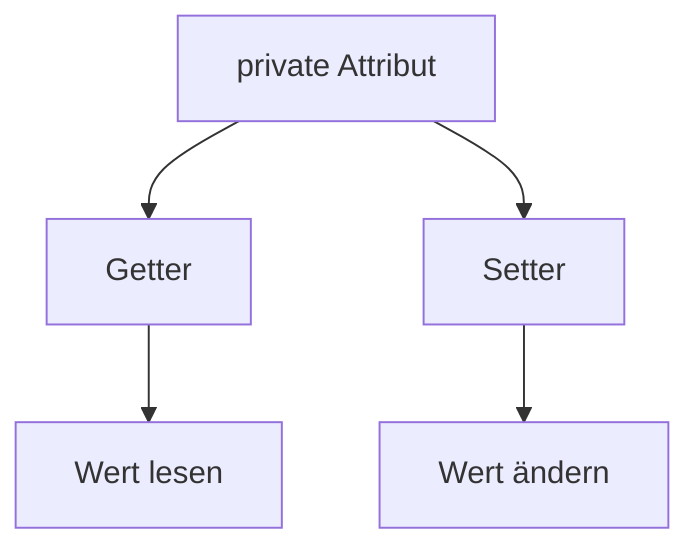

> [!abstract] Lernziel
> Nach diesem Kapitel weißt du:
>
> - Was Getter und Setter sind.
> - Warum sie verwendet werden.
> - Wie Getter und Setter erstellt werden.
> - Warum sie besser sind als öffentliche Attribute.

---

# Warum Getter & Setter?

Im letzten Kapitel hast du gelernt, dass Attribute meistens `private` sind.

Dadurch können andere Klassen **nicht direkt** auf die Attribute zugreifen.

Beispiel:

```java
public class Auto {

    private String marke;

}
```

Folgender Code funktioniert jetzt nicht mehr:

```java
Auto auto = new Auto();

auto.marke = "Audi";
```

Java meldet einen Fehler.

Wie kann man jetzt trotzdem auf das Attribut zugreifen?

Die Lösung sind **Getter** und **Setter**.

---

# Getter

Ein **Getter** liefert den Wert eines Attributs zurück.

Beispiel:

```java
public class Auto {

    private String marke;

    public String getMarke() {
        return marke;
    }

}
```

Jetzt kann der Wert gelesen werden.

```java
Auto auto = new Auto();

System.out.println(auto.getMarke());
```

---

# Setter

Ein **Setter** verändert den Wert eines Attributs.

```java
public class Auto {

    private String marke;

    public void setMarke(String marke) {
        this.marke = marke;
    }

}
```

Jetzt kann das Attribut geändert werden.

```java
Auto auto = new Auto();

auto.setMarke("Audi");
```

---

# Getter und Setter zusammen

```java
public class Auto {

    private String marke;

    public String getMarke() {
        return marke;
    }

    public void setMarke(String marke) {
        this.marke = marke;
    }

}
```

---

# Darstellung


---

# Warum Getter & Setter?

Mit einem Setter kann überprüft werden, ob ein Wert gültig ist.

Beispiel:

```java
public void setPs(int ps) {

    if (ps > 0) {
        this.ps = ps;
    }

}
```

Jetzt kann niemand negative PS speichern.

```java
auto.setPs(-200);
```

Der Wert wird nicht übernommen.

---

# Beispiel aus unseren Projekten

## 👻 Pac-Man

```java
private int score;

public int getScore() {
    return score;
}

public void setScore(int score) {
    this.score = score;
}
```

---

## 🚢 Schiffe versenken

```java
private boolean destroyed;

public boolean isDestroyed() {
    return destroyed;
}

public void setDestroyed(boolean destroyed) {
    this.destroyed = destroyed;
}
```

> [!note]
> Bei `boolean`-Attributen verwendet man häufig `is...()` statt `get...()`.

---

# Darstellung



---

# Vorteile

- Schutz der Daten
- Kontrolle über Änderungen
- Fehler vermeiden
- Einfachere Wartung
- Bessere Erweiterbarkeit

---

# Häufige Fehler

> [!warning] Häufiger Fehler
>
> Im Setter wird häufig vergessen:
>
> ```java
> this.marke = marke;
> ```

---

> [!warning] Häufiger Fehler
>
> Getter verändern keine Werte.
>
> Sie lesen lediglich den aktuellen Wert.

---

# Merksätze 💡

> [!tip] Merke
>
> Getter lesen Werte.

---

> [!tip] Merke
>
> Setter verändern Werte.

---

> [!tip] Merke
>
> Getter und Setter ermöglichen einen kontrollierten Zugriff auf private Attribute.

---

# Mini-Quiz

## 1.

Wofür wird ein Getter verwendet?

> [!spoiler]- Lösung anzeigen
>
> Um den Wert eines Attributs zu lesen.

---

## 2.

Wofür wird ein Setter verwendet?

> [!spoiler]- Lösung anzeigen
>
> Um den Wert eines Attributs zu ändern.

---

## 3.

Warum verwendet man Getter und Setter?

> [!spoiler]- Lösung anzeigen
>
> Weil private Attribute nicht direkt von außen erreichbar sind und der Zugriff kontrolliert erfolgen soll.

---

# Übungsaufgaben

## Aufgabe 1

Schreibe einen Getter für das Attribut `name`.

> [!spoiler]- Lösung anzeigen
>
> ```java
> public String getName() {
>     return name;
> }
> ```

---

## Aufgabe 2

Schreibe einen Setter für das Attribut `alter`.

> [!spoiler]- Lösung anzeigen
>
> ```java
> public void setAlter(int alter) {
>     this.alter = alter;
> }
> ```

---

## Aufgabe 3

Warum ist folgender Setter sinnvoll?

```java
public void setAlter(int alter) {

    if (alter >= 0) {
        this.alter = alter;
    }

}
```

> [!spoiler]- Lösung anzeigen
>
> Dadurch können keine negativen Alterswerte gespeichert werden.

---

# Zusammenfassung

- Getter lesen Werte.
- Setter ändern Werte.
- Getter und Setter arbeiten mit privaten Attributen.
- Setter können Werte vor dem Speichern überprüfen.
- Getter und Setter sind ein wichtiger Bestandteil der Kapselung.

➡️ **Nächstes Kapitel:** [[09 Vererbung]]