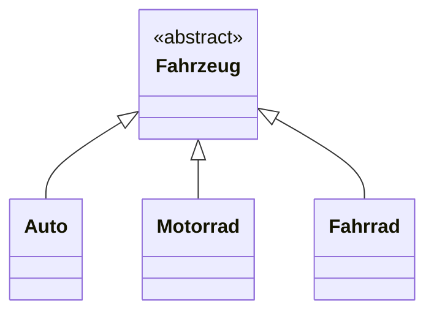
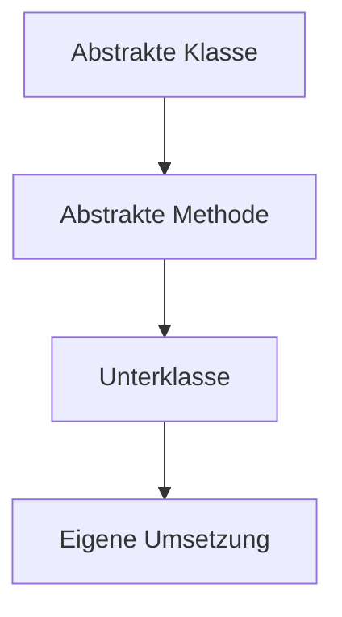

> [!abstract] Lernziel
> Nach diesem Kapitel weißt du:
>
> - Was eine abstrakte Klasse ist.
> - Warum abstrakte Klassen verwendet werden.
> - Wie man abstrakte Klassen erstellt.
> - Was abstrakte Methoden sind.

---

# Was ist eine abstrakte Klasse?

Eine **abstrakte Klasse** ist eine Klasse, von der **keine Objekte erstellt werden können**.

Sie dient als gemeinsamer Bauplan für mehrere Unterklassen.

Eine abstrakte Klasse kann:

- Attribute besitzen
- normale Methoden besitzen
- abstrakte Methoden besitzen

---

# Warum braucht man abstrakte Klassen?

Manchmal gibt es eine Oberklasse, die niemals direkt verwendet werden soll.

Beispiel:

```
Fahrzeug
```

Niemand fährt ein "allgemeines Fahrzeug".

Man fährt:

- Auto
- Motorrad
- Fahrrad

Deshalb macht man `Fahrzeug` abstrakt.

---

# Darstellung



---

# Eine abstrakte Klasse erstellen

```java
public abstract class Fahrzeug {

}
```

Das Schlüsselwort

```java
abstract
```

macht die Klasse abstrakt.

---

# Objekt erzeugen?

```java
Fahrzeug fahrzeug = new Fahrzeug();
```

❌ Das ist **nicht erlaubt**.

Java meldet einen Fehler.

Nur Unterklassen können Objekte erzeugen.

---

# Unterklasse

```java
public class Auto extends Fahrzeug {

}
```

Jetzt funktioniert:

```java
Auto auto = new Auto();
```

---

# Normale Methoden

Abstrakte Klassen dürfen ganz normale Methoden besitzen.

```java
public abstract class Fahrzeug {

    public void tanken() {

        System.out.println("Das Fahrzeug wird getankt.");

    }

}
```

Diese Methode wird von allen Unterklassen übernommen.

---

# Abstrakte Methoden

Eine abstrakte Methode besitzt **keinen Programmcode**.

```java
public abstract void fahren();
```

Hier steht nur die Methodensignatur.

Die Unterklasse muss selbst entscheiden, wie sie aussieht.

---

# Vollständiges Beispiel

```java
public abstract class Fahrzeug {

    public abstract void fahren();

}
```

Unterklasse:

```java
public class Auto extends Fahrzeug {

    @Override
    public void fahren() {

        System.out.println("Das Auto fährt.");

    }

}
```

---

# Darstellung



---

# Warum abstrakte Methoden?

Alle Fahrzeuge fahren.

Aber:

Ein Auto fährt anders als ein Fahrrad.

Deshalb schreibt jede Unterklasse ihre eigene Methode.

---

# Beispiel aus unseren Projekten

## 👻 Pac-Man

```
Spielfigur

│

├── Player

└── Ghost
```

Die abstrakte Klasse könnte enthalten:

```java
public abstract void move();
```

Player und Ghost bewegen sich unterschiedlich.

---

## 🚢 Schiffe versenken

```
Spieler

│

├── Mensch

└── Computer
```

Die abstrakte Methode könnte heißen:

```java
spielen();
```

Der Mensch wartet auf Eingaben.

Der Computer berechnet seinen Zug.

---

# Vorteile

- Gemeinsamer Code wird nur einmal geschrieben.
- Unterklassen müssen wichtige Methoden implementieren.
- Einheitlicher Aufbau.
- Weniger doppelter Code.

---

# Häufige Fehler

> [!warning] Häufiger Fehler
>
> Von einer abstrakten Klasse können keine Objekte erstellt werden.

---

> [!warning] Häufiger Fehler
>
> Eine Unterklasse muss alle abstrakten Methoden implementieren, sofern sie selbst nicht abstrakt ist.

---

# Merksätze 💡

> [!tip] Merke
>
> Eine abstrakte Klasse ist ein unvollständiger Bauplan.

---

> [!tip] Merke
>
> Abstrakte Klassen können nicht instanziiert werden.

---

> [!tip] Merke
>
> Abstrakte Methoden besitzen keinen Programmcode.

---

# Mini-Quiz

## 1.

Kann man von einer abstrakten Klasse ein Objekt erzeugen?

> [!spoiler]- Lösung anzeigen
>
> Nein.

---

## 2.

Welches Schlüsselwort macht eine Klasse abstrakt?

> [!spoiler]- Lösung anzeigen
>
> `abstract`

---

## 3.

Muss eine Unterklasse abstrakte Methoden implementieren?

> [!spoiler]- Lösung anzeigen
>
> Ja, sofern sie selbst keine abstrakte Klasse ist.

---

# Übungsaufgaben

## Aufgabe 1

Warum sollte `Fahrzeug` abstrakt sein?

> [!spoiler]- Lösung anzeigen
>
> Weil niemand ein allgemeines Fahrzeug erstellt.
>
> Stattdessen werden konkrete Fahrzeuge wie Auto oder Motorrad erzeugt.

---

## Aufgabe 2

Erstelle eine abstrakte Klasse `Tier` mit der abstrakten Methode `lautGeben()`.

> [!spoiler]- Lösung anzeigen
>
> ```java
> public abstract class Tier {
>
>     public abstract void lautGeben();
>
> }
> ```

---

## Aufgabe 3

Warum sind abstrakte Methoden sinnvoll?

> [!spoiler]- Lösung anzeigen
>
> Weil jede Unterklasse ihre eigene Implementierung bereitstellen muss.

---

# Zusammenfassung

- Abstrakte Klassen dienen als gemeinsame Grundlage für andere Klassen.
- Von abstrakten Klassen können keine Objekte erzeugt werden.
- Abstrakte Klassen können normale und abstrakte Methoden enthalten.
- Unterklassen müssen abstrakte Methoden implementieren.
- Abstrakte Klassen helfen dabei, gemeinsamen Code wiederzuverwenden.

➡️ **Nächstes Kapitel:** [[12 Interfaces]]