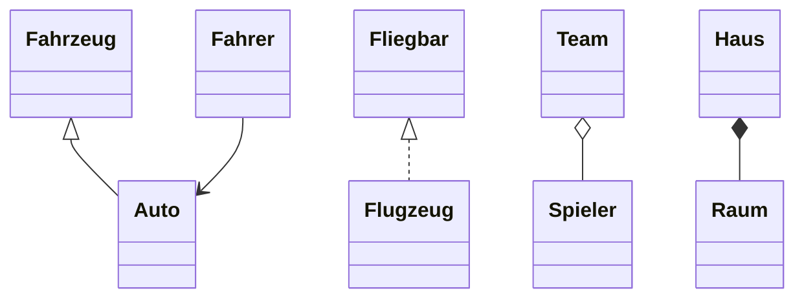
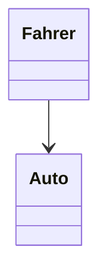
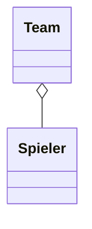
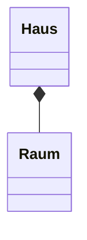
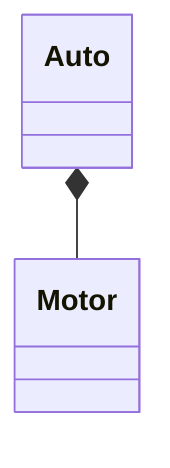
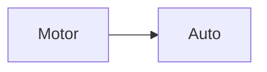
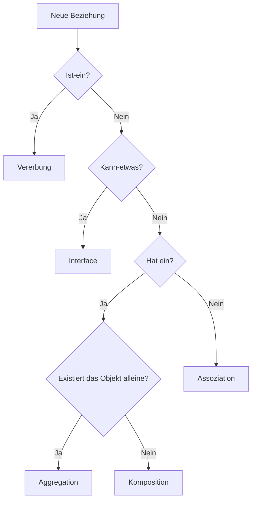

> [!abstract] Lernziel
> Nach diesem Kapitel weißt du:
>
> - Welche Beziehungen zwischen Klassen existieren.
> - Was Assoziation, Aggregation und Komposition bedeuten.
> - Was enge und lose Kopplung ist.
> - Wann welche Beziehung sinnvoll ist.

---

# Warum Beziehungen?

In einem objektorientierten Programm arbeitet selten nur eine Klasse allein.

Mehrere Klassen kommunizieren miteinander und übernehmen unterschiedliche Aufgaben.

Beispiel:

```text
Spiel
│
├── Player
├── Ghost
├── Board
└── Score
```

Zwischen diesen Klassen entstehen verschiedene Beziehungen.

---

# Überblick

| Beziehung | Bedeutung | Merksatz |
|------------|-----------|----------|
| Assoziation | Klassen kennen oder verwenden sich | benutzt |
| Aggregation | Eine Klasse besitzt andere Objekte | hat ein |
| Komposition | Eine Klasse besteht aus anderen Objekten | besteht aus |
| Vererbung | Eine Klasse erweitert eine andere | ist ein |
| Interface | Eine Klasse besitzt eine Fähigkeit | kann etwas |

---

# Gesamtübersicht



---

# 1️⃣ Assoziation

Eine Assoziation beschreibt eine allgemeine Beziehung zwischen zwei Klassen.

Eine Klasse kennt oder verwendet eine andere Klasse.

## Beispiel

Ein Fahrer fährt ein Auto.



```java
public class Fahrer {

    private Auto auto;

}
```

> [!tip] Merke
>
> Assoziation bedeutet:
>
> Eine Klasse verwendet oder kennt eine andere Klasse.

---

# 2️⃣ Aggregation

Aggregation beschreibt eine lockere **Hat-ein-Beziehung**.

Die enthaltenen Objekte können auch ohne das andere Objekt existieren.

## Beispiel

Ein Team besitzt Spieler.

Ein Spieler kann aber auch ohne Team existieren.



```java
public class Team {

    private List<Spieler> spieler;

}
```

> [!tip] Merke
>
> Aggregation = Hat-ein-Beziehung.

---

# 3️⃣ Komposition

Komposition beschreibt eine starke Beziehung.

Das enthaltene Objekt existiert ohne das Hauptobjekt nicht.

## Beispiel

Ein Haus besteht aus Räumen.

Wird das Haus gelöscht, verschwinden auch die Räume.



```java
public class Haus {

    private Raum wohnzimmer = new Raum();

}
```

> [!tip] Merke
>
> Komposition = Besteht-aus-Beziehung.

---

# Enge und lose Kopplung

## Was bedeutet Kopplung?

Kopplung beschreibt, wie stark Klassen voneinander abhängig sind.

Je geringer die Abhängigkeit, desto flexibler ist das Programm.

---

## Enge Kopplung

```java
public class Auto {

    private Motor motor = new Motor();

}
```

Das Auto erstellt seinen Motor selbst.

Dadurch ist es direkt von der Klasse `Motor` abhängig.



### Nachteile

- schwer austauschbar
- schlechter testbar
- Änderungen wirken sich häufig auf mehrere Klassen aus

---

## Lose Kopplung

```java
public class Auto {

    private Motor motor;

    public Auto(Motor motor) {
        this.motor = motor;
    }

}
```

Der Motor wird von außen übergeben.



### Vorteile

- flexibel
- leicht austauschbar
- einfacher testbar
- besser wartbar

---

# Interfaces fördern lose Kopplung

```java
public interface Motor {

    void starten();

}
```

```java
public class ElektroMotor implements Motor {

    @Override
    public void starten() {

        System.out.println("Elektromotor startet.");

    }

}
```

```java
public class BenzinMotor implements Motor {

    @Override
    public void starten() {

        System.out.println("Benzinmotor startet.");

    }

}
```

```java
public class Auto {

    private Motor motor;

    public Auto(Motor motor) {
        this.motor = motor;
    }

}
```

Jetzt kann das Auto mit jedem Motor arbeiten, der das Interface `Motor` implementiert.

---

# Beispiele aus unseren Projekten

## 👻 Pac-Man

```text
Game
│
├── Player
├── Ghost
├── Board
└── Score
```

- Game besitzt ein Board → Komposition
- Player verwendet das Board → Assoziation
- Ghost könnte von Spielfigur erben → Vererbung
- Player und Ghost könnten Bewegbar implementieren → Interface

---

## 🚢 Schiffe versenken

```text
Game
│
├── Player
├── Computer
├── Board
└── Ship
```

- Computer ist ein Player → Vererbung
- Board besitzt Ships → Komposition
- Player verwendet Board → Assoziation

---

# Wann verwendet man was?



---

# Vergleich

| Beziehung | Beispiel |
|------------|----------|
| Vererbung | Auto ist ein Fahrzeug |
| Interface | Vogel kann fliegen |
| Assoziation | Fahrer benutzt Auto |
| Aggregation | Team hat Spieler |
| Komposition | Haus besteht aus Räumen |

---

# Häufige Fehler

> [!warning] Häufiger Fehler
>
> Nicht jede Beziehung ist Vererbung.

---

> [!warning] Häufiger Fehler
>
> Aggregation und Komposition werden häufig verwechselt.

---

> [!warning] Häufiger Fehler
>
> Enge Kopplung erschwert Wartung und Tests.

---

# Merksätze 💡

> [!tip] Merke
>
> Vererbung = **Ist-ein**

---

> [!tip] Merke
>
> Interface = **Kann-etwas**

---

> [!tip] Merke
>
> Aggregation = **Hat-ein**

---

> [!tip] Merke
>
> Komposition = **Besteht-aus**

---

> [!tip] Merke
>
> Gute Programme besitzen möglichst **lose Kopplung**.

---

# Mini-Quiz

## 1.

Welche Beziehung beschreibt:

"Ein Auto ist ein Fahrzeug."

> [!spoiler]- Lösung anzeigen
>
> Vererbung.

---

## 2.

Welche Beziehung beschreibt:

"Ein Team hat Spieler."

> [!spoiler]- Lösung anzeigen
>
> Aggregation.

---

## 3.

Welche Beziehung beschreibt:

"Ein Haus besteht aus Räumen."

> [!spoiler]- Lösung anzeigen
>
> Komposition.

---

## 4.

Warum ist lose Kopplung besser als enge Kopplung?

> [!spoiler]- Lösung anzeigen
>
> Klassen sind flexibler, einfacher austauschbar, besser testbar und leichter wartbar.

---

# Übungsaufgaben

## Aufgabe 1

Ordne die Beziehungen zu:

- Auto → Fahrzeug
- Vogel → Fliegbar
- Fahrer → Auto
- Team → Spieler
- Haus → Raum

> [!spoiler]- Lösung anzeigen
>
> - Auto → Fahrzeug → Vererbung
> - Vogel → Fliegbar → Interface
> - Fahrer → Auto → Assoziation
> - Team → Spieler → Aggregation
> - Haus → Raum → Komposition

---

## Aufgabe 2

Warum sollte man möglichst lose gekoppelte Klassen entwickeln?

> [!spoiler]- Lösung anzeigen
>
> Weil Änderungen einfacher möglich sind und Klassen besser wiederverwendet sowie getestet werden können.

---

# Zusammenfassung

- Klassen arbeiten über Beziehungen zusammen.
- Vererbung beschreibt eine **Ist-ein-Beziehung**.
- Interfaces beschreiben **Fähigkeiten**.
- Aggregation beschreibt eine lockere **Hat-ein-Beziehung**.
- Komposition beschreibt eine starke **Besteht-aus-Beziehung**.
- Gute objektorientierte Programme besitzen möglichst **lose Kopplung**.

> [!success] Geschafft! 🎉
>
> Damit hast du die wichtigsten Grundlagen der
> objektorientiertenProgrammierung abgeschlossen.

➡️ **Nächstes Kapitel:** [[14 Cheatsheet]]