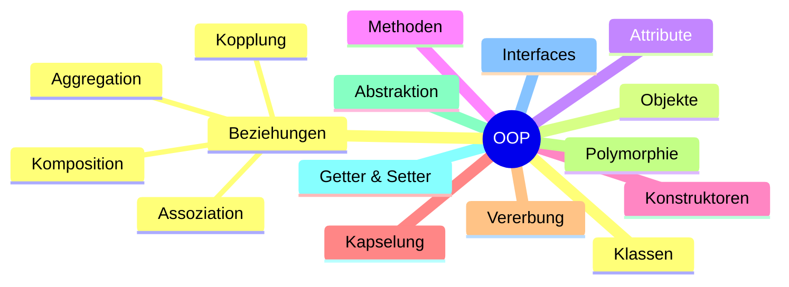

> [!abstract] Zweck
> Dieses Cheatsheet fasst die wichtigsten Grundlagen der objektorientierten Programmierung kompakt zusammen.

---

# Die vier Säulen der OOP

| Säule | Beschreibung |
|--------|--------------|
| Kapselung | Daten schützen |
| Vererbung | Eigenschaften übernehmen |
| Polymorphie | Gleiches Interface, unterschiedliches Verhalten |
| Abstraktion | Wichtige Eigenschaften hervorheben und Unwichtiges ausblenden |

---

# Grundbegriffe

| Begriff | Merksatz |
|----------|----------|
| Klasse | Bauplan |
| Objekt | Instanz einer Klasse |
| Attribut | Eigenschaft |
| Methode | Verhalten |
| Konstruktor | Wird beim Erzeugen eines Objekts aufgerufen |
| `this` | Aktuelles Objekt |
| Getter | Liest Werte |
| Setter | Ändert Werte |

---

# Sichtbarkeiten

| Schlüsselwort | Sichtbarkeit |
|---------------|--------------|
| `private` | Nur innerhalb der Klasse |
| `protected` | Klasse + Unterklassen |
| `public` | Überall |

---

# Vererbung

```java
public class Auto extends Fahrzeug {

}
```

✅ Ist-ein-Beziehung

Beispiel:

```
Auto ist ein Fahrzeug.
```

---

# Interface

```java
public class Vogel implements Fliegbar {

}
```

✅ Kann-etwas-Beziehung

Beispiel:

```
Vogel kann fliegen.
```

---

# Beziehungen zwischen Klassen

| Beziehung | Merksatz |
|------------|----------|
| Assoziation | benutzt |
| Aggregation | hat ein |
| Komposition | besteht aus |
| Vererbung | ist ein |
| Interface | kann etwas |

---

# Kopplung

| Enge Kopplung | Lose Kopplung |
|---------------|---------------|
| Stark abhängig | Geringe Abhängigkeit |
| Schwer austauschbar | Leicht austauschbar |
| Schlechter testbar | Gut testbar |

💡 Gute Programme besitzen möglichst **lose Kopplung**.

---

# OOP auf einen Blick



---

# Häufige Schlüsselwörter

| Schlüsselwort | Bedeutung |
|---------------|-----------|
| `class` | Klasse erstellen |
| `new` | Objekt erzeugen |
| `this` | Aktuelles Objekt |
| `extends` | Vererbung |
| `implements` | Interface umsetzen |
| `private` | Nur innerhalb der Klasse |
| `protected` | Für Unterklassen sichtbar |
| `public` | Öffentlich |
| `abstract` | Abstrakte Klasse/Methode |
| `interface` | Interface definieren |
| `@Override` | Methode überschreiben |

---

# Merkhilfen

> [!tip] Klasse = Bauplan

> [!tip] Objekt = Instanz

> [!tip] Vererbung = Ist-ein

> [!tip] Interface = Kann-etwas

> [!tip] Aggregation = Hat-ein

> [!tip] Komposition = Besteht-aus

> [!tip] Gute OOP = Lose Kopplung

---

> [!success] 🎉 Geschafft!
>
> Du kennst jetzt die wichtigsten Grundlagen der objektorientierten Programmierung und bist bereit für fortgeschrittene Java-Themen wie Collections, Generics, Exceptions und Design Patterns.