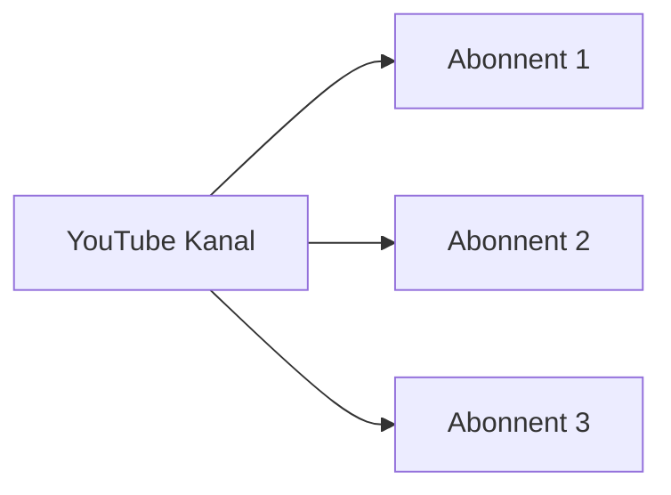
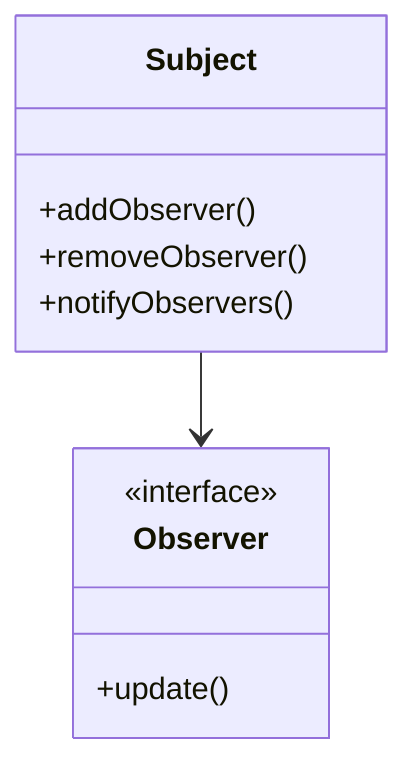
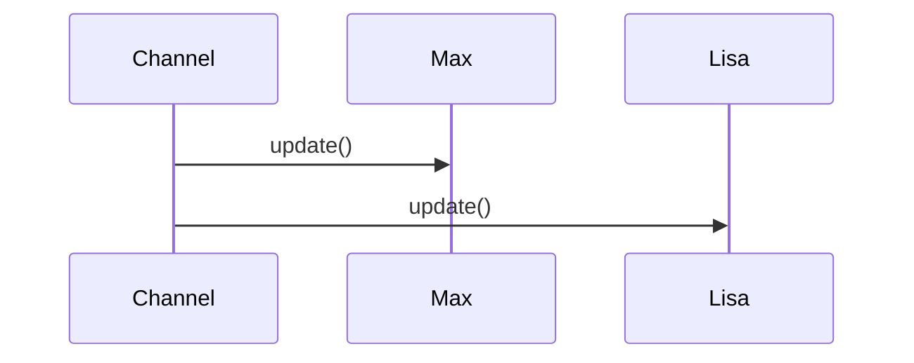

> [!abstract] Lernziel
> Nach diesem Kapitel weißt du:
>
> - Was das Observer Pattern ist.
> - Welches Problem es löst.
> - Wie es aufgebaut ist.
> - Wie man es in Java implementiert.
> - Wo es in der Praxis verwendet wird.

---

# Was ist das Observer Pattern?

Das Observer Pattern ist ein **Verhaltensmuster (Behavioral Pattern)**.

Es sorgt dafür, dass **mehrere Objekte automatisch informiert werden**, wenn sich der Zustand eines anderen Objekts ändert.

---

# Das Problem

Stell dir einen YouTube-Kanal vor.

Es gibt:

- einen Kanal
- viele Abonnenten

Wenn ein neues Video erscheint, sollen automatisch alle Abonnenten benachrichtigt werden.

Ohne Observer müsste jeder Benutzer ständig selbst nachsehen.

Das wäre ineffizient.

---

# Die Lösung

Der Kanal merkt sich alle Abonnenten.

Sobald ein neues Video erscheint, informiert er automatisch alle.



---

# Die Rollen

Beim Observer Pattern gibt es zwei Hauptrollen.

## Subject (Beobachtetes Objekt)

Das Objekt, das beobachtet wird.

Es

- speichert alle Observer
- informiert sie bei Änderungen

---

## Observer (Beobachter)

Der Observer wartet auf Änderungen.

Sobald das Subject etwas meldet,

führt er seine eigene Reaktion aus.

---

# Aufbau



---

# Java-Implementierung

## Observer

```java
public interface Observer {

    void update(String message);

}
```

---

## Konkreter Observer

```java
public class User implements Observer {

    private String name;

    public User(String name) {
        this.name = name;
    }

    @Override
    public void update(String message) {

        System.out.println(name + ": " + message);

    }

}
```

---

## Subject

```java
import java.util.ArrayList;
import java.util.List;

public class Channel {

    private List<Observer> observers = new ArrayList<>();

    public void subscribe(Observer observer) {

        observers.add(observer);

    }

    public void unsubscribe(Observer observer) {

        observers.remove(observer);

    }

    public void uploadVideo(String title) {

        System.out.println("Neues Video: " + title);

        notifyObservers(title);

    }

    private void notifyObservers(String title) {

        for (Observer observer : observers) {

            observer.update(title);

        }

    }

}
```

---

## Main

```java
public class Main {

    public static void main(String[] args) {

        Channel channel = new Channel();

        User max = new User("Max");
        User lisa = new User("Lisa");

        channel.subscribe(max);
        channel.subscribe(lisa);

        channel.uploadVideo("Observer Pattern erklärt");

    }

}
```

---

# Ausgabe

```
Neues Video: Observer Pattern erklärt

Max: Observer Pattern erklärt

Lisa: Observer Pattern erklärt
```

---

# Ablauf



---

# Observer Pattern in unseren Projekten

## 👻 Pac-Man

Player sammelt einen Punkt.

↓

Score soll automatisch aktualisiert werden.

↓

HUD soll automatisch aktualisiert werden.

↓

Sound soll abgespielt werden.

Der Player muss diese Klassen nicht kennen.

Er meldet lediglich:

> Punkt gesammelt!

Alle Observer reagieren darauf.

---

## 🦊 FoxTrainer

Der Benutzer beantwortet eine Frage.

↓

Punktestand

↓

Fortschrittsbalken

↓

Statistik

↓

Erfolgsanimation

Alle werden automatisch informiert.

---

# Einsatzgebiete

Das Observer Pattern wird häufig verwendet bei:

- GUI-Programmen
- Spielen
- Chat-Anwendungen
- Benachrichtigungssystemen
- Social Media
- Börsenkursen
- Wetter-Apps
- JavaFX
- Swing

---

# Vorteile

- Lose Kopplung
- Erweiterbar
- Observer können jederzeit hinzugefügt oder entfernt werden.
- Subject kennt die konkrete Implementierung der Observer nicht.

---

# Nachteile

- Viele Observer können das System langsamer machen.
- Der Programmablauf kann schwerer nachzuvollziehen sein.

---

# Häufige Fehler

> [!warning] Häufiger Fehler
>
> Das Subject sollte nicht wissen, welche konkreten Observer existieren.

---

> [!warning] Häufiger Fehler
>
> Observer sollten über ein Interface angesprochen werden.

---

# Merksätze 💡

> [!tip] Merke
>
> Einer informiert viele.

---

> [!tip] Merke
>
> Das Subject kennt nur das Interface der Observer.

---

> [!tip] Merke
>
> Observer sorgen für lose Kopplung.

---

# Mini-Quiz

## 1.

Welche beiden Rollen gibt es?

> [!spoiler]- Lösung anzeigen
>
> Subject und Observer.

---

## 2.

Warum verwendet man ein Interface?

> [!spoiler]- Lösung anzeigen
>
> Damit das Subject unabhängig von konkreten Klassen bleibt und nur die Methode `update()` kennen muss.

---

## 3.

Warum gehört das Observer Pattern zu den Verhaltensmustern?

> [!spoiler]- Lösung anzeigen
>
> Weil es beschreibt, wie Objekte miteinander kommunizieren.

---

# Übungsaufgaben

## Aufgabe 1

Nenne drei Programme, in denen Observer sinnvoll wäre.

> [!spoiler]- Lösung anzeigen
>
> Zum Beispiel:
>
> - Messenger
> - Wetter-App
> - Börsen-App
> - Spiel
> - Quiz-App

---

## Aufgabe 2

Wer informiert beim Observer Pattern die Beobachter?

> [!spoiler]- Lösung anzeigen
>
> Das Subject.

---

# Zusammenfassung

- Das Observer Pattern ist ein Verhaltensmuster.
- Ein Subject informiert mehrere Observer automatisch über Änderungen.
- Observer werden über ein Interface angesprochen.
- Das Pattern sorgt für lose Kopplung.
- Es wird häufig in GUIs, Spielen und Benachrichtigungssystemen verwendet.

➡️ **Nächstes Kapitel:** [[02 Singleton Pattern]]