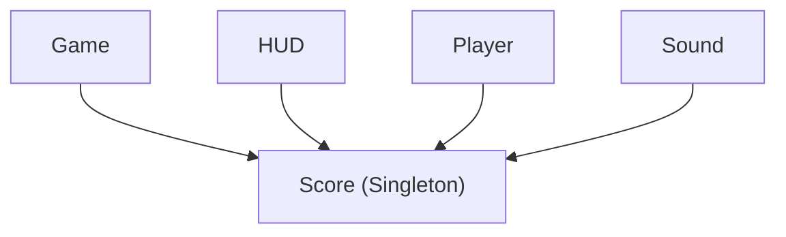
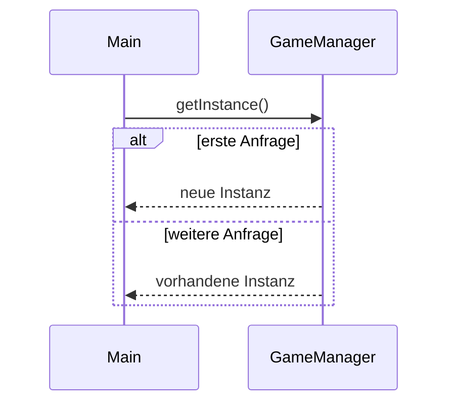

> [!abstract] Lernziel
> Nach diesem Kapitel weißt du:
>
> - Was das Singleton Pattern ist.
> - Welches Problem es löst.
> - Wie man ein Singleton in Java erstellt.
> - Wann man es einsetzen sollte.
> - Welche Vor- und Nachteile es besitzt.

---

# Was ist das Singleton Pattern?

Das Singleton Pattern ist ein **Erzeugungsmuster (Creational Pattern)**.

Es sorgt dafür, dass **von einer Klasse genau eine Instanz existiert**.

Alle Programmteile greifen auf dieselbe Instanz zu.

---

# Das Problem

Stell dir ein Spiel vor.

Es gibt einen Punktestand.

Wenn jeder Programmteil seinen eigenen Punktestand erzeugt,

```java
Score score = new Score();
```

existieren plötzlich mehrere unterschiedliche Punktestände.

Das wäre falsch.

Es soll nur **einen** geben.

---

# Die Lösung

Es wird genau **eine Instanz** erstellt.

Alle anderen Klassen benutzen dieselbe Instanz.



---

# Eigenschaften eines Singleton

Ein Singleton besitzt:

- privaten Konstruktor
- private statische Instanz
- öffentliche Zugriffsmethode

---

# Java-Implementierung

```java
public class GameManager {

    private static GameManager instance;

    private GameManager() {

    }

    public static GameManager getInstance() {

        if (instance == null) {
            instance = new GameManager();
        }

        return instance;

    }

}
```

---

# Erklärung

## 1.

```java
private static GameManager instance;
```

Hier wird die einzige Instanz gespeichert.

---

## 2.

```java
private GameManager() {

}
```

Niemand kann von außen schreiben:

```java
new GameManager();
```

Der Konstruktor ist privat.

---

## 3.

```java
getInstance()
```

Diese Methode liefert immer dieselbe Instanz zurück.

Beim ersten Aufruf wird sie erzeugt.

Danach wird immer dieselbe Instanz verwendet.

---

# Verwendung

```java
GameManager game = GameManager.getInstance();

GameManager game2 = GameManager.getInstance();
```

Jetzt gilt:

```java
game == game2
```

Ergebnis

```
true
```

Beide Variablen zeigen auf dasselbe Objekt.

---

# Ablauf



---

# Singleton in unseren Projekten

## 👻 Pac-Man

Ein möglicher Singleton:

```text
GameManager
```

Er verwaltet:

- aktuelles Level
- Punktestand
- Anzahl Leben
- Spielstatus

Alle Klassen greifen auf denselben GameManager zu.

---

## 🦊 FoxTrainer

Ein Singleton könnte sein:

```text
QuizManager
```

Er verwaltet:

- aktuelle Frage
- Punktestand
- Fortschritt
- Einstellungen

---

## 🚢 Schiffe versenken

Ein Singleton könnte sein:

```text
GameManager
```

Er verwaltet:

- aktuelles Spiel
- Spieler
- Spielstatus

---

# Einsatzgebiete

Singleton eignet sich für:

- Spielverwaltung
- Konfigurationen
- Logger
- Datenbankverbindungen (je nach Architektur)
- Einstellungen
- Cache

---

# Vorteile

- Genau eine Instanz
- Einfacher globaler Zugriff
- Spart Speicher
- Zentralisierte Verwaltung

---

# Nachteile

- Globaler Zustand
- Erschwert Unit-Tests
- Kann versteckte Abhängigkeiten erzeugen
- Wird manchmal zu häufig eingesetzt

---

# Häufige Fehler

> [!warning] Häufiger Fehler
>
> Den Konstruktor öffentlich lassen.
>
> Dann kann jeder weitere Objekte erzeugen.

---

> [!warning] Häufiger Fehler
>
> Überall Singleton verwenden.
>
> Nicht jede Klasse sollte ein Singleton sein.

---

# Merksätze 💡

> [!tip] Merke
>
> Singleton bedeutet:
>
> **Genau eine Instanz.**

---

> [!tip] Merke
>
> Der Konstruktor ist immer `private`.

---

> [!tip] Merke
>
> Der Zugriff erfolgt über `getInstance()`.

---

# Mini-Quiz

## 1.

Wie viele Instanzen besitzt ein Singleton?

> [!spoiler]- Lösung anzeigen
>
> Genau eine.

---

## 2.

Warum ist der Konstruktor `private`?

> [!spoiler]- Lösung anzeigen
>
> Damit niemand mit `new` weitere Objekte erzeugen kann.

---

## 3.

Wie greift man auf ein Singleton zu?

> [!spoiler]- Lösung anzeigen
>
> Über die Methode `getInstance()`.

---

# Übungsaufgaben

## Aufgabe 1

Warum eignet sich ein GameManager gut als Singleton?

> [!spoiler]- Lösung anzeigen
>
> Weil es nur einen zentralen Spielzustand geben soll.

---

## Aufgabe 2

Warum wäre eine Klasse `Spieler` kein gutes Singleton?

> [!spoiler]- Lösung anzeigen
>
> Weil es mehrere Spieler geben kann.

---

## Aufgabe 3

Nenne drei Klassen, die sich gut als Singleton eignen.

> [!spoiler]- Lösung anzeigen
>
> Zum Beispiel:
>
> - GameManager
> - Logger
> - Konfiguration
> - Einstellungen

---

# Zusammenfassung

- Das Singleton Pattern ist ein Erzeugungsmuster.
- Es stellt sicher, dass genau eine Instanz einer Klasse existiert.
- Der Konstruktor ist `private`.
- Der Zugriff erfolgt über `getInstance()`.
- Singleton eignet sich für zentrale Verwaltungsobjekte wie GameManager oder Konfigurationen.

➡️ **Nächstes Kapitel:** [[03 Factory Pattern]]