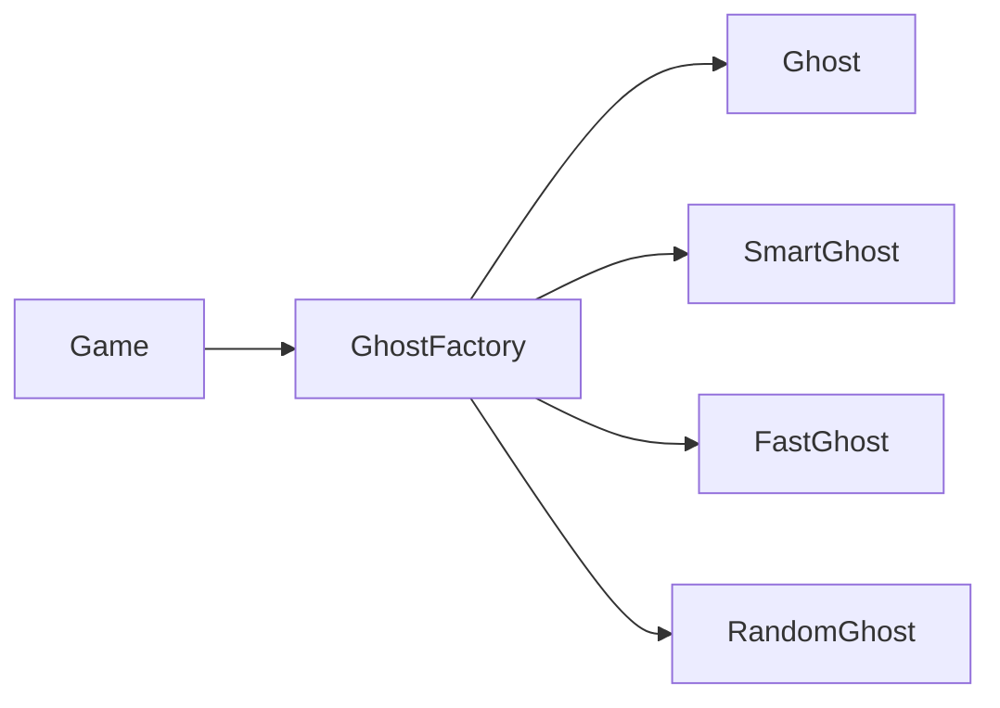
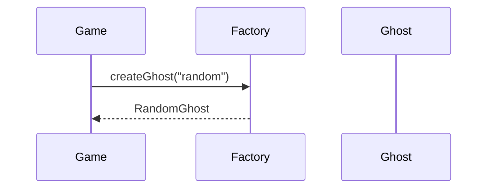

> [!abstract] Lernziel
> Nach diesem Kapitel weißt du:
>
> - Was das Factory Pattern ist.
> - Welches Problem es löst.
> - Wie eine Factory funktioniert.
> - Wann man das Factory Pattern einsetzen sollte.
> - Welche Vor- und Nachteile es besitzt.

---

# Was ist das Factory Pattern?

Das Factory Pattern ist ein **Erzeugungsmuster (Creational Pattern)**.

Es übernimmt die Aufgabe, Objekte zu erzeugen.

Anstatt überall selbst `new` zu verwenden, wird die Erstellung einer speziellen Klasse – der **Factory** – überlassen.

---

# Das Problem

Stell dir dein Pac-Man-Spiel vor.

Du möchtest verschiedene Geister erzeugen.

```java
Ghost ghost1 = new Ghost();
Ghost ghost2 = new SmartGhost();
Ghost ghost3 = new FastGhost();
Ghost ghost4 = new RandomGhost();
```

Je mehr Gegnertypen hinzukommen,

desto unübersichtlicher wird dein Code.

---

# Die Lösung

Die Erstellung übernimmt eine Factory.



Jetzt muss das Spiel nicht mehr wissen,

welcher Ghost erzeugt werden soll.

---

# Beispiel

## Oberklasse

```java
public abstract class Ghost {

    public abstract void move();

}
```

---

## Unterklassen

```java
public class SmartGhost extends Ghost {

    @Override
    public void move() {

        System.out.println("Smart Ghost");

    }

}
```

```java
public class RandomGhost extends Ghost {

    @Override
    public void move() {

        System.out.println("Random Ghost");

    }

}
```

---

# Factory

```java
public class GhostFactory {

    public static Ghost createGhost(String type) {

        switch (type) {

            case "smart":
                return new SmartGhost();

            case "random":
                return new RandomGhost();

            default:
                return new SmartGhost();

        }

    }

}
```

---

# Verwendung

```java
Ghost ghost = GhostFactory.createGhost("random");

ghost.move();
```

Ausgabe

```
Random Ghost
```

---

# Ablauf



---

# Warum ist das besser?

Ohne Factory

```java
Ghost ghost = new RandomGhost();
```

Mit Factory

```java
Ghost ghost = GhostFactory.createGhost("random");
```

Das Spiel muss nicht mehr wissen,

welche Klasse erzeugt wird.

---

# Factory in unseren Projekten

## 👻 Pac-Man

```text
GhostFactory
```

Erzeugt

- SmartGhost
- RandomGhost
- FastGhost
- HunterGhost

---

## 🦊 FoxTrainer

```text
QuestionFactory
```

Erzeugt

- MultipleChoiceQuestion
- TrueFalseQuestion
- ImageQuestion

---

## 🚢 Schiffe versenken

```text
ShipFactory
```

Erzeugt

- Zerstörer
- Kreuzer
- Schlachtschiff
- Flugzeugträger

---

# Einsatzgebiete

Factory eignet sich für:

- Spiele
- GUI-Elemente
- Dokumente
- Datenbankobjekte
- Parser
- APIs

---

# Vorteile

- Objekt-Erstellung an einer Stelle
- Weniger `new` im Code
- Einfach erweiterbar
- Lose Kopplung
- Übersichtlicher Code

---

# Nachteile

- Zusätzliche Klasse
- Für kleine Projekte manchmal unnötig

---

# Häufige Fehler

> [!warning] Häufiger Fehler
>
> Die Factory sollte nur Objekte erzeugen.
>
> Spiel-Logik gehört nicht in die Factory.

---

> [!warning] Häufiger Fehler
>
> Nicht überall eine Factory verwenden.
>
> Für einfache Klassen ist `new` oft völlig ausreichend.

---

# Merksätze 💡

> [!tip] Merke
>
> Factory bedeutet:
>
> **Eine Klasse erzeugt Objekte für andere Klassen.**

---

> [!tip] Merke
>
> Die Factory versteckt die Objekt-Erzeugung.

---

> [!tip] Merke
>
> Dadurch entsteht lose Kopplung.

---

# Mini-Quiz

## 1.

Zu welcher Kategorie gehört das Factory Pattern?

> [!spoiler]- Lösung anzeigen
>
> Erzeugungsmuster (Creational Pattern).

---

## 2.

Welche Aufgabe besitzt eine Factory?

> [!spoiler]- Lösung anzeigen
>
> Sie erzeugt Objekte.

---

## 3.

Welchen Vorteil besitzt eine Factory?

> [!spoiler]- Lösung anzeigen
>
> Die Objekt-Erstellung ist zentralisiert und der restliche Code bleibt übersichtlicher.

---

# Übungsaufgaben

## Aufgabe 1

Warum könnte Pac-Man eine GhostFactory verwenden?

> [!spoiler]- Lösung anzeigen
>
> Damit das Spiel verschiedene Ghost-Typen erzeugen kann, ohne deren Klassen direkt zu kennen.

---

## Aufgabe 2

Nenne drei Klassen, die eine Factory erzeugen könnte.

> [!spoiler]- Lösung anzeigen
>
> Zum Beispiel:
>
> - Ghost
> - Ship
> - Question
> - Enemy
> - Dokument

---

## Aufgabe 3

Warum verbessert eine Factory die Wartbarkeit?

> [!spoiler]- Lösung anzeigen
>
> Weil Änderungen an der Objekt-Erzeugung nur an einer Stelle vorgenommen werden müssen.

---

# Zusammenfassung

- Das Factory Pattern ist ein Erzeugungsmuster.
- Eine Factory übernimmt die Objekt-Erzeugung.
- Dadurch wird die Objekt-Erstellung zentralisiert.
- Das Factory Pattern sorgt für übersichtlicheren Code und lose Kopplung.
- Es wird häufig in Spielen, GUIs und Frameworks eingesetzt.

➡️ **Nächstes Kapitel:** [[04 Strategy Pattern]]