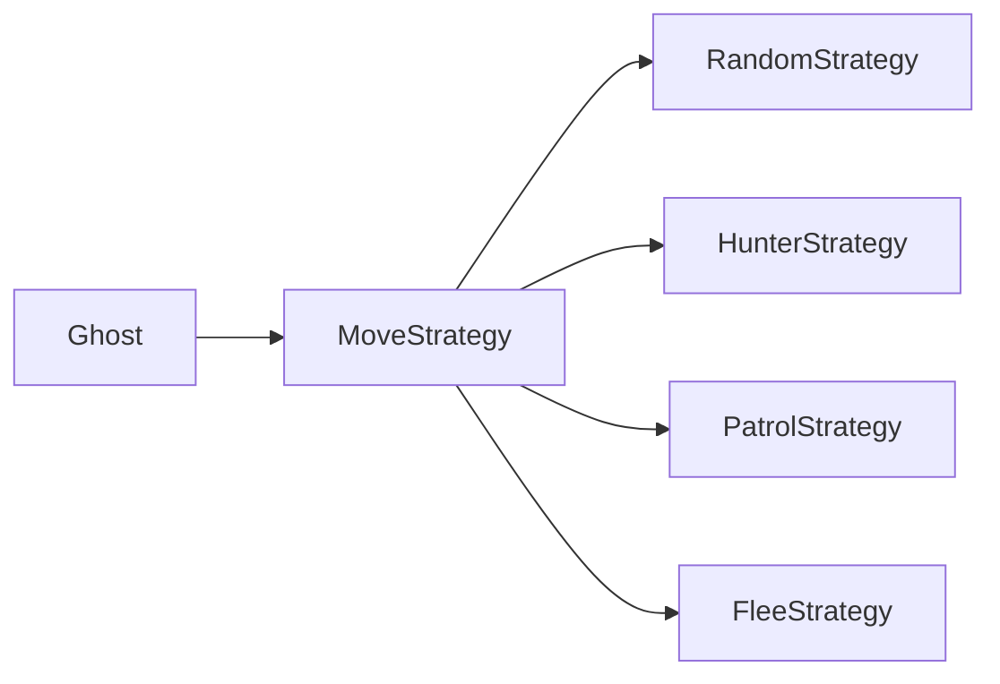
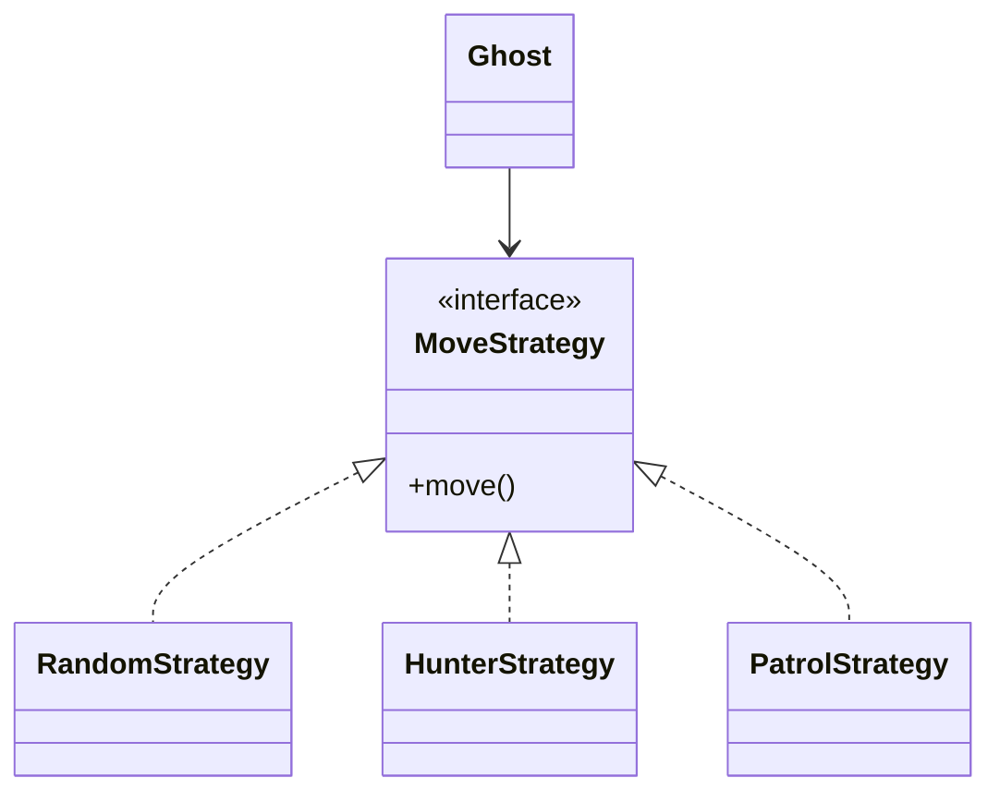
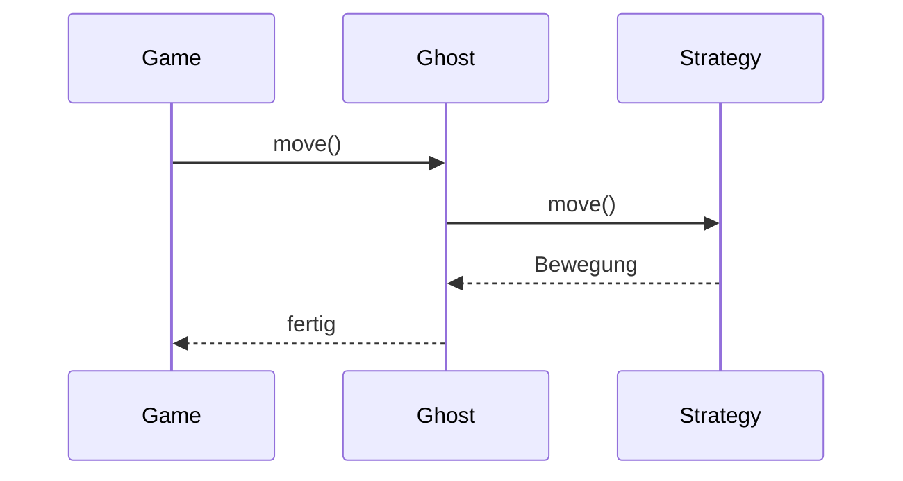

> [!abstract] Lernziel
> Nach diesem Kapitel weißt du:
>
> - Was das Strategy Pattern ist.
> - Welches Problem es löst.
> - Wie Strategien ausgetauscht werden können.
> - Wann das Strategy Pattern sinnvoll ist.
> - Welche Vor- und Nachteile es besitzt.

---

# Was ist das Strategy Pattern?

Das Strategy Pattern ist ein **Verhaltensmuster (Behavioral Pattern)**.

Es ermöglicht, **verschiedene Algorithmen oder Verhaltensweisen austauschbar zu machen**.

Das Objekt muss dabei nicht geändert werden.

Es tauscht lediglich seine Strategie aus.

---

# Das Problem

Stell dir dein Pac-Man-Spiel vor.

Du möchtest verschiedene Gegnertypen.

Zum Beispiel:

- Zufällig laufen
- Spieler verfolgen
- Fliehen
- Patrouillieren

Ohne Strategy würdest du vermutlich schreiben:

```java
if(mode == RANDOM){

}

else if(mode == HUNTER){

}

else if(mode == FLEE){

}

else if(mode == PATROL){

}
```

Mit jedem neuen Verhalten wächst diese Liste.

Der Code wird unübersichtlich.

---

# Die Lösung

Jedes Verhalten wird in eine eigene Klasse ausgelagert.



Der Ghost kennt nur das Interface.

---

# Aufbau



---

# Strategy Interface

```java
public interface MoveStrategy {

    void move();

}
```

---

# Strategie 1

```java
public class RandomStrategy implements MoveStrategy {

    @Override
    public void move() {

        System.out.println("Läuft zufällig.");

    }

}
```

---

# Strategie 2

```java
public class HunterStrategy implements MoveStrategy {

    @Override
    public void move() {

        System.out.println("Verfolgt den Spieler.");

    }

}
```

---

# Ghost

```java
public class Ghost {

    private MoveStrategy strategy;

    public Ghost(MoveStrategy strategy) {

        this.strategy = strategy;

    }

    public void move() {

        strategy.move();

    }

}
```

---

# Verwendung

```java
Ghost ghost = new Ghost(new RandomStrategy());

ghost.move();
```

Ausgabe

```
Läuft zufällig.
```

---

Jetzt wechseln wir die Strategie.

```java
ghost = new Ghost(new HunterStrategy());

ghost.move();
```

Ausgabe

```
Verfolgt den Spieler.
```

---

# Ablauf



---

# Strategy in unseren Projekten

## 👻 Pac-Man

Mögliche Strategien:

- RandomStrategy
- HunterStrategy
- FastStrategy
- PatrolStrategy
- FleeStrategy

Der Ghost bleibt immer derselbe.

Nur seine Strategie ändert sich.

---

## 🦊 FoxTrainer

Mögliche Strategien:

- Zufällige Fragen
- Nach Schwierigkeit
- Nach Kategorie
- Falsch beantwortete zuerst

Die Strategie entscheidet,

welche Frage als Nächstes erscheint.

---

## 🚢 Schiffe versenken

Computer-KI:

- Zufällig schießen
- Schiffe gezielt suchen
- Wahrscheinlichkeiten berechnen

Auch hier könnte jede KI eine eigene Strategy sein.

---

# Vorteile

- Weniger if-else-Ketten
- Verhalten austauschbar
- Leicht erweiterbar
- Lose Kopplung
- Gute Wartbarkeit

---

# Nachteile

- Mehr Klassen
- Für kleine Programme manchmal zu aufwendig

---

# Häufige Fehler

> [!warning] Häufiger Fehler
>
> Das Strategy Pattern ersetzt häufig lange if-else-Ketten.

---

> [!warning] Häufiger Fehler
>
> Der Context (Ghost) sollte die Strategie nur verwenden,
> nicht deren Logik kennen.

---

# Merksätze 💡

> [!tip] Merke
>
> Strategy bedeutet:
>
> Verhalten austauschbar machen.

---

> [!tip] Merke
>
> Der Context kennt nur das Interface.

---

> [!tip] Merke
>
> Neue Strategien können jederzeit ergänzt werden.

---

# Mini-Quiz

## 1.

Zu welcher Kategorie gehört das Strategy Pattern?

> [!spoiler]- Lösung anzeigen
>
> Verhaltensmuster.

---

## 2.

Welches Problem löst Strategy?

> [!spoiler]- Lösung anzeigen
>
> Austauschbare Algorithmen oder Verhaltensweisen.

---

## 3.

Warum verwendet man ein Interface?

> [!spoiler]- Lösung anzeigen
>
> Damit verschiedene Strategien austauschbar sind.

---

# Übungsaufgaben

## Aufgabe 1

Nenne drei Strategien für einen Pac-Man-Gegner.

> [!spoiler]- Lösung anzeigen
>
> - Random
> - Hunter
> - Patrol
> - Fast
> - Flee

---

## Aufgabe 2

Warum könnte FoxTrainer das Strategy Pattern verwenden?

> [!spoiler]- Lösung anzeigen
>
> Um unterschiedliche Methoden zur Auswahl der nächsten Frage zu verwenden.

---

## Aufgabe 3

Warum ist Strategy besser als viele if-else-Blöcke?

> [!spoiler]- Lösung anzeigen
>
> Weil neue Verhaltensweisen als eigene Klassen ergänzt werden können, ohne bestehenden Code zu verändern.

---

# Zusammenfassung

- Das Strategy Pattern ist ein Verhaltensmuster.
- Es macht Algorithmen und Verhaltensweisen austauschbar.
- Der Context kennt nur das Strategy-Interface.
- Neue Strategien können leicht ergänzt werden.
- Strategy ersetzt häufig lange if-else-Ketten.

➡️ **Nächstes Kapitel:** [[05 Builder Pattern]]