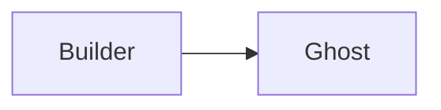
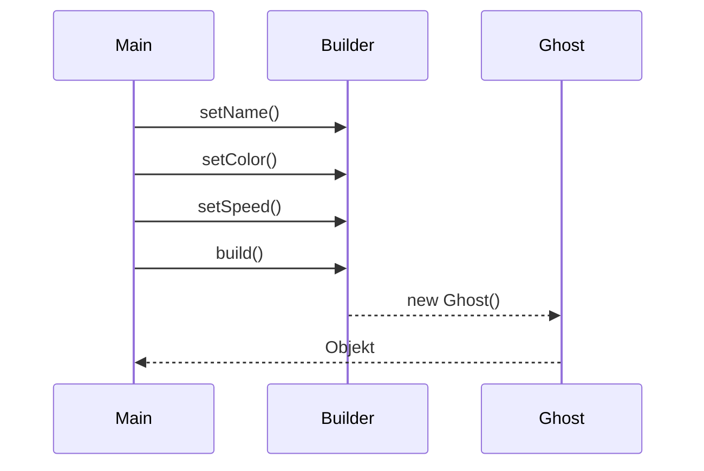

> [!abstract] Lernziel
> Nach diesem Kapitel weißt du:
>
> - Was das Builder Pattern ist.
> - Welches Problem es löst.
> - Wie ein Builder funktioniert.
> - Wann das Builder Pattern sinnvoll ist.
> - Welche Vor- und Nachteile es besitzt.

---

# Was ist das Builder Pattern?

Das Builder Pattern ist ein **Erzeugungsmuster (Creational Pattern)**.

Es ermöglicht, **komplexe Objekte Schritt für Schritt aufzubauen**.

Dadurch werden Konstruktoren mit vielen Parametern vermieden.

---

# Das Problem

Stell dir vor, dein Pac-Man-Gegner besitzt:

- Name
- Geschwindigkeit
- Farbe
- Leben
- Position X
- Position Y
- KI
- Punktewert

Dann müsste der Konstruktor so aussehen:

```java
Ghost ghost = new Ghost(
    "Blinky",
    "Rot",
    5,
    100,
    10,
    15,
    new HunterStrategy(),
    200
);
```

Jetzt weiß kaum noch jemand,

welcher Wert wofür steht.

---

# Die Lösung

Ein Builder erstellt das Objekt Schritt für Schritt.

```java
Ghost ghost = new GhostBuilder()
        .setName("Blinky")
        .setColor("Rot")
        .setSpeed(5)
        .setStrategy(new HunterStrategy())
        .build();
```

Jetzt ist sofort erkennbar,

welcher Wert gesetzt wird.

---

# Aufbau



---

# Ghost

```java
public class Ghost {

    private String name;
    private String color;
    private int speed;

    public Ghost(String name,
                 String color,
                 int speed) {

        this.name = name;
        this.color = color;
        this.speed = speed;

    }

}
```

---

# Builder

```java
public class GhostBuilder {

    private String name;
    private String color;
    private int speed;

    public GhostBuilder setName(String name){

        this.name = name;
        return this;

    }

    public GhostBuilder setColor(String color){

        this.color = color;
        return this;

    }

    public GhostBuilder setSpeed(int speed){

        this.speed = speed;
        return this;

    }

    public Ghost build(){

        return new Ghost(name, color, speed);

    }

}
```

---

# Verwendung

```java
Ghost ghost = new GhostBuilder()

        .setName("Blinky")
        .setColor("Rot")
        .setSpeed(5)

        .build();
```

---

# Ablauf



---

# Builder in unseren Projekten

## 👻 Pac-Man

Ein Ghost besitzt viele Eigenschaften.

Builder macht den Code lesbarer.

---

## 🦊 FoxTrainer

Eine Frage könnte besitzen:

- Frage
- Antworten
- Richtige Antwort
- Schwierigkeit
- Kategorie
- Punkte

Builder:

```java
Question frage = new QuestionBuilder()

        .setText("Was ist Java?")
        .setDifficulty(2)
        .setCategory("OOP")

        .build();
```

---

## 🚢 Schiffe versenken

Ein Schiff könnte besitzen:

- Name
- Länge
- Farbe
- Symbol
- Startposition

Auch hier wäre Builder sinnvoll.

---

# Einsatzgebiete

Builder eignet sich besonders bei

- vielen Attributen
- optionalen Werten
- komplexen Objekten
- Konfigurationsobjekten

---

# Vorteile

- Sehr gut lesbarer Code
- Keine riesigen Konstruktoren
- Optionale Werte möglich
- Einfach erweiterbar

---

# Nachteile

- Zusätzliche Klasse
- Für kleine Klassen oft unnötig

---

# Häufige Fehler

> [!warning] Häufiger Fehler
>
> Builder lohnt sich nicht für Klassen mit zwei oder drei Attributen.

---

> [!warning] Häufiger Fehler
>
> `build()` sollte erst das fertige Objekt erzeugen.

---

# Merksätze 💡

> [!tip] Merke
>
> Builder erstellt Objekte Schritt für Schritt.

---

> [!tip] Merke
>
> Builder ersetzt häufig sehr große Konstruktoren.

---

> [!tip] Merke
>
> Builder verbessert die Lesbarkeit.

---

# Mini-Quiz

## 1.

Zu welcher Kategorie gehört Builder?

> [!spoiler]- Lösung anzeigen
>
> Erzeugungsmuster.

---

## 2.

Welches Problem löst Builder?

> [!spoiler]- Lösung anzeigen
>
> Konstruktoren mit sehr vielen Parametern.

---

## 3.

Warum ist Builder gut lesbar?

> [!spoiler]- Lösung anzeigen
>
> Weil jeder gesetzte Wert eindeutig benannt wird.

---

# Übungsaufgaben

## Aufgabe 1

Warum wäre Builder bei einem Ghost sinnvoll?

> [!spoiler]- Lösung anzeigen
>
> Weil ein Ghost viele Eigenschaften besitzen kann und der Code dadurch übersichtlicher wird.

---

## Aufgabe 2

Nenne drei Klassen, bei denen Builder sinnvoll wäre.

> [!spoiler]- Lösung anzeigen
>
> Zum Beispiel:
>
> - Ghost
> - Question
> - Ship
> - Character
> - Configuration

---

## Aufgabe 3

Warum ist Builder besser als ein Konstruktor mit zehn Parametern?

> [!spoiler]- Lösung anzeigen
>
> Weil der Code leichter lesbar und wartbar ist.

---

# Zusammenfassung

- Das Builder Pattern ist ein Erzeugungsmuster.
- Es erstellt komplexe Objekte Schritt für Schritt.
- Builder verbessert die Lesbarkeit.
- Große Konstruktoren werden vermieden.
- Builder eignet sich besonders bei vielen optionalen Attributen.

➡️ **Nächstes Kapitel:** [[06 Decorator Pattern]]