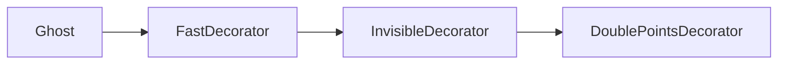
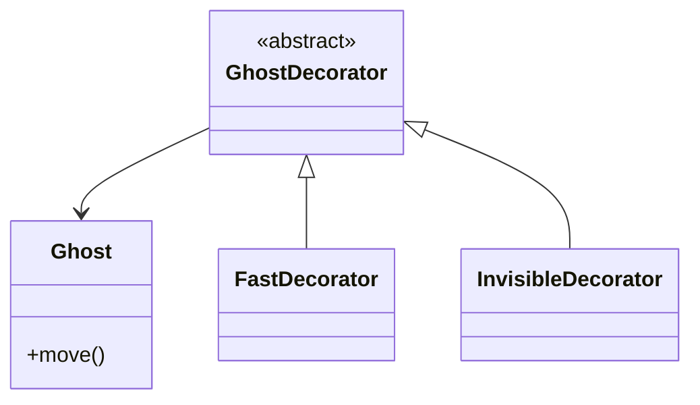
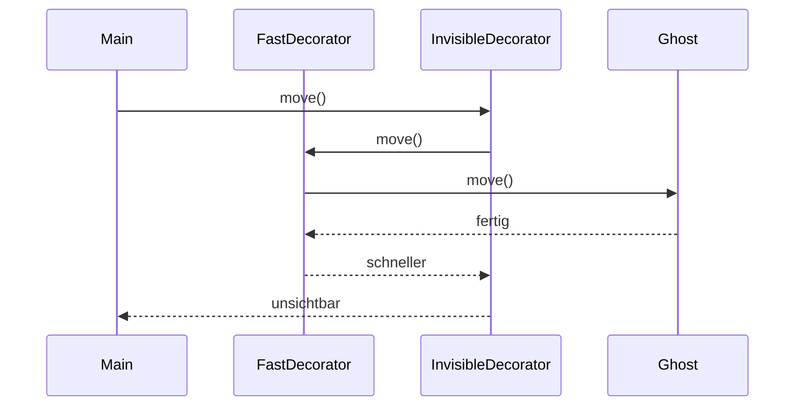

> [!abstract] Lernziel
> Nach diesem Kapitel weißt du:
>
> - Was das Decorator Pattern ist.
> - Welches Problem es löst.
> - Wie Decorators funktionieren.
> - Wann man sie einsetzen sollte.
> - Welche Vor- und Nachteile sie besitzen.

---

# Was ist das Decorator Pattern?

Das Decorator Pattern ist ein **Strukturmuster (Structural Pattern)**.

Es ermöglicht, einem Objekt **zusätzliche Fähigkeiten zu geben**, ohne seine Klasse zu verändern.

Statt eine Klasse umzubauen, wird sie einfach "verpackt" (dekoriert).

---

# Das Problem

Stell dir dein Pac-Man-Spiel vor.

Ein Geist kann plötzlich

- schneller werden
- unsichtbar werden
- doppelte Punkte geben
- den Spieler einfrieren

Ohne Decorator müsste man viele Klassen erstellen.

```
Ghost

FastGhost

InvisibleGhost

FrozenGhost

FastInvisibleGhost

FastFrozenGhost

InvisibleFrozenGhost
```

Mit jeder Kombination entstehen neue Klassen.

Das wird schnell unübersichtlich.

---

# Die Lösung

Man kombiniert Fähigkeiten zur Laufzeit.



Der Geist bleibt derselbe.

Nur seine Fähigkeiten ändern sich.

---

# Aufbau



---

# Ghost

```java
public interface Ghost {

    void move();

}
```

---

# Einfacher Ghost

```java
public class BasicGhost implements Ghost {

    @Override
    public void move() {

        System.out.println("Ghost läuft.");

    }

}
```

---

# Decorator

```java
public abstract class GhostDecorator implements Ghost {

    protected Ghost ghost;

    public GhostDecorator(Ghost ghost) {

        this.ghost = ghost;

    }

}
```

---

# FastDecorator

```java
public class FastDecorator extends GhostDecorator {

    public FastDecorator(Ghost ghost) {

        super(ghost);

    }

    @Override
    public void move() {

        ghost.move();

        System.out.println("Ghost ist schneller.");

    }

}
```

---

# InvisibleDecorator

```java
public class InvisibleDecorator extends GhostDecorator {

    public InvisibleDecorator(Ghost ghost) {

        super(ghost);

    }

    @Override
    public void move() {

        ghost.move();

        System.out.println("Ghost ist unsichtbar.");

    }

}
```

---

# Verwendung

```java
Ghost ghost = new BasicGhost();

ghost = new FastDecorator(ghost);

ghost = new InvisibleDecorator(ghost);

ghost.move();
```

Ausgabe

```
Ghost läuft.

Ghost ist schneller.

Ghost ist unsichtbar.
```

---

# Ablauf



---

# Decorator in unseren Projekten

## 👻 Pac-Man

Ein Ghost erhält während des Spiels zusätzliche Eigenschaften.

Zum Beispiel:

- schneller
- unsichtbar
- doppelte Punkte
- friert den Spieler ein

Die Ghost-Klasse muss dafür nicht geändert werden.

---

## 🦊 FoxTrainer

Eine Frage könnte dekoriert werden.

Zum Beispiel:

- Zeitlimit
- Bonuspunkte
- Hinweis anzeigen

Die Grundklasse bleibt unverändert.

---

## 🚢 Schiffe versenken

Ein Schiff könnte zusätzliche Eigenschaften erhalten.

Zum Beispiel:

- gepanzert
- getarnt
- schneller

---

# Einsatzgebiete

Decorator eignet sich für:

- Spiele
- GUI-Komponenten
- Streams
- Eingabefilter
- Zusatzfunktionen

---

# Vorteile

- Klassen bleiben klein.
- Neue Funktionen können kombiniert werden.
- Keine riesigen Vererbungsbäume.
- Sehr flexibel.

---

# Nachteile

- Viele kleine Klassen.
- Der Ablauf kann schwieriger nachvollziehbar sein.

---

# Häufige Fehler

> [!warning] Häufiger Fehler
>
> Decorator ersetzt keine Vererbung.
>
> Er erweitert ein vorhandenes Objekt.

---

> [!warning] Häufiger Fehler
>
> Decorators sollten möglichst nur eine zusätzliche Aufgabe besitzen.

---

# Merksätze 💡

> [!tip] Merke
>
> Decorator erweitert Objekte zur Laufzeit.

---

> [!tip] Merke
>
> Das ursprüngliche Objekt wird nicht verändert.

---

> [!tip] Merke
>
> Mehrere Decorators können kombiniert werden.

---

# Mini-Quiz

## 1.

Zu welcher Kategorie gehört das Decorator Pattern?

> [!spoiler]- Lösung anzeigen
>
> Strukturmuster.

---

## 2.

Welches Problem löst Decorator?

> [!spoiler]- Lösung anzeigen
>
> Zusätzliche Funktionen können hinzugefügt werden, ohne neue Unterklassen für jede Kombination zu erstellen.

---

## 3.

Kann man mehrere Decorators kombinieren?

> [!spoiler]- Lösung anzeigen
>
> Ja.

---

# Übungsaufgaben

## Aufgabe 1

Welche Decorators wären für einen Ghost sinnvoll?

> [!spoiler]- Lösung anzeigen
>
> - FastDecorator
> - InvisibleDecorator
> - FrozenDecorator
> - DoublePointsDecorator

---

## Aufgabe 2

Warum ist Decorator besser als viele Unterklassen?

> [!spoiler]- Lösung anzeigen
>
> Weil Fähigkeiten flexibel kombiniert werden können und nicht für jede Kombination eine eigene Klasse benötigt wird.

---

## Aufgabe 3

Nenne zwei Programme, in denen Decorator sinnvoll wäre.

> [!spoiler]- Lösung anzeigen
>
> Zum Beispiel:
>
> - Spiele
> - Texteditoren
> - GUI-Anwendungen
> - Dateiverarbeitung

---

# Zusammenfassung

- Das Decorator Pattern ist ein Strukturmuster.
- Es erweitert Objekte um zusätzliche Funktionen.
- Das ursprüngliche Objekt bleibt unverändert.
- Mehrere Decorators können kombiniert werden.
- Decorator verhindert große Vererbungsbäume.

➡️ **Nächstes Kapitel:** [[07 Adapter Pattern]]