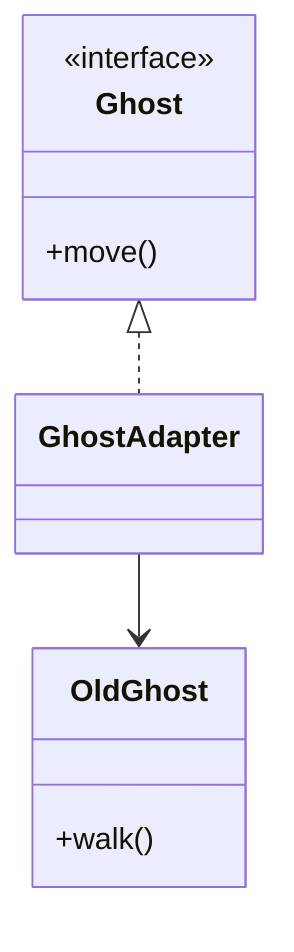
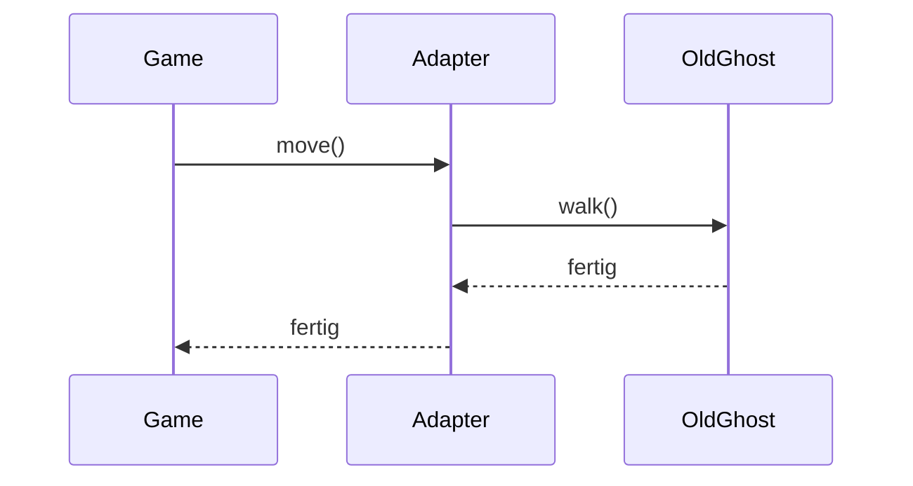

> [!abstract] Lernziel
> Nach diesem Kapitel weißt du:
>
> - Was das Adapter Pattern ist.
> - Welches Problem es löst.
> - Wie ein Adapter funktioniert.
> - Wann man ihn einsetzen sollte.
> - Welche Vor- und Nachteile er besitzt.

---

# Was ist das Adapter Pattern?

Das Adapter Pattern ist ein **Strukturmuster (Structural Pattern)**.

Es ermöglicht, zwei Klassen zusammenarbeiten zu lassen,

obwohl ihre Schnittstellen nicht zusammenpassen.

Der Adapter wirkt dabei wie ein **Übersetzer**.

---

# Das Problem

Stell dir vor,

dein Spiel erwartet:

```java
move();
```

Du möchtest aber eine fremde Bibliothek benutzen.

Diese besitzt nur:

```java
walk();
```

Beide machen dasselbe,

heißen aber unterschiedlich.

Sie können deshalb nicht direkt zusammenarbeiten.

---

# Die Lösung

Ein Adapter übersetzt.


Game ruft

```java
move()
```

auf.

Der Adapter übersetzt dies zu

```java
walk()
```

---

# Aufbau



---

# Interface

```java
public interface Ghost {

    void move();

}
```

---

# Alte Klasse

```java
public class OldGhost {

    public void walk() {

        System.out.println("Ghost läuft.");

    }

}
```

---

# Adapter

```java
public class GhostAdapter implements Ghost {

    private OldGhost ghost;

    public GhostAdapter(OldGhost ghost) {

        this.ghost = ghost;

    }

    @Override
    public void move() {

        ghost.walk();

    }

}
```

---

# Verwendung

```java
OldGhost oldGhost = new OldGhost();

Ghost ghost = new GhostAdapter(oldGhost);

ghost.move();
```

Ausgabe

```
Ghost läuft.
```

---

# Ablauf



---

# Adapter in unseren Projekten

## 👻 Pac-Man

Du lädst später eine KI-Bibliothek herunter.

Sie besitzt:

```java
walk()
```

Dein Spiel verwendet aber:

```java
move()
```

Ein Adapter verbindet beides.

---

## 🦊 FoxTrainer

Du verwendest eine externe API.

Sie liefert:

```java
getQuestion()
```

Dein Programm erwartet aber:

```java
nextQuestion()
```

Der Adapter übersetzt.

---

## 🚢 Schiffe versenken

Eine externe Bibliothek liefert

```java
shootAt()
```

Dein Spiel benutzt

```java
shoot()
```

Auch hier hilft ein Adapter.

---

# Einsatzgebiete

Adapter eignet sich für:

- Fremde Bibliotheken
- Alte Programme
- APIs
- Frameworks
- Hardware
- Legacy-Code

---

# Vorteile

- Vorhandener Code muss nicht geändert werden.
- Fremde Klassen können weiterverwendet werden.
- Lose Kopplung.
- Gute Erweiterbarkeit.

---

# Nachteile

- Zusätzliche Klasse.
- Mehr Komplexität.

---

# Häufige Fehler

> [!warning] Häufiger Fehler
>
> Adapter erweitert keine Funktion.
>
> Er übersetzt lediglich zwischen zwei Schnittstellen.

---

> [!warning] Häufiger Fehler
>
> Adapter und Decorator werden häufig verwechselt.

---

# Decorator oder Adapter?

| Decorator | Adapter |
|-----------|---------|
| erweitert Verhalten | übersetzt Schnittstellen |
| fügt Funktionen hinzu | macht Klassen kompatibel |

---

# Merksätze 💡

> [!tip] Merke
>
> Adapter = Übersetzer.

---

> [!tip] Merke
>
> Der Adapter verbindet zwei inkompatible Klassen.

---

> [!tip] Merke
>
> Der ursprüngliche Code bleibt unverändert.

---

# Mini-Quiz

## 1.

Zu welcher Kategorie gehört das Adapter Pattern?

> [!spoiler]- Lösung anzeigen
>
> Strukturmuster.

---

## 2.

Welches Problem löst der Adapter?

> [!spoiler]- Lösung anzeigen
>
> Er verbindet Klassen mit unterschiedlichen Schnittstellen.

---

## 3.

Verändert der Adapter die alte Klasse?

> [!spoiler]- Lösung anzeigen
>
> Nein.
>
> Er übersetzt lediglich die Aufrufe.

---

# Übungsaufgaben

## Aufgabe 1

Warum könnte Pac-Man einen Adapter benötigen?

> [!spoiler]- Lösung anzeigen
>
> Um eine fremde Bibliothek mit einer anderen Schnittstelle einzubinden.

---

## Aufgabe 2

Warum ist Adapter besser als den alten Code umzuschreiben?

> [!spoiler]- Lösung anzeigen
>
> Weil vorhandener Code erhalten bleibt und leichter aktualisiert werden kann.

---

## Aufgabe 3

Nenne drei Einsatzgebiete für Adapter.

> [!spoiler]- Lösung anzeigen
>
> - APIs
> - Hardware
> - Legacy-Code
> - Fremde Bibliotheken

---

# Zusammenfassung

- Das Adapter Pattern ist ein Strukturmuster.
- Es verbindet inkompatible Schnittstellen.
- Der Adapter wirkt wie ein Übersetzer.
- Vorhandene Klassen müssen nicht geändert werden.
- Adapter wird häufig bei APIs und Fremdbibliotheken eingesetzt.

➡️ **Nächstes Kapitel:** [[08 Command Pattern]]