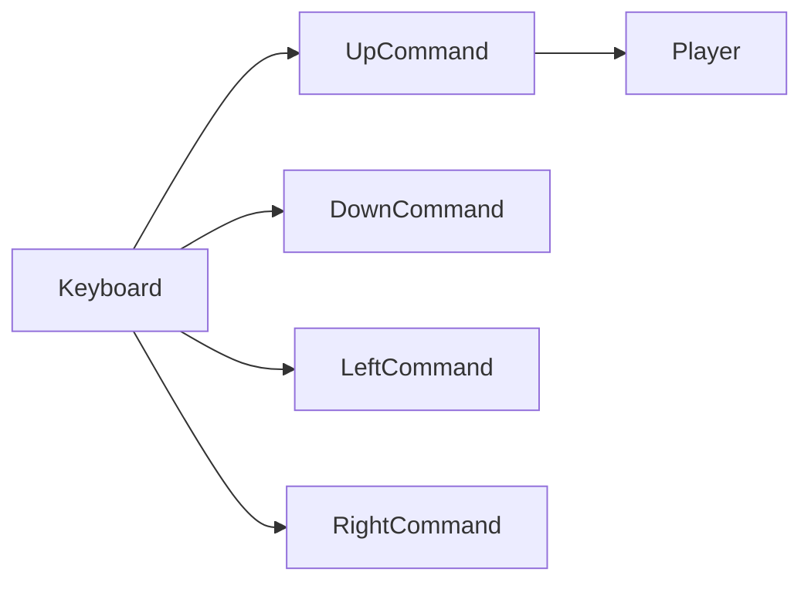
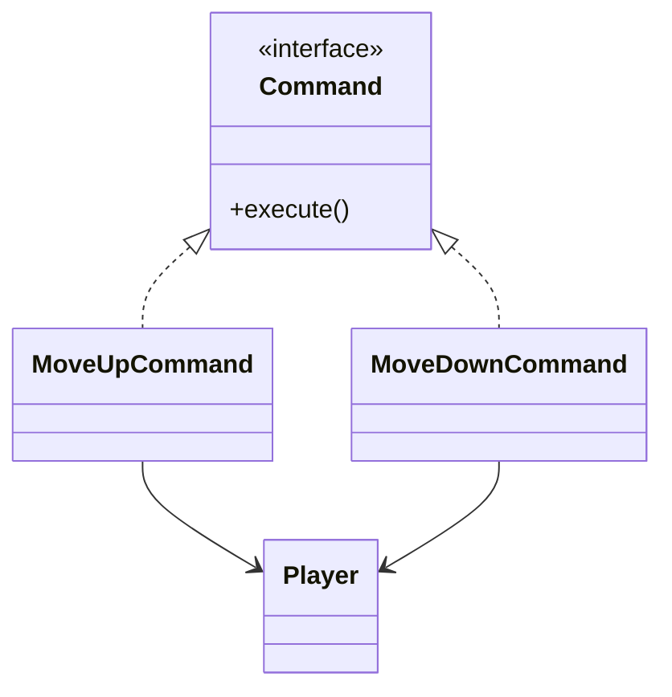
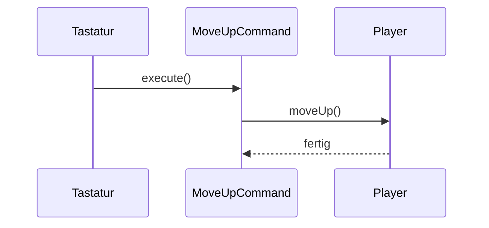

> [!abstract] Lernziel
> Nach diesem Kapitel weißt du:
>
> - Was das Command Pattern ist.
> - Welches Problem es löst.
> - Wie Commands funktionieren.
> - Wann man das Pattern einsetzen sollte.
> - Welche Vor- und Nachteile es besitzt.

---

# Was ist das Command Pattern?

Das Command Pattern ist ein **Verhaltensmuster (Behavioral Pattern)**.

Es verpackt einen Befehl in ein eigenes Objekt.

Dadurch können Befehle gespeichert, weitergegeben oder später ausgeführt werden.

---

# Das Problem

Stell dir dein Pac-Man-Spiel vor.

Der Spieler kann

- nach oben laufen
- nach unten laufen
- nach links laufen
- nach rechts laufen

Ohne Command könnte dein Code so aussehen:

```java
if(key == UP){

    player.moveUp();

}

else if(key == DOWN){

    player.moveDown();

}

else if(key == LEFT){

    player.moveLeft();

}

else if(key == RIGHT){

    player.moveRight();

}
```

Je mehr Aktionen hinzukommen,

desto größer wird die if-else-Kette.

---

# Die Lösung

Jeder Befehl wird als eigenes Objekt gespeichert.



---

# Aufbau



---

# Command Interface

```java
public interface Command {

    void execute();

}
```

---

# Player

```java
public class Player {

    public void moveUp() {

        System.out.println("Spieler läuft nach oben.");

    }

}
```

---

# MoveUpCommand

```java
public class MoveUpCommand implements Command {

    private Player player;

    public MoveUpCommand(Player player) {

        this.player = player;

    }

    @Override
    public void execute() {

        player.moveUp();

    }

}
```

---

# Verwendung

```java
Player player = new Player();

Command command = new MoveUpCommand(player);

command.execute();
```

Ausgabe

```
Spieler läuft nach oben.
```

---

# Ablauf



---

# Warum ist das besser?

Jetzt kann man Commands

- speichern
- wiederholen
- rückgängig machen
- in Listen speichern
- über das Netzwerk senden

Ohne den Player zu verändern.

---

# Command in unseren Projekten

## 👻 Pac-Man

Mögliche Commands:

- MoveUpCommand
- MoveDownCommand
- MoveLeftCommand
- MoveRightCommand

Später könnte man sogar

- Undo
- Replay
- Tastenkonfiguration

einbauen.

---

## 🦊 FoxTrainer

Commands:

- NextQuestionCommand
- CheckAnswerCommand
- RestartQuizCommand

---

## 🚢 Schiffe versenken

Commands:

- ShootCommand
- PlaceShipCommand
- RestartGameCommand

---

# Einsatzgebiete

Command eignet sich für:

- Spiele
- Menüs
- Tastatursteuerung
- Makros
- Undo/Redo
- Netzwerkbefehle

---

# Vorteile

- Lose Kopplung
- Neue Befehle leicht ergänzbar
- Undo möglich
- Befehle können gespeichert werden

---

# Nachteile

- Viele kleine Klassen
- Höherer Programmieraufwand

---

# Häufige Fehler

> [!warning] Häufiger Fehler
>
> Ein Command sollte genau **eine Aufgabe** besitzen.

---

> [!warning] Häufiger Fehler
>
> Nicht die komplette Spiellogik in den Command schreiben.

---

# Merksätze 💡

> [!tip] Merke
>
> Command = Ein Befehl als Objekt.

---

> [!tip] Merke
>
> Jeder Command besitzt meist eine Methode `execute()`.

---

> [!tip] Merke
>
> Commands können gespeichert oder später ausgeführt werden.

---

# Mini-Quiz

## 1.

Zu welcher Kategorie gehört das Command Pattern?

> [!spoiler]- Lösung anzeigen
>
> Verhaltensmuster.

---

## 2.

Welches Problem löst Command?

> [!spoiler]- Lösung anzeigen
>
> Befehle werden als eigene Objekte gekapselt und können flexibel verwendet werden.

---

## 3.

Warum eignet sich Command gut für Spiele?

> [!spoiler]- Lösung anzeigen
>
> Weil Eingaben, Menüs oder Aktionen einfach gespeichert, wiederholt oder rückgängig gemacht werden können.

---

# Übungsaufgaben

## Aufgabe 1

Nenne vier Commands für Pac-Man.

> [!spoiler]- Lösung anzeigen
>
> - MoveUpCommand
> - MoveDownCommand
> - MoveLeftCommand
> - MoveRightCommand

---

## Aufgabe 2

Warum eignet sich Command für Undo?

> [!spoiler]- Lösung anzeigen
>
> Weil jede Aktion als eigenes Objekt gespeichert werden kann.

---

## Aufgabe 3

Nenne drei Programme, in denen Command sinnvoll wäre.

> [!spoiler]- Lösung anzeigen
>
> - Spiel
> - Texteditor
> - Zeichenprogramm
> - Menüsystem

---

# Zusammenfassung

- Das Command Pattern ist ein Verhaltensmuster.
- Ein Command kapselt einen Befehl in einem Objekt.
- Commands besitzen meist eine Methode `execute()`.
- Sie eignen sich für Spiele, Menüs und Undo/Redo.
- Das Pattern sorgt für lose Kopplung und gute Erweiterbarkeit.

➡️ **Nächstes Kapitel:** [[09 MVC Pattern]]