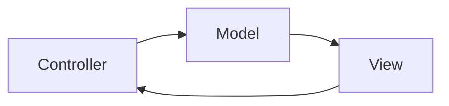
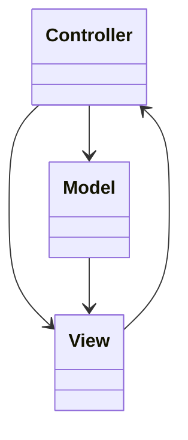
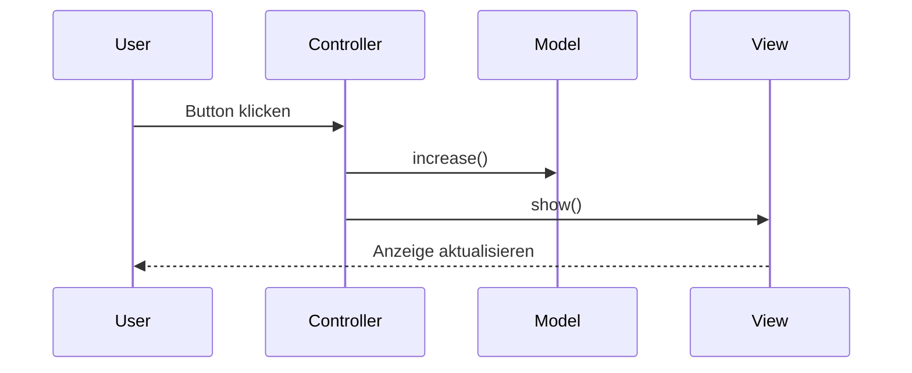

> [!abstract] Lernziel
> Nach diesem Kapitel weißt du:
>
> - Was das MVC Pattern ist.
> - Welche Aufgaben Model, View und Controller besitzen.
> - Warum MVC Anwendungen übersichtlicher macht.
> - Wo MVC eingesetzt wird.
> - Welche Vor- und Nachteile MVC besitzt.

---

# Was ist MVC?

MVC steht für:

- **Model**
- **View**
- **Controller**

MVC trennt eine Anwendung in drei Bereiche.

Dadurch bleibt der Code übersichtlich und leichter wartbar.

---

# Das Problem

Stell dir vor, alles befindet sich in einer einzigen Klasse.

```java
Game
```

Diese Klasse

- zeichnet das Spielfeld
- berechnet die Spielregeln
- verarbeitet Tastatureingaben

Mit der Zeit wird sie immer größer.

---

# Die Lösung

MVC verteilt die Aufgaben.



Jede Klasse besitzt nur eine klar definierte Aufgabe.

---

# Die drei Bestandteile

## Model

Das Model enthält

- Daten
- Spielregeln
- Berechnungen

Es kennt weder Buttons noch Fenster.

Beispiel:

```text
Player

Ghost

Board

Score
```

---

## View

Die View zeigt die Daten an.

Zum Beispiel:

- Fenster
- Konsole
- GUI
- Webseite

Sie verändert keine Spielregeln.

---

## Controller

Der Controller verbindet alles.

Er

- verarbeitet Eingaben
- ruft Methoden des Models auf
- aktualisiert die View

---

# Aufbau



---

# Einfaches Beispiel

## Model

```java
public class Counter {

    private int value;

    public void increase() {

        value++;

    }

    public int getValue() {

        return value;

    }

}
```

---

## View

```java
public class CounterView {

    public void show(int value) {

        System.out.println("Wert: " + value);

    }

}
```

---

## Controller

```java
public class CounterController {

    private Counter model;
    private CounterView view;

    public CounterController(Counter model,
                             CounterView view) {

        this.model = model;
        this.view = view;

    }

    public void clickButton() {

        model.increase();

        view.show(model.getValue());

    }

}
```

---

# Ablauf



---

# MVC in unseren Projekten

## 👻 Pac-Man

### Model

- Player
- Ghost
- Board
- Score

---

### View

- Lanterna-Ausgabe

---

### Controller

- Tastatureingaben
- Spiel starten
- Spieler bewegen

---

## 🦊 FoxTrainer

### Model

- Fragen
- Antworten
- Punktestand

---

### View

- HTML
- CSS

---

### Controller

- JavaScript
- Button-Klicks
- Auswertung

---

## 🚢 Schiffe versenken

### Model

- Board
- Ships
- Player

---

### View

- Konsole oder GUI

---

### Controller

- Schüsse
- Schiff platzieren
- Spielablauf

---

# Einsatzgebiete

MVC wird verwendet bei:

- JavaFX
- Swing
- Spring MVC
- Webseiten
- Desktop-Anwendungen
- Mobile Apps

---

# Vorteile

- Klare Aufgabenverteilung
- Leichter wartbar
- Gute Testbarkeit
- Wiederverwendbare Komponenten

---

# Nachteile

- Mehr Klassen
- Für kleine Programme manchmal unnötig

---

# Häufige Fehler

> [!warning] Häufiger Fehler
>
> Die View sollte keine Spiellogik enthalten.

---

> [!warning] Häufiger Fehler
>
> Das Model sollte keine Benutzereingaben verarbeiten.

---

> [!warning] Häufiger Fehler
>
> Der Controller sollte keine Daten dauerhaft speichern.

---

# Merksätze 💡

> [!tip] Merke
>
> Model = Daten

---

> [!tip] Merke
>
> View = Darstellung

---

> [!tip] Merke
>
> Controller = Steuerung

---

> [!tip] Merke
>
> MVC trennt Verantwortlichkeiten.

---

# Mini-Quiz

## 1.

Wofür steht MVC?

> [!spoiler]- Lösung anzeigen
>
> Model, View und Controller.

---

## 2.

Welche Aufgabe besitzt das Model?

> [!spoiler]- Lösung anzeigen
>
> Es verwaltet die Daten und die Geschäftslogik.

---

## 3.

Welche Aufgabe besitzt die View?

> [!spoiler]- Lösung anzeigen
>
> Sie stellt Informationen dar.

---

## 4.

Welche Aufgabe besitzt der Controller?

> [!spoiler]- Lösung anzeigen
>
> Er verarbeitet Eingaben und verbindet Model und View.

---

# Übungsaufgaben

## Aufgabe 1

Ordne die Klassen deines Pac-Man-Projekts dem MVC-Modell zu.

> [!spoiler]- Lösung anzeigen
>
> **Model:** Player, Ghost, Board, Score
>
> **View:** Lanterna-Ausgabe
>
> **Controller:** Tastatursteuerung, Spielablauf

---

## Aufgabe 2

Warum macht MVC Programme übersichtlicher?

> [!spoiler]- Lösung anzeigen
>
> Weil jede Klasse nur eine klar definierte Aufgabe besitzt.

---

# Zusammenfassung

- MVC ist ein Architekturmuster.
- Es trennt eine Anwendung in Model, View und Controller.
- Das Model enthält Daten und Logik.
- Die View stellt Informationen dar.
- Der Controller verarbeitet Eingaben und verbindet Model und View.
- MVC sorgt für übersichtlichen und wartbaren Code.

➡️ **Nächstes Kapitel:** `99 📝 Design Patterns Cheatsheet`