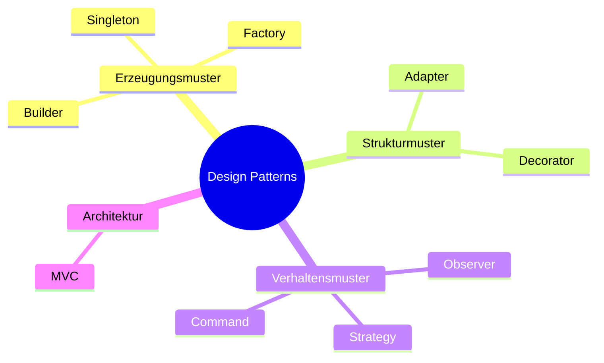

> [!abstract] Zweck
> Dieses Cheatsheet fasst die wichtigsten Design Patterns kompakt zusammen.

---

# Kategorien

| Kategorie         | Zweck                            | Beispiele                   |
| ----------------- | -------------------------------- | --------------------------- |
| Erzeugungsmuster  | Objekte erzeugen                 | Singleton, Factory, Builder |
| Strukturmuster    | Klassen verbinden oder erweitern | Adapter, Decorator          |
|  Verhaltensmuster | Zusammenarbeit von Objekten      | Observer, Strategy, Command |

---

# Überblick

| Pattern   | Merksatz                                          |
| --------- | ------------------------------------------------- |
| Observer  | Einer informiert viele                            |
| Singleton | Genau eine Instanz                                |
| Factory   | Erzeugt Objekte                                   |
| Strategy  | Verhalten austauschbar                            |
| Builder   | Objekt Schritt für Schritt erstellen              |
| Decorator | Objekt erweitern                                  |
| Adapter   | Schnittstellen übersetzen                         |
| Command   | Befehl als Objekt                                 |
| MVC       | Anwendung in Model, View und Controller aufteilen |

---

# Pattern auf einen Blick

---

# Wann benutze ich welches Pattern?

| Problem | Pattern |
|----------|---------|
| Es darf nur ein Objekt geben | Singleton |
| Objekte sollen zentral erzeugt werden | Factory |
| Konstruktor hat zu viele Parameter | Builder |
| Verhalten soll austauschbar sein | Strategy |
| Mehrere Objekte sollen automatisch informiert werden | Observer |
| Ein Objekt soll zusätzliche Funktionen erhalten | Decorator |
| Zwei Klassen passen nicht zusammen | Adapter |
| Aktionen sollen als Objekte gespeichert werden | Command |
| Anwendung sauber trennen | MVC |

---

# Merkhilfen

> [!tip] Observer
>
> Einer informiert viele.

---

> [!tip] Singleton
>
> Genau eine Instanz.

---

> [!tip] Factory
>
> Eine Klasse erzeugt Objekte.

---

> [!tip] Strategy
>
> Verhalten austauschen.

---

> [!tip] Builder
>
> Komplexe Objekte Schritt für Schritt bauen.

---

> [!tip] Decorator
>
> Fähigkeiten hinzufügen.

---

> [!tip] Adapter
>
> Übersetzt zwischen zwei Schnittstellen.

---

> [!tip] Command
>
> Ein Befehl wird zu einem Objekt.

---

> [!tip] MVC
>
> Trenne Daten, Darstellung und Steuerung.

---

# Pattern in unseren Projekten

| Projekt | Passende Pattern |
|----------|------------------|
| 👻 Pac-Man | Strategy, Observer, Factory, Command, Decorator |
| 🦊 FoxTrainer | MVC, Factory, Observer, Strategy |
| 🚢 Schiffe versenken | Factory, Strategy, Command |

---

# Merke 💡

> [!success] Die wichtigste Frage lautet:
>
> **Welches Problem möchte ich lösen?**
>
> Erst danach wählst du das passende Design Pattern.

---

# Kurzfassung

| Pattern | Ein Satz |
|----------|-----------|
| Observer | Benachrichtigt mehrere Objekte automatisch |
| Singleton | Es gibt genau ein Objekt |
| Factory | Erzeugt Objekte zentral |
| Strategy | Tauscht Verhalten aus |
| Builder | Baut komplexe Objekte Schritt für Schritt |
| Decorator | Fügt zusätzliche Funktionen hinzu |
| Adapter | Macht inkompatible Klassen kompatibel |
| Command | Verpackt Befehle in Objekte |
| MVC | Trennt Daten, Darstellung und Steuerung |