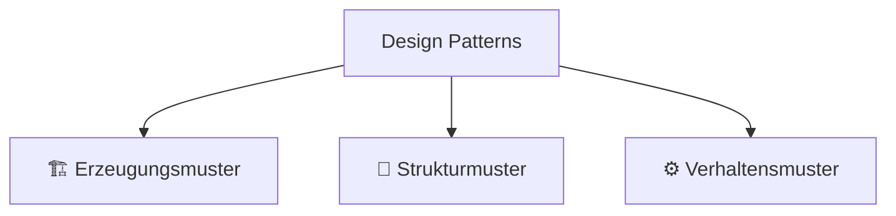

> [!abstract] Lernziel
> Nach diesem Kapitel weißt du:
>
> - Was Design Patterns sind.
> - Warum sie verwendet werden.
> - Wer die "Gang of Four" (GoF) sind.
> - Wie Design Patterns eingeteilt werden.
> - Welche Patterns du in diesem Handbuch lernen wirst.

---

# Was sind Design Patterns?

Design Patterns (Entwurfsmuster) sind **bewährte Lösungsansätze für häufig auftretende Probleme in der Softwareentwicklung**.

Sie sind **keine fertigen Programme**, sondern Vorlagen oder Ideen, die immer wieder verwendet werden können.

Man kann sie sich wie Baupläne vorstellen.

---

# Warum gibt es Design Patterns?

Stell dir vor, tausende Entwickler stehen vor demselben Problem.

Anstatt jedes Mal eine neue Lösung zu erfinden, wurden bewährte Lösungen gesammelt.

Diese Lösungen nennt man **Design Patterns**.

---

# Beispiel

Problem:

Mehrere Objekte sollen automatisch informiert werden, wenn sich etwas ändert.

Lösung:

➡️ Observer Pattern

---

Problem:

Es soll nur genau **eine Instanz** einer Klasse geben.

Lösung:

➡️ Singleton Pattern

---

Problem:

Objekte sollen flexibel erzeugt werden.

Lösung:

➡️ Factory Pattern

---

# Alltag

Design Patterns sind wie Baupläne.

Ein Architekt zeichnet auch nicht jedes Haus völlig neu.

Er verwendet bewährte Konzepte und passt sie an.

Softwareentwickler machen genau dasselbe.

---

# Die Gang of Four (GoF)

1994 veröffentlichten vier Entwickler das Buch:

**Design Patterns: Elements of Reusable Object-Oriented Software**

Sie wurden bekannt als:

> **Gang of Four (GoF)**

Die Autoren sind:

- Erich Gamma
- Richard Helm
- Ralph Johnson
- John Vlissides

Sie beschrieben 23 klassische Design Patterns.

Diese gelten bis heute als Standard.

---

# Einteilung der Design Patterns

Die GoF unterteilt Design Patterns in drei Gruppen.

---

# 01 Erzeugungsmuster (Creational)

Sie beschäftigen sich damit,

**wie Objekte erzeugt werden.**

Beispiele:

- Singleton
- Factory
- Builder

---

# 02 Strukturmuster (Structural)

Sie beschäftigen sich damit,

**wie Klassen und Objekte zusammenarbeiten.**

Beispiele:

- Adapter
- Decorator
- Facade

---

# 03 Verhaltensmuster (Behavioral)

Sie beschäftigen sich damit,

**wie Objekte miteinander kommunizieren.**

Beispiele:

- Observer
- Strategy
- Command

---

# Die Design Patterns in diesem Handbuch

| Kapitel | Kategorie |
|----------|-----------|
| Observer | Verhaltensmuster |
| Singleton | Erzeugungsmuster |
| Factory | Erzeugungsmuster |
| Strategy | Verhaltensmuster |
| Builder | Erzeugungsmuster |
| Decorator | Strukturmuster |
| Adapter | Strukturmuster |
| Command | Verhaltensmuster |
| MVC | Architekturmuster |

---

# Voraussetzungen

Bevor man Design Patterns lernt, sollte man folgende OOP-Themen beherrschen:

- Klassen
- Objekte
- Methoden
- Konstruktoren
- Kapselung
- Getter & Setter
- Vererbung
- Polymorphie
- Abstrakte Klassen
- Interfaces

---

# Warum sollte ich Design Patterns lernen?

Design Patterns helfen dabei,

- besseren Code zu schreiben,
- häufige Probleme zu lösen,
- wartbare Programme zu entwickeln,
- mit anderen Entwicklern dieselbe Sprache zu sprechen.

In vielen Unternehmen werden Design Patterns täglich eingesetzt.

---

# Häufige Fehler

> [!warning] Häufiger Fehler
>
> Design Patterns sind keine fertigen Programme.
>
> Sie liefern lediglich einen bewährten Lösungsansatz.

---

> [!warning] Häufiger Fehler
>
> Nicht jedes Problem benötigt ein Design Pattern.
>
> Einfache Lösungen sind oft besser.

---

# Merksätze 💡

> [!tip] Merke
>
> Design Patterns sind bewährte Lösungsansätze.

---

> [!tip] Merke
>
> Design Patterns lösen wiederkehrende Probleme.

---

> [!tip] Merke
>
> Es gibt Erzeugungs-, Struktur- und Verhaltensmuster.

---

# Mini-Quiz

## 1.

Was ist ein Design Pattern?

> [!spoiler]- Lösung anzeigen
>
> Ein bewährter Lösungsansatz für ein häufig auftretendes Softwareproblem.

---

## 2.

Sind Design Patterns fertige Programme?

> [!spoiler]- Lösung anzeigen
>
> Nein.
>
> Sie sind Vorlagen bzw. Entwurfsmuster.

---

## 3.

Wie heißen die drei Hauptkategorien?

> [!spoiler]- Lösung anzeigen
>
> - Erzeugungsmuster
> - Strukturmuster
> - Verhaltensmuster

---

# Übungsaufgaben

## Aufgabe 1

Nenne zwei Vorteile von Design Patterns.

> [!spoiler]- Lösung anzeigen
>
> Zum Beispiel:
>
> - Wiederverwendbare Lösungen
> - Bessere Wartbarkeit
> - Verständlicher Code
> - Einheitliche Vorgehensweisen

---

## Aufgabe 2

Warum wurden Design Patterns entwickelt?

> [!spoiler]- Lösung anzeigen
>
> Um häufige Probleme nicht jedes Mal neu lösen zu müssen.

---

# Zusammenfassung

- Design Patterns sind bewährte Lösungsansätze.
- Sie sind keine fertigen Programme.
- Die GoF beschrieb 23 klassische Design Patterns.
- Es gibt Erzeugungs-, Struktur- und Verhaltensmuster.
- Design Patterns helfen dabei, wartbare und verständliche Software zu entwickeln.

➡️ **Nächstes Kapitel:**  [[01 Observer Pattern]]