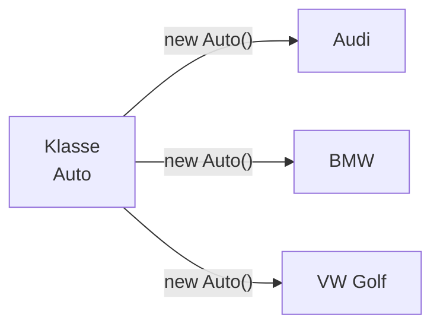
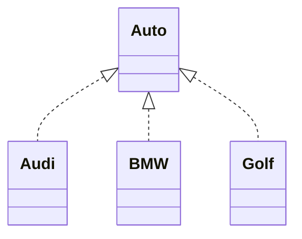

> [!info] Lernziel
> Nach diesem Kapitel weißt du:
> - Was ein Objekt ist.
> - Wie Objekte erzeugt werden.
> - Was eine Instanz ist.
> - Wie Objekte mit Klassen zusammenhängen.

---

# Was ist ein Objekt?

Ein **Objekt** ist eine **konkrete Instanz einer Klasse**.

Während eine Klasse nur den Bauplan beschreibt, ist ein Objekt das fertige "Produkt".

Aus einer Klasse können beliebig viele Objekte erzeugt werden.

---

# Beispiel

Klasse:

```
Auto
```

Objekte:

- Audi A4
- BMW M3
- VW Golf

Alle drei wurden aus derselben Klasse erzeugt.

Sie besitzen jedoch unterschiedliche Werte.

---

# Klasse und Objekt



---

# Objekte erzeugen

In Java werden Objekte mit dem Schlüsselwort **new** erstellt.

```java
Auto audi = new Auto();
```

---

# Erklärung

```java
Auto
```

Datentyp bzw. Klassenname.

---

```java
audi
```

Name der Variablen.

Sie speichert die Referenz auf das Objekt.

---

```java
new Auto()
```

Erzeugt ein neues Objekt der Klasse `Auto`.

---

# Mehrere Objekte

```java
Auto audi = new Auto();
Auto bmw = new Auto();
Auto golf = new Auto();
```

Jetzt existieren drei verschiedene Objekte.

---

# Unterschiedliche Werte

```java
audi.marke = "Audi";
bmw.marke = "BMW";
golf.marke = "VW";
```

Alle stammen aus derselben Klasse.

Jedes Objekt besitzt jedoch eigene Daten.

---

# Darstellung



> [!note]
> Das Diagramm soll nur verdeutlichen, dass mehrere Objekte aus derselben Klasse entstehen. Ein echtes UML-Klassendiagramm zeigt normalerweise keine einzelnen Objekte.

---

# Objekte in unseren Projekten

## 👻 Pac-Man

Klasse:

```
Player
```

Objekt:

```java
Player pacman = new Player();
```

---

Klasse:

```
Ghost
```

Objekte:

```java
Ghost blinky = new Ghost();
Ghost pinky = new Ghost();
Ghost inky = new Ghost();
Ghost clyde = new Ghost();
```

Obwohl alle Geister dieselbe Klasse besitzen, haben sie unterschiedliche Positionen und Verhaltensweisen.

---

## 🚢 Schiffe versenken

Klasse:

```
Player
```

Objekte:

```java
Player spieler1 = new Player();
Player spieler2 = new Player();
```

Beide besitzen:

- eigenes Spielfeld
- eigene Schiffe
- eigenen Punktestand

---

# Instanz

Ein Objekt wird häufig auch **Instanz einer Klasse** genannt.

Die Begriffe bedeuten dasselbe.

> Klasse → Bauplan
>
> Instanz → fertiges Objekt

---

# Häufige Fehler

❌ Klasse und Objekt verwechseln.

```
Auto
```

ist eine Klasse.

```
audi
```

ist ein Objekt.

---

❌ Denken, dass zwei Objekte dieselben Daten besitzen.

Jedes Objekt besitzt eigene Werte.

---

# Merksätze 💡

> Ein Objekt ist eine Instanz einer Klasse.

> Aus einer Klasse können beliebig viele Objekte erzeugt werden.

> Jedes Objekt besitzt seinen eigenen Zustand.

---

# Mini-Quiz

## 1.

Was ist der Unterschied zwischen einer Klasse und einem Objekt?

<details>
<summary>Lösung</summary>

Eine Klasse ist der Bauplan.

Ein Objekt ist eine konkrete Instanz dieses Bauplans.

</details>

---

## 2.

Wie erzeugt man in Java ein Objekt?

<details>
<summary>Lösung</summary>

Mit dem Schlüsselwort `new`.

Beispiel:

```java
Auto audi = new Auto();
```

</details>

---

## 3.

Können zwei Objekte derselben Klasse unterschiedliche Werte besitzen?

<details>
<summary>Lösung</summary>

Ja.

Jedes Objekt besitzt seine eigenen Attribute und damit seinen eigenen Zustand.

</details>

---

# Übungsaufgaben

## Aufgabe 1

Nenne drei mögliche Objekte der Klasse **Hund**.

<details>
<summary>Lösung</summary>

Beispielsweise:

- Bello
- Luna
- Rex

Alle sind Objekte der Klasse `Hund`.

</details>

---

## Aufgabe 2

Erzeuge in Java zwei Objekte der Klasse `Auto`.

<details>
<summary>Lösung</summary>

```java
Auto auto1 = new Auto();
Auto auto2 = new Auto();
```

</details>

---

## Aufgabe 3

Warum benötigt man Klassen, wenn man Objekte erzeugen möchte?

<details>
<summary>Lösung</summary>

Weil Objekte immer nach dem Bauplan einer Klasse erstellt werden.

Ohne Klasse kann kein Objekt erzeugt werden.

</details>

---

# Zusammenfassung

- Ein Objekt ist eine Instanz einer Klasse.
- Objekte werden mit `new` erzeugt.
- Mehrere Objekte können aus derselben Klasse entstehen.
- Jedes Objekt besitzt eigene Daten.

➡️ **Nächstes Kapitel:** `03 Attribute`