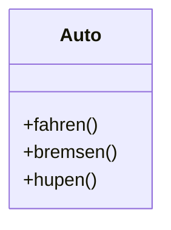
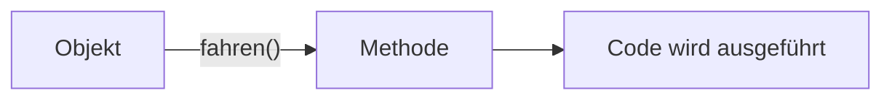

> [!abstract] Lernziel
> Nach diesem Kapitel weißt du:
>
> - Was Methoden sind.
> - Warum Methoden verwendet werden.
> - Wie man Methoden erstellt.
> - Wie Methoden aufgerufen werden.

---

# Was sind Methoden?

Methoden beschreiben das **Verhalten** eines Objekts.

Während Attribute Informationen speichern, führen Methoden Aktionen aus.

Man kann sich Methoden wie **Funktionen** vorstellen, die zu einer Klasse gehören.

---

# Beispiel aus dem Alltag

Ein Auto besitzt Eigenschaften:

- Marke
- Farbe
- PS

Außerdem kann es:

- fahren()
- bremsen()
- hupen()

Die Eigenschaften sind Attribute.

Die Aktionen sind Methoden.

---

# Einfache Methode

```java
public class Auto {

    void fahren() {
        System.out.println("Das Auto fährt.");
    }

}
```

---

# Erklärung

```java
void fahren() {

}
```

| Bestandteil | Bedeutung |
|-------------|-----------|
| void | Die Methode gibt nichts zurück. |
| fahren | Name der Methode. |
| () | Hier könnten Parameter stehen. |
| {} | Hier steht der Programmcode. |

---

# Methode aufrufen

```java
Auto audi = new Auto();

audi.fahren();
```

Ausgabe

```
Das Auto fährt.
```

---

# Mehrere Methoden

```java
public class Auto {

    void fahren() {
        System.out.println("Das Auto fährt.");
    }

    void bremsen() {
        System.out.println("Das Auto bremst.");
    }

    void hupen() {
        System.out.println("Hup!");
    }

}
```

---

# Darstellung



---

# Methoden mit Rückgabewert

Nicht jede Methode besitzt `void`.

Eine Methode kann auch einen Wert zurückgeben.

```java
int geschwindigkeit() {

    return 190;

}
```

---

# Erklärung

```java
int geschwindigkeit() {
    return 190;
}
```

Die Methode liefert einen **int** zurück.

---

# Rückgabewert verwenden

```java
int tempo = audi.geschwindigkeit();

System.out.println(tempo);
```

Ausgabe

```
190
```

---

# Methoden mit Parametern

Methoden können Werte entgegennehmen.

```java
void fahren(int kilometer) {

    System.out.println("Das Auto fährt " + kilometer + " km.");

}
```

Aufruf

```java
audi.fahren(50);
```

Ausgabe

```
Das Auto fährt 50 km.
```

---

# Methoden in unseren Projekten

## 👻 Pac-Man

Methoden:

```java
move();

collectPoint();

draw();
```

---

## 🚢 Schiffe versenken

Methoden:

```java
placeShip();

shoot();

printBoard();
```

---

# Warum Methoden?

Methoden verhindern, dass Code mehrfach geschrieben werden muss.

Statt:

```java
System.out.println("Hallo");
System.out.println("Hallo");
System.out.println("Hallo");
```

kann man schreiben:

```java
void hallo() {
    System.out.println("Hallo");
}

hallo();
hallo();
hallo();
```

Der Code ist dadurch übersichtlicher.

---

# Ablauf



---

# Häufige Fehler

> [!warning] Häufiger Fehler
> Eine Methode wird häufig vergessen aufzurufen.
>
> Sie existiert zwar, wird aber nie ausgeführt.

---

> [!warning] Häufiger Fehler
> Eine Methode mit Rückgabewert benötigt immer `return`.

---

# Merksätze 💡

> [!tip] Merke
> Methoden beschreiben das Verhalten eines Objekts.

---

> [!tip] Merke
> Methoden können Parameter besitzen.

---

> [!tip] Merke
> Methoden können Werte zurückgeben.

---

> [!tip] Merke
> `void` bedeutet, dass nichts zurückgegeben wird.

---

# Mini-Quiz

## 1.

Was beschreibt eine Methode?

> [!spoiler]- Lösung anzeigen
>
> Das Verhalten bzw. die Aktionen eines Objekts.

---

## 2.

Was bedeutet `void`?

> [!spoiler]- Lösung anzeigen
>
> Die Methode gibt keinen Wert zurück.

---

## 3.

Was macht `return`?

> [!spoiler]- Lösung anzeigen
>
> Gibt einen Wert an den Aufrufer zurück.

---

# Übungsaufgaben

## Aufgabe 1

Schreibe eine Methode `essen()`, die "Ich esse." ausgibt.

> [!spoiler]- Lösung anzeigen
>
> ```java
> void essen() {
>     System.out.println("Ich esse.");
> }
> ```

---

## Aufgabe 2

Schreibe eine Methode `addieren()`, die zwei Zahlen addiert und das Ergebnis zurückgibt.

> [!spoiler]- Lösung anzeigen
>
> ```java
> int addieren(int a, int b) {
>     return a + b;
> }
> ```

---

## Aufgabe 3

Welche Methoden könnte eine Klasse `Hund` besitzen?

> [!spoiler]- Lösung anzeigen
>
> Zum Beispiel:
>
> - bellen()
> - laufen()
> - schlafen()
> - fressen()

---

# Zusammenfassung

- Methoden beschreiben das Verhalten eines Objekts.
- Methoden werden über ein Objekt aufgerufen.
- Methoden können Parameter besitzen.
- Methoden können Werte zurückgeben.
- `void` bedeutet, dass kein Wert zurückgegeben wird.

➡️ **Nächstes Kapitel:** `05 Konstruktoren`