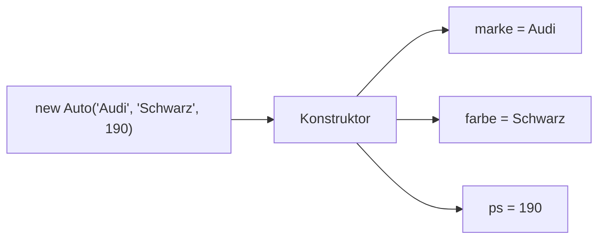

> [!abstract] Lernziel
> Nach diesem Kapitel weißt du:
>
> - Was ein Konstruktor ist.
> - Warum Konstruktoren verwendet werden.
> - Wie man Konstruktoren schreibt.
> - Wie Objekte mit Startwerten erstellt werden.

---

# Was ist ein Konstruktor?

Ein **Konstruktor** ist eine spezielle Methode, die **automatisch aufgerufen wird**, sobald ein neues Objekt erstellt wird.

Er dient dazu, einem Objekt direkt beim Erzeugen Anfangswerte zu geben.

---

# Warum braucht man Konstruktoren?

Ohne Konstruktor:

```java
Auto audi = new Auto();

audi.marke = "Audi";
audi.farbe = "Schwarz";
audi.ps = 190;
```

Mit Konstruktor:

```java
Auto audi = new Auto("Audi", "Schwarz", 190);
```

Der Code ist kürzer und übersichtlicher.

---

# Besonderheiten eines Konstruktors

Ein Konstruktor

- besitzt **denselben Namen wie die Klasse**
- besitzt **keinen Rückgabewert**
- wird **automatisch** ausgeführt

---

# Einfacher Konstruktor

```java
public class Auto {

    Auto() {
        System.out.println("Ein Auto wurde erstellt.");
    }

}
```

---

# Objekt erzeugen

```java
Auto audi = new Auto();
```

Ausgabe

```
Ein Auto wurde erstellt.
```

Der Konstruktor wurde automatisch ausgeführt.

---

# Konstruktor mit Parametern

```java
public class Auto {

    String marke;
    String farbe;
    int ps;

    Auto(String marke, String farbe, int ps) {

        this.marke = marke;
        this.farbe = farbe;
        this.ps = ps;

    }

}
```

---

# Erklärung

```java
Auto(...)
```

Name des Konstruktors.

Er muss genauso heißen wie die Klasse.

---

```java
String marke
```

Parameter.

Hier werden Werte übergeben.

---

```java
this.marke = marke;
```

Der übergebene Wert wird im Attribut gespeichert.

> [!note]
> Das Schlüsselwort **this** lernst du im nächsten Kapitel ausführlich kennen.

---

# Objekt erstellen

```java
Auto audi = new Auto("Audi", "Schwarz", 190);
```

Jetzt besitzt das Objekt sofort alle Werte.

---

# Darstellung



---

# Standardkonstruktor

Schreibt man **keinen Konstruktor**, erzeugt Java automatisch einen **Standardkonstruktor**.

```java
public class Auto {

}
```

Man kann trotzdem schreiben:

```java
Auto audi = new Auto();
```

Sobald man jedoch einen eigenen Konstruktor erstellt, verschwindet der automatische Standardkonstruktor.

---

# Konstruktoren in unseren Projekten

## 👻 Pac-Man

```java
Player pacman = new Player(5, 8);
```

Der Konstruktor könnte direkt die Startposition setzen.

---

## 🚢 Schiffe versenken

```java
Ship ship = new Ship(4);
```

Die Schiffslänge wird direkt beim Erstellen festgelegt.

---

# Warum Konstruktoren?

Konstruktoren sorgen dafür, dass ein Objekt direkt vollständig erstellt wird.

Dadurch entstehen weniger Fehler.

---

# Häufige Fehler

> [!warning] Häufiger Fehler
>
> Ein Konstruktor besitzt **keinen Rückgabewert**.
>
> Falsch:
>
> ```java
> void Auto() {
> }
> ```
>
> Richtig:
>
> ```java
> Auto() {
> }
> ```

---

> [!warning] Häufiger Fehler
>
> Der Name des Konstruktors muss exakt dem Klassennamen entsprechen.

---

# Merksätze 💡

> [!tip] Merke
>
> Ein Konstruktor wird automatisch beim Erzeugen eines Objekts aufgerufen.

---

> [!tip] Merke
>
> Der Konstruktor besitzt denselben Namen wie die Klasse.

---

> [!tip] Merke
>
> Konstruktoren besitzen keinen Rückgabewert.

---

# Mini-Quiz

## 1.

Wann wird ein Konstruktor ausgeführt?

> [!spoiler]- Lösung anzeigen
>
> Automatisch beim Erzeugen eines Objekts.

---

## 2.

Muss ein Konstruktor einen Rückgabewert besitzen?

> [!spoiler]- Lösung anzeigen
>
> Nein.

---

## 3.

Wie muss ein Konstruktor heißen?

> [!spoiler]- Lösung anzeigen
>
> Genau wie die Klasse.

---

# Übungsaufgaben

## Aufgabe 1

Schreibe einen Konstruktor für die Klasse `Person`, der `name` und `alter` übernimmt.

> [!spoiler]- Lösung anzeigen
>
> ```java
> public class Person {
>
>     String name;
>     int alter;
>
>     Person(String name, int alter) {
>         this.name = name;
>         this.alter = alter;
>     }
> }
> ```

---

## Aufgabe 2

Erzeuge ein Objekt der Klasse `Person`.

> [!spoiler]- Lösung anzeigen
>
> ```java
> Person p = new Person("Max", 20);
> ```

---

## Aufgabe 3

Warum sind Konstruktoren praktisch?

> [!spoiler]- Lösung anzeigen
>
> Weil Objekte direkt mit gültigen Startwerten erstellt werden können und der Code übersichtlicher wird.

---

# Zusammenfassung

- Konstruktoren werden automatisch beim Erzeugen eines Objekts aufgerufen.
- Sie besitzen denselben Namen wie die Klasse.
- Sie haben keinen Rückgabewert.
- Mit Konstruktoren können Objekte direkt mit Startwerten erstellt werden.
- Ohne eigenen Konstruktor erzeugt Java automatisch einen Standardkonstruktor.

➡️ **Nächstes Kapitel:** `06 this`