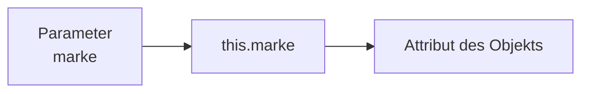
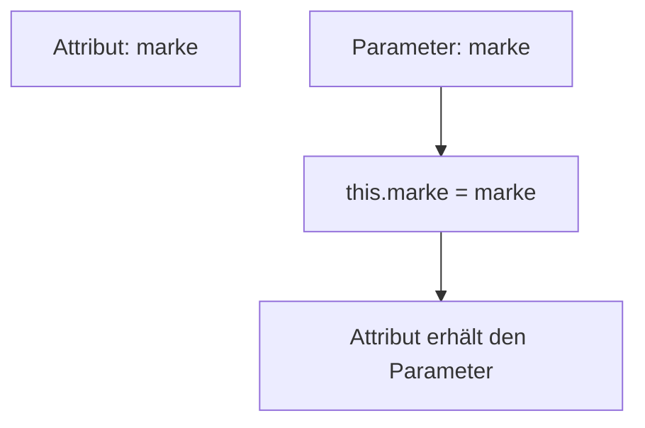

> [!abstract] Lernziel
> Nach diesem Kapitel weißt du:
>
> - Was `this` bedeutet.
> - Wann `this` verwendet wird.
> - Warum `this` häufig in Konstruktoren vorkommt.
> - Wann `this` nicht notwendig ist.

---

# Was bedeutet `this`?

`this` ist eine Referenz auf **das aktuelle Objekt**.

Mit `this` greift man auf die Attribute oder Methoden **des eigenen Objekts** zu.

---

# Warum braucht man `this`?

Schauen wir uns zuerst dieses Beispiel an:

```java
public class Auto {

    String marke;

    Auto(String marke) {

        marke = marke;

    }

}
```

Was passiert hier?

Eigentlich sollte das Attribut `marke` den Wert erhalten.

Das passiert aber **nicht**.

Warum?

Weil Java nicht weiß, welche `marke` gemeint ist.

Es existieren nämlich zwei Variablen mit demselben Namen:

- das Attribut
- der Parameter

---

# Die Lösung

```java
public class Auto {

    String marke;

    Auto(String marke) {

        this.marke = marke;

    }

}
```

Jetzt ist eindeutig:

```java
this.marke
```

→ Attribut des Objekts

```java
marke
```

→ Parameter des Konstruktors

---

# Darstellung



---

# Beispiel

```java
Auto audi = new Auto("Audi");
```

Der Konstruktor erhält:

```
marke = "Audi"
```

Dann passiert:

```java
this.marke = marke;
```

Also:

```
Attribut = Parameter
```

Ergebnis:

```
marke = Audi
```

---

# this bei mehreren Attributen

```java
public class Auto {

    String marke;
    String farbe;
    int ps;

    Auto(String marke, String farbe, int ps) {

        this.marke = marke;
        this.farbe = farbe;
        this.ps = ps;

    }

}
```

So sieht man `this` in der Praxis am häufigsten.

---

# this bei Methoden

`this` kann auch Methoden des aktuellen Objekts aufrufen.

```java
public class Auto {

    void starten() {

        this.fahren();

    }

    void fahren() {

        System.out.println("Das Auto fährt.");

    }

}
```

Das `this` ist hier optional.

Auch das funktioniert:

```java
fahren();
```

---

# Wann braucht man `this`?

| Situation | `this` notwendig? |
|-----------|------------------|
| Attribut und Parameter heißen gleich | ✅ Ja |
| Auf Methode des eigenen Objekts zugreifen | ❌ Optional |
| Auf Attribut des eigenen Objekts zugreifen | ❌ Optional (wenn kein Namenskonflikt besteht) |

---

# Beispiel ohne `this`

```java
public class Auto {

    String marke;

    void anzeigen() {

        System.out.println(marke);

    }

}
```

Hier reicht einfach:

```java
marke
```

Da kein Parameter mit demselben Namen existiert.

---

# Beispiel mit `this`

```java
public class Auto {

    String marke;

    void anzeigen(String marke) {

        this.marke = marke;

    }

}
```

Jetzt ist `this` notwendig.

---

# Darstellung



---

# this in unseren Projekten

## 👻 Pac-Man

```java
Player(int x, int y) {

    this.x = x;
    this.y = y;

}
```

---

## 🚢 Schiffe versenken

```java
Ship(int length) {

    this.length = length;

}
```

---

# Häufige Fehler

> [!warning] Häufiger Fehler
>
> Viele denken, `this` sei immer notwendig.
>
> Das stimmt nicht.

---

> [!warning] Häufiger Fehler
>
> Ohne `this` werden bei gleichnamigen Parametern die Attribute nicht verändert.

---

# Merksätze 💡

> [!tip] Merke
>
> `this` bezeichnet immer das aktuelle Objekt.

---

> [!tip] Merke
>
> `this` wird hauptsächlich verwendet, um Attribute und Parameter auseinanderzuhalten.

---

> [!tip] Merke
>
> Ohne Namenskonflikt kann `this` oft weggelassen werden.

---

# Mini-Quiz

## 1.

Wofür steht `this`?

> [!spoiler]- Lösung anzeigen
>
> Für das aktuelle Objekt.

---

## 2.

Warum schreibt man häufig

```java
this.marke = marke;
```

> [!spoiler]- Lösung anzeigen
>
> Damit das Attribut und der Parameter eindeutig unterschieden werden.

---

## 3.

Ist `this` immer notwendig?

> [!spoiler]- Lösung anzeigen
>
> Nein.
>
> Nur wenn ein Namenskonflikt besteht oder man das aktuelle Objekt ausdrücklich ansprechen möchte.

---

# Übungsaufgaben

## Aufgabe 1

Warum funktioniert folgender Konstruktor nicht wie erwartet?

```java
Person(String name) {

    name = name;

}
```

> [!spoiler]- Lösung anzeigen
>
> Beide `name` beziehen sich auf den Parameter.
>
> Das Attribut wird nie verändert.
>
> Richtig wäre:
>
> ```java
> this.name = name;
> ```

---

## Aufgabe 2

Erstelle einen Konstruktor für eine Klasse `Hund` mit den Attributen `name` und `alter`.

> [!spoiler]- Lösung anzeigen
>
> ```java
> public class Hund {
>
>     String name;
>     int alter;
>
>     Hund(String name, int alter) {
>
>         this.name = name;
>         this.alter = alter;
>
>     }
> }
> ```

---

# Zusammenfassung

- `this` verweist auf das aktuelle Objekt.
- Meist wird `this` in Konstruktoren verwendet.
- `this` hilft dabei, Attribute und Parameter mit gleichem Namen zu unterscheiden.
- Ohne Namenskonflikt kann `this` häufig weggelassen werden.

➡️ **Nächstes Kapitel:** `07 Kapselung`