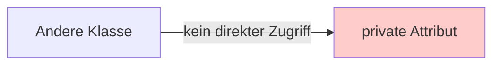
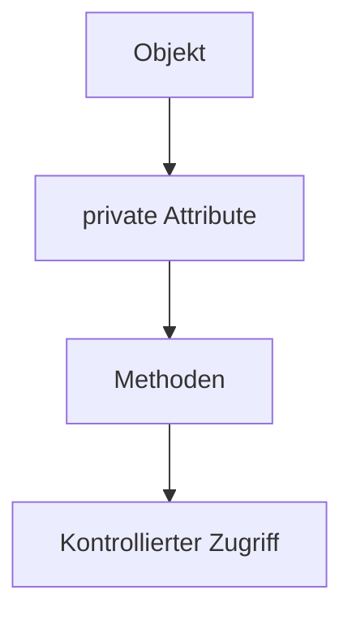

> [!abstract] Lernziel
> Nach diesem Kapitel weißt du:
>
> - Was Kapselung bedeutet.
> - Warum Attribute geschützt werden.
> - Warum `private` verwendet wird.
> - Welche Vorteile Kapselung bietet.

---

# Was ist Kapselung?

**Kapselung** bedeutet, dass die Daten eines Objekts geschützt werden.

Andere Klassen sollen **nicht direkt** auf wichtige Attribute zugreifen können.

Stattdessen erfolgt der Zugriff kontrolliert über Methoden.

---

# Warum Kapselung?

Stell dir ein Bankkonto vor.

Das Guthaben sollte **nicht jeder beliebig verändern können**.

Falsch wäre:

```java
konto.guthaben = -1000000;
```

Dadurch könnten ungültige Werte entstehen.

Deshalb werden Attribute geschützt.

---

# Ohne Kapselung

```java
public class Auto {

    String marke;
    int ps;

}
```

Jetzt kann jeder schreiben:

```java
Auto auto = new Auto();

auto.ps = -500;
```

Das ergibt keinen Sinn.

---

# Mit Kapselung

```java
public class Auto {

    private String marke;
    private int ps;

}
```

Jetzt sind die Attribute geschützt.

Von außerhalb funktioniert Folgendes **nicht mehr**:

```java
auto.ps = 190;
```

Java meldet einen Fehler.

---

# Darstellung



---

# private

Das Schlüsselwort

```java
private
```

bedeutet:

Nur die eigene Klasse darf auf dieses Attribut zugreifen.

---

# Warum ist das sinnvoll?

Dadurch kann verhindert werden, dass ungültige Werte gespeichert werden.

Beispiel:

```java
private int alter;
```

Ohne Kontrolle könnte jemand schreiben:

```java
alter = -10;
```

Das wäre unsinnig.

---

# Kapselung in unseren Projekten

## 👻 Pac-Man

```java
private int score;
```

Der Punktestand soll nicht beliebig verändert werden.

---

## 🚢 Schiffe versenken

```java
private int length;
private boolean destroyed;
```

Auch diese Werte sollten geschützt sein.

---

# Vorteile der Kapselung

- Schutz der Daten
- Weniger Fehler
- Bessere Kontrolle
- Wartbarer Code
- Änderungen sind einfacher möglich

---

# Darstellung



---

# In der Praxis

Heute werden Attribute fast immer so geschrieben:

```java
private String marke;
private int ps;
private String farbe;
```

Der Zugriff erfolgt anschließend über **Getter** und **Setter**.

Diese lernst du im nächsten Kapitel kennen.

---

# Häufige Fehler

> [!warning] Häufiger Fehler
>
> Anfänger machen Attribute häufig `public`.
>
> In der Praxis werden Attribute meistens `private` geschrieben.

---

> [!warning] Häufiger Fehler
>
> Kapselung bedeutet **nicht**, dass niemand auf die Daten zugreifen darf.
>
> Der Zugriff erfolgt lediglich kontrolliert.

---

# Merksätze 💡

> [!tip] Merke
>
> Kapselung schützt die Daten eines Objekts.

---

> [!tip] Merke
>
> Attribute werden in Java meistens `private` geschrieben.

---

> [!tip] Merke
>
> Der Zugriff erfolgt kontrolliert über Methoden.

---

# Mini-Quiz

## 1.

Was bedeutet Kapselung?

> [!spoiler]- Lösung anzeigen
>
> Daten eines Objekts werden geschützt und können nicht beliebig verändert werden.

---

## 2.

Welches Schlüsselwort wird meistens für Attribute verwendet?

> [!spoiler]- Lösung anzeigen
>
> `private`

---

## 3.

Warum ist Kapselung sinnvoll?

> [!spoiler]- Lösung anzeigen
>
> Damit keine ungültigen oder unerwünschten Werte gespeichert werden.

---

# Übungsaufgaben

## Aufgabe 1

Warum sollte folgendes Attribut nicht `public` sein?

```java
public int kontostand;
```

> [!spoiler]- Lösung anzeigen
>
> Jeder könnte den Kontostand beliebig verändern.
>
> Besser:
>
> ```java
> private int kontostand;
> ```

---

## Aufgabe 2

Schreibe eine Klasse `Person` mit zwei privaten Attributen.

> [!spoiler]- Lösung anzeigen
>
> ```java
> public class Person {
>
>     private String name;
>     private int alter;
>
> }
> ```

---

## Aufgabe 3

Warum verwendet man `private`?

> [!spoiler]- Lösung anzeigen
>
> Um Attribute vor unkontrolliertem Zugriff zu schützen.

---

# Zusammenfassung

- Kapselung schützt die Daten eines Objekts.
- Attribute werden meist `private` deklariert.
- Direkter Zugriff von außen ist nicht möglich.
- Der Zugriff erfolgt kontrolliert über Methoden.
- Im nächsten Kapitel lernst du Getter und Setter kennen.

➡️ **Nächstes Kapitel:** `08 Getter & Setter`