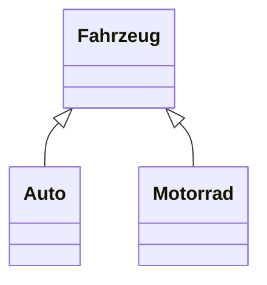
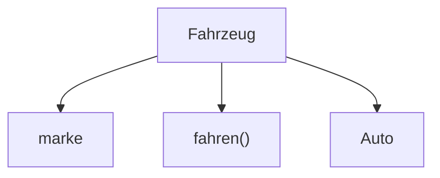
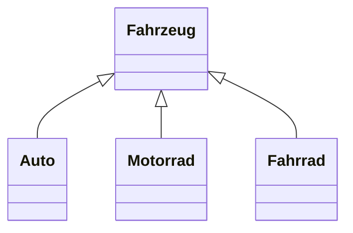

> [!abstract] Lernziel
> Nach diesem Kapitel weißt du:
>
> - Was Vererbung ist.
> - Warum Vererbung verwendet wird.
> - Wie Vererbung in Java funktioniert.
> - Welche Vorteile Vererbung bietet.

---

# Was ist Vererbung?

Vererbung bedeutet, dass eine Klasse die Eigenschaften und Methoden einer anderen Klasse übernimmt.

Dadurch muss gemeinsamer Code nicht mehrfach geschrieben werden.

Man spricht dabei von einer **Oberklasse (Superklasse)** und einer **Unterklasse (Subklasse)**.

---

# Beispiel aus dem Alltag

Alle Fahrzeuge besitzen:

- Räder
- Farbe
- Geschwindigkeit

Ein Auto ist ein Fahrzeug.

Ein Motorrad ist ebenfalls ein Fahrzeug.

Statt diese Eigenschaften mehrfach zu schreiben, werden sie in einer gemeinsamen Klasse gespeichert.

---

# Darstellung



---

# Oberklasse

```java
public class Fahrzeug {

    protected String marke;

    public void fahren() {
        System.out.println("Das Fahrzeug fährt.");
    }

}
```

---

# Unterklasse

```java
public class Auto extends Fahrzeug {

}
```

Das Schlüsselwort

```java
extends
```

bedeutet:

> Die Klasse **Auto** erbt von der Klasse **Fahrzeug**.

---

# Was wird vererbt?

Die Klasse `Auto` besitzt automatisch:

- marke
- fahren()

Obwohl beides nicht erneut geschrieben wurde.

---

# Beispiel

```java
Auto audi = new Auto();

audi.marke = "Audi";

audi.fahren();
```

Ausgabe

```
Das Fahrzeug fährt.
```

---

# Darstellung



---

# Eigene Methoden hinzufügen

Eine Unterklasse kann eigene Methoden besitzen.

```java
public class Auto extends Fahrzeug {

    public void hupen() {

        System.out.println("Hup!");

    }

}
```

Jetzt besitzt `Auto`:

- marke
- fahren()
- hupen()

---

# Mehrere Unterklassen



Alle Klassen übernehmen gemeinsame Eigenschaften.

---

# Vererbung in unseren Projekten

## 👻 Pac-Man

Mögliche Struktur:

```text
Spielfigur
│
├── Player
└── Ghost
```

Beide besitzen:

- Position
- Geschwindigkeit

Der `Player` und die `Ghost`-Klassen können zusätzlich eigenes Verhalten besitzen.

---

## 🚢 Schiffe versenken

Eine mögliche Struktur wäre:

```text
Spieler
│
├── Mensch
└── Computer
```

Beide besitzen:

- Name
- Spielfeld

Der Computer besitzt zusätzlich eine KI.

---

# Vorteile der Vererbung

- Weniger Code
- Höhere Wiederverwendbarkeit
- Einfachere Wartung
- Gemeinsame Eigenschaften müssen nur einmal geschrieben werden

---

# Häufige Fehler

> [!warning] Häufiger Fehler
>
> Vererbung bedeutet **nicht**, dass Klassen identisch sind.
>
> Unterklassen können zusätzliche Attribute und Methoden besitzen.

---

> [!warning] Häufiger Fehler
>
> In Java kann eine Klasse nur von **einer** Klasse erben.

---

# Merksätze 💡

> [!tip] Merke
>
> Vererbung spart Code.

---

> [!tip] Merke
>
> Die Oberklasse enthält gemeinsame Eigenschaften.

---

> [!tip] Merke
>
> Unterklassen können zusätzliche Methoden besitzen.

---

# Mini-Quiz

## 1.

Welches Schlüsselwort wird für Vererbung verwendet?

> [!spoiler]- Lösung anzeigen
>
> `extends`

---

## 2.

Wer besitzt die gemeinsamen Eigenschaften?

> [!spoiler]- Lösung anzeigen
>
> Die Oberklasse (Superklasse).

---

## 3.

Kann eine Unterklasse eigene Methoden besitzen?

> [!spoiler]- Lösung anzeigen
>
> Ja.
>
> Sie übernimmt die Methoden der Oberklasse und kann zusätzliche Methoden hinzufügen.

---

# Übungsaufgaben

## Aufgabe 1

Erstelle eine Oberklasse `Tier` und eine Unterklasse `Hund`.

> [!spoiler]- Lösung anzeigen
>
> ```java
> public class Tier {
>
>     public void fressen() {
>         System.out.println("Das Tier frisst.");
>     }
>
> }
>
> public class Hund extends Tier {
>
> }
> ```

---

## Aufgabe 2

Warum ist Vererbung sinnvoll?

> [!spoiler]- Lösung anzeigen
>
> Weil gemeinsamer Code nur einmal geschrieben werden muss und dadurch Programme übersichtlicher und leichter wartbar sind.

---

## Aufgabe 3

Welche gemeinsamen Eigenschaften könnten `Auto` und `Motorrad` besitzen?

> [!spoiler]- Lösung anzeigen
>
> Zum Beispiel:
>
> - Marke
> - Farbe
> - Geschwindigkeit
> - fahren()

---

# Zusammenfassung

- Vererbung ermöglicht das Übernehmen von Eigenschaften und Methoden einer anderen Klasse.
- Das Schlüsselwort `extends` wird für Vererbung verwendet.
- Gemeinsamer Code wird in der Oberklasse gespeichert.
- Unterklassen können zusätzliche Eigenschaften und Methoden besitzen.
- Vererbung verbessert die Wiederverwendbarkeit und Wartbarkeit des Codes.

➡️ **Nächstes Kapitel:** `10 Polymorphie`