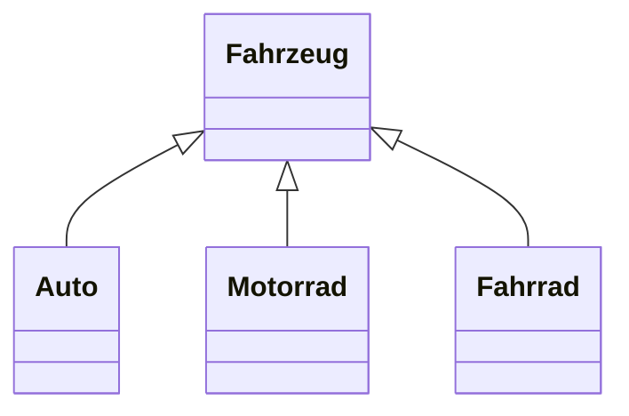
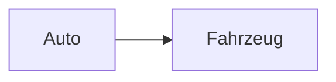
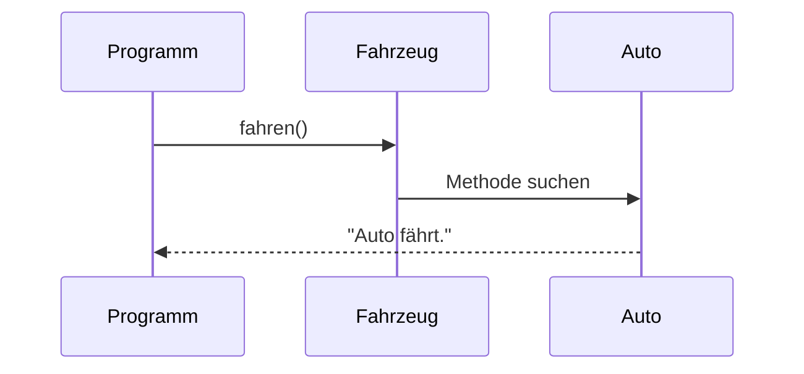

> [!abstract] Lernziel
> Nach diesem Kapitel weißt du:
>
> - Was Polymorphie bedeutet.
> - Warum Polymorphie verwendet wird.
> - Wie Polymorphie in Java funktioniert.
> - Welche Vorteile sie bietet.

---

# Was ist Polymorphie?

**Polymorphie** bedeutet übersetzt:

> **Viele Formen**

In der Objektorientierung bedeutet das:

Ein Objekt kann **über den Typ seiner Oberklasse** angesprochen werden.

Dadurch können verschiedene Unterklassen ein gemeinsames Verhalten besitzen.

---

# Beispiel aus dem Alltag

Stell dir verschiedene Fahrzeuge vor.

Es gibt:

- Auto
- Motorrad
- Fahrrad

Alle sind Fahrzeuge.

Deshalb kann man sagen:

> Ein Auto ist ein Fahrzeug.

> Ein Motorrad ist ein Fahrzeug.

> Ein Fahrrad ist ein Fahrzeug.

---

# Darstellung



---

# Klassen

```java
public class Fahrzeug {

    public void fahren() {
        System.out.println("Das Fahrzeug fährt.");
    }

}
```

```java
public class Auto extends Fahrzeug {

}
```

---

# Polymorphie

Normalerweise schreibt man:

```java
Auto audi = new Auto();
```

Mit Polymorphie:

```java
Fahrzeug audi = new Auto();
```

Warum funktioniert das?

Weil ein **Auto ein Fahrzeug ist**.

---

# Darstellung



---

# Methoden überschreiben

Jetzt wird es interessant.

```java
public class Fahrzeug {

    public void fahren() {

        System.out.println("Fahrzeug fährt.");

    }

}
```

```java
public class Auto extends Fahrzeug {

    @Override
    public void fahren() {

        System.out.println("Auto fährt.");

    }

}
```

---

# Aufruf

```java
Fahrzeug audi = new Auto();

audi.fahren();
```

Ausgabe

```
Auto fährt.
```

Obwohl die Variable den Typ `Fahrzeug` besitzt.

Java verwendet automatisch die Methode der tatsächlichen Objektklasse.

Das nennt man **Polymorphie**.

---

# Darstellung



---

# Mehrere Objekte

```java
Fahrzeug[] fahrzeuge = {

    new Auto(),
    new Motorrad(),
    new Fahrrad()

};
```

Jetzt können alle Objekte gleich behandelt werden.

---

# Schleife

```java
for(Fahrzeug f : fahrzeuge){

    f.fahren();

}
```

Ausgabe

```
Auto fährt.

Motorrad fährt.

Fahrrad fährt.
```

Dies ist einer der größten Vorteile der Polymorphie.

---

# Polymorphie in unseren Projekten

## 👻 Pac-Man

```
Spielfigur

│

├── Player

└── Ghost
```

Alle Spielfiguren könnten besitzen:

```java
move();
draw();
```

Jede Klasse führt diese Methoden unterschiedlich aus.

---

## 🚢 Schiffe versenken

```
Spieler

│

├── Mensch

└── Computer
```

Beide besitzen:

```java
spielen();
```

Der Mensch wartet auf Eingaben.

Der Computer berechnet seinen Zug.

---

# Vorteile

- Einheitlicher Code
- Weniger Bedingungen
- Bessere Erweiterbarkeit
- Wiederverwendbarkeit

---

# Häufige Fehler

> [!warning] Häufiger Fehler
>
> Polymorphie funktioniert nur mit Vererbung oder Interfaces.

---

> [!warning] Häufiger Fehler
>
> Der Typ der Variablen bestimmt **nicht**, welche Methode ausgeführt wird.
>
> Entscheidend ist die tatsächliche Objektklasse.

---

# Merksätze 💡

> [!tip] Merke
>
> Polymorphie bedeutet "Viele Formen".

---

> [!tip] Merke
>
> Eine Oberklassen-Referenz kann auf Objekte ihrer Unterklassen zeigen.

---

> [!tip] Merke
>
> Java führt immer die Methode des tatsächlichen Objekts aus.

---

# Mini-Quiz

## 1.

Was bedeutet Polymorphie?

> [!spoiler]- Lösung anzeigen
>
> Viele Formen.
>
> Ein Objekt kann über den Typ seiner Oberklasse angesprochen werden.

---

## 2.

Ist folgender Code gültig?

```java
Fahrzeug auto = new Auto();
```

> [!spoiler]- Lösung anzeigen
>
> Ja.

---

## 3.

Welche Ausgabe erzeugt dieser Code?

```java
Fahrzeug auto = new Auto();

auto.fahren();
```

wenn `Auto` die Methode überschreibt?

> [!spoiler]- Lösung anzeigen
>
> Die Methode der Klasse `Auto` wird ausgeführt.

---

# Übungsaufgaben

## Aufgabe 1

Warum funktioniert

```java
Tier tier = new Hund();
```

> [!spoiler]- Lösung anzeigen
>
> Weil ein Hund ein Tier ist.

---

## Aufgabe 2

Nenne drei Klassen, die von `Fahrzeug` erben könnten.

> [!spoiler]- Lösung anzeigen
>
> Zum Beispiel:
>
> - Auto
> - Motorrad
> - Fahrrad

---

## Aufgabe 3

Warum ist Polymorphie nützlich?

> [!spoiler]- Lösung anzeigen
>
> Weil verschiedene Objekte über denselben Typ verwaltet werden können und trotzdem ihr eigenes Verhalten besitzen.

---

# Zusammenfassung

- Polymorphie bedeutet „Viele Formen“.
- Eine Oberklassen-Referenz kann auf Unterklassen-Objekte zeigen.
- Überschriebene Methoden werden zur Laufzeit anhand des tatsächlichen Objekts ausgewählt.
- Polymorphie macht Programme flexibler und leichter erweiterbar.

➡️ **Nächstes Kapitel:** `11 Abstrakte Klassen`