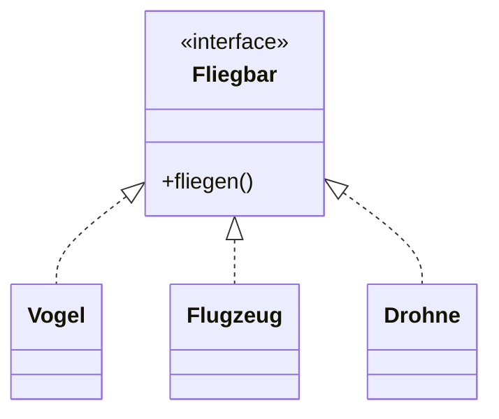
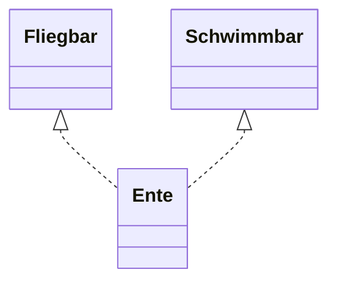

> [!abstract] Lernziel
> Nach diesem Kapitel weißt du:
>
> - Was ein Interface ist.
> - Warum Interfaces verwendet werden.
> - Wie Interfaces in Java erstellt werden.
> - Wann man Interfaces statt Vererbung verwendet.

---

# Was ist ein Interface?

Ein **Interface** beschreibt einen Vertrag.

Es legt fest, **welche Methoden eine Klasse besitzen muss**, aber nicht **wie** diese Methoden umgesetzt werden.

Eine Klasse, die ein Interface implementiert, muss alle darin definierten Methoden bereitstellen.

---

# Warum braucht man Interfaces?

Stell dir vor, verschiedene Klassen können fliegen.

Zum Beispiel:

- Vogel
- Flugzeug
- Drohne

Alle können fliegen.

Sie sind aber völlig unterschiedliche Objekte.

Deshalb wäre Vererbung hier unpassend.

Ein Interface beschreibt stattdessen einfach die Fähigkeit:

```
Fliegen
```

---

# Darstellung



---

# Interface erstellen

```java
public interface Fliegbar {

    void fliegen();

}
```

Ein Interface enthält Methoden ohne Implementierung.

---

# Interface implementieren

```java
public class Vogel implements Fliegbar {

    @Override
    public void fliegen() {

        System.out.println("Der Vogel fliegt.");

    }

}
```

---

# Erklärung

```java
implements
```

bedeutet:

> Diese Klasse erfüllt den Vertrag des Interfaces.

---

# Objekt erzeugen

```java
Vogel vogel = new Vogel();

vogel.fliegen();
```

Ausgabe

```
Der Vogel fliegt.
```

---

# Mehrere Interfaces

Eine Klasse kann mehrere Interfaces implementieren.

```java
public interface Schwimmbar {

    void schwimmen();

}
```

```java
public interface Fliegbar {

    void fliegen();

}
```

```java
public class Ente implements Fliegbar, Schwimmbar {

    @Override
    public void fliegen() {
        System.out.println("Die Ente fliegt.");
    }

    @Override
    public void schwimmen() {
        System.out.println("Die Ente schwimmt.");
    }

}
```

---

# Darstellung



---

# Interfaces in unseren Projekten

## 👻 Pac-Man

Ein mögliches Interface:

```java
public interface Bewegbar {

    void move();

}
```

Dieses Interface könnten implementieren:

- Player
- Ghost

---

## 🚢 Schiffe versenken

Ein mögliches Interface:

```java
public interface Schiessbar {

    void schiessen();

}
```

Dieses Interface könnten implementieren:

- Mensch
- Computer

Beide schießen unterschiedlich, besitzen aber dieselbe Methode.

---

# Interface oder Vererbung?

| Vererbung | Interface |
|------------|-----------|
| beschreibt eine **Ist-ein**-Beziehung | beschreibt eine **Kann-etwas**-Beziehung |
| `extends` | `implements` |
| nur eine Oberklasse möglich | mehrere Interfaces möglich |

---

## Beispiel

Vererbung:

```
Auto ist ein Fahrzeug.
```

✅ sinnvoll

---

Interface:

```
Auto kann fahren.
```

✅ sinnvoll

---

Falsch wäre:

```
Auto erbt von Fliegen.
```

❌

Fliegen ist keine Oberklasse, sondern eine Fähigkeit.

---

# Vorteile

- Klassen bleiben flexibel.
- Mehrfachimplementierung möglich.
- Gemeinsame Fähigkeiten können beschrieben werden.
- Lose Kopplung zwischen Klassen.

---

# Häufige Fehler

> [!warning] Häufiger Fehler
>
> Interfaces werden mit Vererbung verwechselt.
>
> Ein Interface beschreibt keine Oberklasse.

---

> [!warning] Häufiger Fehler
>
> Interfaces werden mit `implements` eingebunden.
>
> Nicht mit `extends`.

---

# Merksätze 💡

> [!tip] Merke
>
> Ein Interface beschreibt einen Vertrag.

---

> [!tip] Merke
>
> Klassen implementieren Interfaces mit `implements`.

---

> [!tip] Merke
>
> Eine Klasse kann mehrere Interfaces implementieren.

---

> [!tip] Merke
>
> Interfaces beschreiben Fähigkeiten.

---

# Mini-Quiz

## 1.

Welches Schlüsselwort verwendet man für Interfaces?

> [!spoiler]- Lösung anzeigen
>
> `implements`

---

## 2.

Kann eine Klasse mehrere Interfaces implementieren?

> [!spoiler]- Lösung anzeigen
>
> Ja.

---

## 3.

Beschreibt ein Interface eine Klasse oder eine Fähigkeit?

> [!spoiler]- Lösung anzeigen
>
> Eine Fähigkeit.

---

# Übungsaufgaben

## Aufgabe 1

Erstelle ein Interface `Laufbar` mit der Methode `laufen()`.

> [!spoiler]- Lösung anzeigen
>
> ```java
> public interface Laufbar {
>
>     void laufen();
>
> }
> ```

---

## Aufgabe 2

Erstelle eine Klasse `Hund`, die `Laufbar` implementiert.

> [!spoiler]- Lösung anzeigen
>
> ```java
> public class Hund implements Laufbar {
>
>     @Override
>     public void laufen() {
>         System.out.println("Der Hund läuft.");
>     }
>
> }
> ```

---

## Aufgabe 3

Wann verwendet man eher ein Interface als Vererbung?

> [!spoiler]- Lösung anzeigen
>
> Wenn verschiedene Klassen dieselbe Fähigkeit besitzen sollen, aber keine gemeinsame Oberklasse benötigen.

---

# Zusammenfassung

- Ein Interface beschreibt einen Vertrag.
- Interfaces definieren Methoden ohne Implementierung.
- Klassen verwenden `implements`, um ein Interface umzusetzen.
- Eine Klasse kann mehrere Interfaces implementieren.
- Interfaces beschreiben Fähigkeiten, nicht Verwandtschaft.

➡️ **Nächstes Kapitel:** `13 Beziehungen zwischen Klassen`