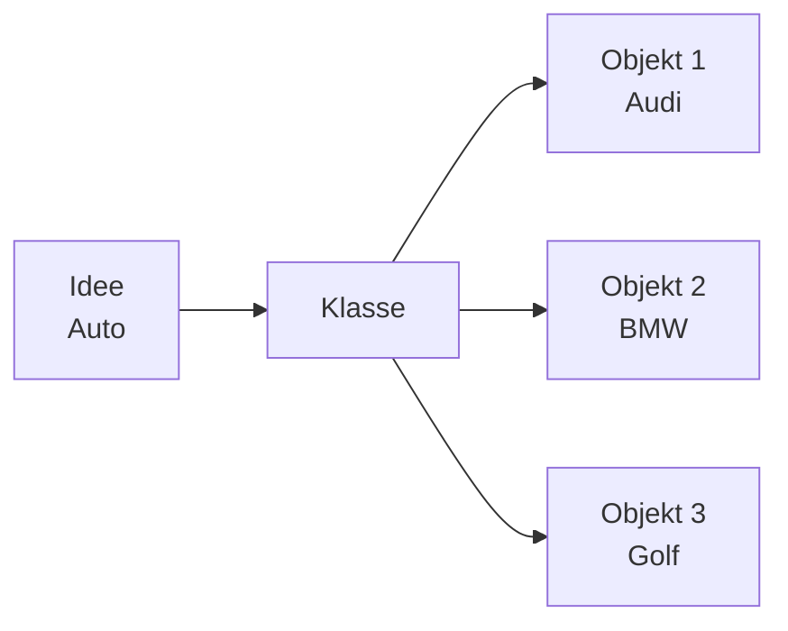
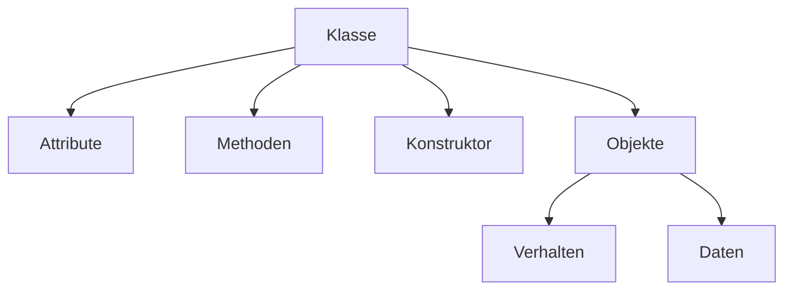
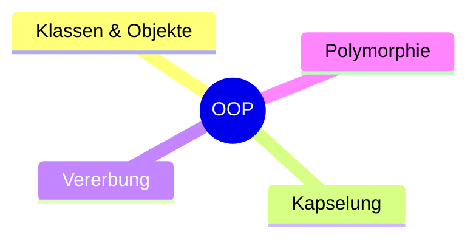

> [!info] Lernziel
> Nach diesem Kapitel weißt du:
> - Was objektorientierte Programmierung (OOP) ist.
> - Warum OOP verwendet wird.
> - Welche Grundbegriffe es gibt.
> - Welche Themen dich im weiteren Verlauf erwarten.

---

# Was ist OOP?

**OOP (Objektorientierte Programmierung)** ist ein Programmierparadigma.

Dabei wird ein Programm aus **Klassen** und **Objekten** aufgebaut.

Anstatt nur Anweisungen nacheinander auszuführen, modelliert man reale oder abstrakte Dinge als Objekte.

Beispiele:

- 🚗 Auto
- 👤 Person
- 🐶 Hund
- 👻 Pac-Man
- 🚢 Schiff

Jedes Objekt besitzt:

- Eigenschaften (**Attribute**)
- Fähigkeiten (**Methoden**)

---

# Warum OOP?

Bei kleinen Programmen könnte man alles in eine einzige Datei schreiben.

Bei größeren Projekten wird das jedoch schnell unübersichtlich.

OOP hilft dabei, Programme sinnvoll zu strukturieren.

## Vorteile

- übersichtlicher Code
- bessere Wartbarkeit
- Wiederverwendbarkeit
- einfachere Erweiterbarkeit
- realitätsnahe Modellierung

---

# Beispiel aus dem Alltag

Ein Auto besitzt Eigenschaften:

- Marke
- Farbe
- Geschwindigkeit

Außerdem kann es:

- fahren()
- bremsen()
- hupen()

In Java könnte das später so aussehen:

```java
Auto audi = new Auto();

audi.fahren();
audi.bremsen();
```

---

# OOP in unseren Projekten

## 👻 Pac-Man

Klassen:

- Player
- Board
- Ghost
- Game

---

## 🚢 Schiffe versenken

Klassen:

- Player
- Ship
- Board
- Computer
- Game

---

## 🧠 Lerntrainer

Klassen:

- User
- Quiz
- Question
- Answer

---

# Die wichtigsten Begriffe

| Begriff | Bedeutung |
|----------|-----------|
| Klasse | Bauplan eines Objekts |
| Objekt | Konkrete Instanz einer Klasse |
| Attribut | Eigenschaft eines Objekts |
| Methode | Fähigkeit eines Objekts |
| Konstruktor | Erstellt ein Objekt |
| Vererbung | Eine Klasse übernimmt Eigenschaften einer anderen |
| Polymorphie | Gleiches Verhalten unterschiedlicher Klassen |
| Kapselung | Schutz der Daten |

---

# Von der Idee zum Objekt



---

# Zusammenhang



---

# Die vier Säulen der OOP



Diese vier Konzepte bilden die Grundlage der objektorientierten Programmierung.

---

# Roadmap

Im nächsten Kapitel beschäftigen wir uns Schritt für Schritt mit allen wichtigen OOP-Themen.

| Kapitel | Thema |
|---------:|-------|
| 01 | Klasse |
| 02 | Objekte |
| 03 | Attribute |
| 04 | Methoden |
| 05 | Konstruktoren |
| 06 | this |
| 07 | Kapselung |
| 08 | Getter & Setter |
| 09 | Vererbung |
| 10 | Polymorphie |
| 11 | Abstrakte Klassen |
| 12 | Interfaces |
| 13 | Beziehungen zwischen Klassen |

---

# Merksätze 💡

> Eine **Klasse** ist ein Bauplan.

> Ein **Objekt** ist eine konkrete Instanz einer Klasse.

> **Attribute** beschreiben den Zustand eines Objekts.

> **Methoden** beschreiben das Verhalten eines Objekts.

> OOP hilft dabei, große Programme übersichtlich und wartbar zu entwickeln.

---

# Mini-Quiz

## 1.

Ist **Auto** eine Klasse oder ein Objekt?

<details>
<summary>Antwort</summary>

Klasse.

</details>

---

## 2.

Ist ein schwarzer Audi A4 eine Klasse oder ein Objekt?

<details>
<summary>Antwort</summary>

Objekt.

</details>

---

## 3.

Was beschreibt ein Attribut?

<details>
<summary>Antwort</summary>

Eine Eigenschaft eines Objekts.

</details>

---

# Zusammenfassung

- OOP besteht aus Klassen und Objekten.
- Objekte besitzen Attribute und Methoden.
- OOP sorgt für gut strukturierte Programme.
- Die folgenden Kapitel erklären jedes Thema im Detail.

➡️ **Nächstes Kapitel:** `01 Klasse`