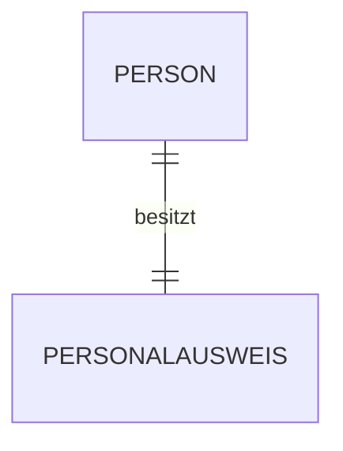
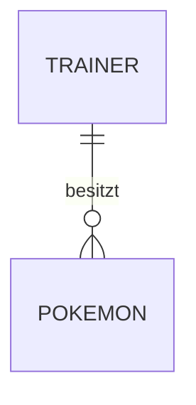
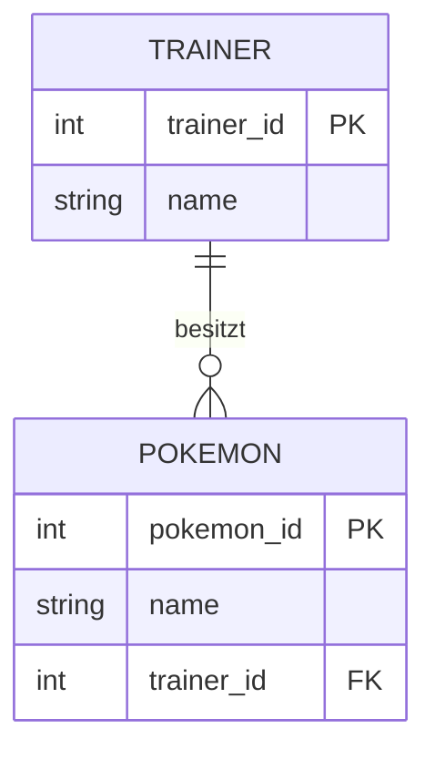
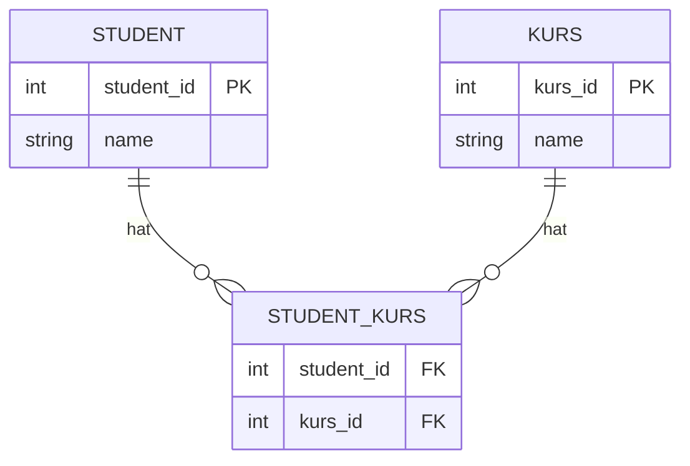
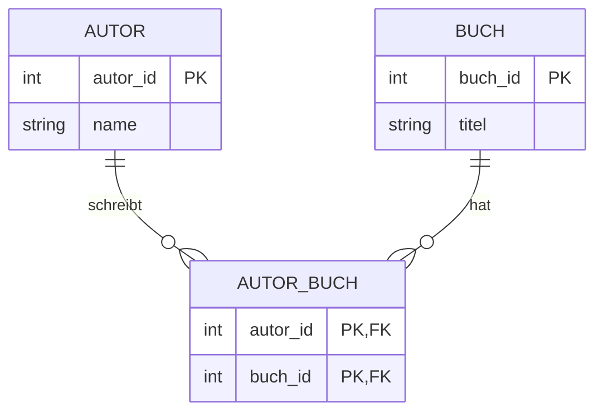

## Warum gibt es Beziehungen?

In relationalen Datenbanken werden Informationen auf mehrere Tabellen verteilt.

Zum Beispiel:

```text
Trainer
Pokemon
```

Statt den Namen des Trainers bei jedem Pokémon erneut zu speichern, verbinden wir die Tabellen über Schlüssel.

Dafür verwenden wir:

- `PRIMARY KEY`
- `FOREIGN KEY`

---

# 1:1-Beziehung

Bei einer **1:1-Beziehung** gehört ein Datensatz genau zu einem anderen Datensatz.

Beispiel:

> Eine Person besitzt genau einen Personalausweis.



Das bedeutet:

```text
Person 1 ───── 1 Personalausweis
```

1:1-Beziehungen kommen vor, sind aber weniger häufig als 1:n-Beziehungen.

---

# 1:n-Beziehung

Eine **1:n-Beziehung** bedeutet:

> Ein Datensatz kann mit mehreren Datensätzen einer anderen Tabelle verbunden sein.

Beispiel:

> Ein Trainer kann mehrere Pokémon besitzen.



Also:

```text
Trainer 1 ───── n Pokemon
```

Ein Trainer:

```text
Ash
```

kann besitzen:

```text
Pikachu
Glurak
Bisasam
Schiggy
```

---

# Umsetzung einer 1:n-Beziehung

Wir haben die Tabelle:

```text
Trainer
```

| trainer_id | name |
|---|---|
| 1 | Ash |
| 2 | Misty |

Und:

```text
Pokemon
```

| pokemon_id | name | trainer_id |
|---|---|---|
| 1 | Pikachu | 1 |
| 2 | Glurak | 1 |
| 3 | Starmie | 2 |

Der entscheidende Punkt ist:

```text
trainer_id
```

in der Tabelle `Pokemon`.

Das ist der **Foreign Key**.

---

## SQL

```sql
CREATE TABLE Trainer (
    trainer_id INTEGER PRIMARY KEY,
    name VARCHAR(50) NOT NULL
);

CREATE TABLE Pokemon (
    pokemon_id INTEGER PRIMARY KEY,
    name VARCHAR(50) NOT NULL,
    trainer_id INTEGER,

    FOREIGN KEY (trainer_id)
        REFERENCES Trainer(trainer_id)
);
```

---

# Wo kommt der Foreign Key hin?

Bei einer:

```text
1:n
```

Beziehung kommt der Foreign Key normalerweise auf die:

> **n-Seite**

Bei:

```text
Trainer 1 ───── n Pokemon
```

also in:

```text
Pokemon
```



### Merksatz

> **Bei 1:n kommt der Foreign Key auf die n-Seite.**

---

# Warum funktioniert das?

Angenommen:

```text
Ash → trainer_id = 1
```

Dann können mehrere Pokémon diese ID speichern:

```text
Pikachu → trainer_id = 1
Glurak  → trainer_id = 1
Bisasam → trainer_id = 1
```

Dadurch wissen wir:

> Alle drei Pokémon gehören zu Ash.

---

# n:m-Beziehung

Jetzt wird es etwas interessanter.

Eine **n:m-Beziehung** bedeutet:

> Mehrere Datensätze der einen Tabelle können mit mehreren Datensätzen der anderen Tabelle verbunden sein.

Beispiel:

> Ein Student besucht mehrere Kurse und ein Kurs wird von mehreren Studenten besucht.


Also:

```text
Student n ───── m Kurs
```

---

# Problem bei n:m

Wir können hier nicht einfach einen Foreign Key in eine der beiden Tabellen schreiben.

Angenommen:

```text
Student
----------------
student_id
name
kurs_id ???
```

Ein Student kann mehrere Kurse besuchen.

Wir bräuchten dann beispielsweise:

```text
kurs_id = 1, 3, 7
```

❌ Das wäre schlechtes Datenbankdesign und widerspricht unter anderem der Idee atomarer Werte.

---

# Lösung: Zwischentabelle

Für eine n:m-Beziehung erstellen wir eine **dritte Tabelle**.

Zum Beispiel:

```text
Student
Kurs
Student_Kurs
```

Die Zwischentabelle verbindet beide Tabellen.



Aus:

```text
Student n ───── m Kurs
```

werden technisch zwei 1:n-Beziehungen:

```text
Student 1 ───── n Student_Kurs
Kurs    1 ───── n Student_Kurs
```

---

# Beispiel mit Daten

## Student

| student_id | name |
|---|---|
| 1 | Max |
| 2 | Anna |

## Kurs

| kurs_id | name |
|---|---|
| 1 | Java |
| 2 | SQL |
| 3 | Python |

## Student_Kurs

| student_id | kurs_id |
|---|---|
| 1 | 1 |
| 1 | 2 |
| 2 | 2 |
| 2 | 3 |

Das bedeutet:

```text
Max
├── Java
└── SQL

Anna
├── SQL
└── Python
```

Und gleichzeitig:

```text
SQL
├── Max
└── Anna
```

Damit funktioniert die Beziehung in beide Richtungen.

---

# Zwischentabelle in SQL

```sql
CREATE TABLE Student (
    student_id INTEGER PRIMARY KEY,
    name VARCHAR(50) NOT NULL
);

CREATE TABLE Kurs (
    kurs_id INTEGER PRIMARY KEY,
    name VARCHAR(50) NOT NULL
);

CREATE TABLE Student_Kurs (
    student_id INTEGER,
    kurs_id INTEGER,

    FOREIGN KEY (student_id)
        REFERENCES Student(student_id),

    FOREIGN KEY (kurs_id)
        REFERENCES Kurs(kurs_id)
);
```

---

# Zusammengesetzter Primary Key

Bei einer Zwischentabelle können wir die beiden Foreign Keys gemeinsam zum Primary Key machen.

```sql
CREATE TABLE Student_Kurs (
    student_id INTEGER,
    kurs_id INTEGER,

    PRIMARY KEY (student_id, kurs_id),

    FOREIGN KEY (student_id)
        REFERENCES Student(student_id),

    FOREIGN KEY (kurs_id)
        REFERENCES Kurs(kurs_id)
);
```

Das nennt man einen:

> **zusammengesetzten Primärschlüssel**

oder:

> **Composite Primary Key**

---

## Warum?

Angenommen:

```text
student_id | kurs_id
-----------|--------
1          | 2
```

bedeutet:

> Student 1 besucht Kurs 2.

Diese Kombination sollte nicht zweimal vorkommen:

```text
1 | 2
1 | 2  ❌
```

Der zusammengesetzte Primary Key verhindert das.

---

# Beispiel mit Büchern und Autoren

Ein weiteres klassisches Beispiel:

> Ein Autor kann mehrere Bücher schreiben.

Aber:

> Ein Buch kann auch mehrere Autoren haben.

Also:

```text
Autor n ───── m Buch
```

Dafür brauchen wir:

```text
Autor
Buch
Autor_Buch
```



Genau dieses Prinzip hatten wir auch bei unserem Bibliothekssystem.

---

# Zwischentabellen können eigene Daten haben

Eine Zwischentabelle muss nicht nur aus zwei Foreign Keys bestehen.

Beispiel:

```text
Student_Kurs
```

könnte zusätzlich speichern:

```text
anmeldedatum
note
status
```

Zum Beispiel:

| student_id | kurs_id | anmeldedatum | note |
|---|---|---|---|
| 1 | 2 | 2026-07-10 | 1.7 |
| 2 | 2 | 2026-07-12 | 2.3 |

SQL:

```sql
CREATE TABLE Student_Kurs (
    student_id INTEGER,
    kurs_id INTEGER,
    anmeldedatum DATE,
    note DECIMAL(2,1),

    PRIMARY KEY (student_id, kurs_id),

    FOREIGN KEY (student_id)
        REFERENCES Student(student_id),

    FOREIGN KEY (kurs_id)
        REFERENCES Kurs(kurs_id)
);
```

---

# Beziehungen erkennen

Bei Aufgaben kannst du dir folgende Fragen stellen.

## Frage 1

> Kann A mehrere B haben?

## Frage 2

> Kann B mehrere A haben?

---

## Beispiel Trainer und Pokémon

Kann ein Trainer mehrere Pokémon haben?

```text
Ja
```

Kann ein Pokémon mehrere Trainer haben?

Wenn wir sagen:

```text
Nein
```

dann haben wir:

```text
1:n
```

---

## Beispiel Studenten und Kurse

Kann ein Student mehrere Kurse besuchen?

```text
Ja
```

Kann ein Kurs mehrere Studenten haben?

```text
Ja
```

Dann haben wir:

```text
n:m
```

und brauchen eine:

> **Zwischentabelle**

---

# Übersicht

| Beziehung | Beispiel | Umsetzung |
|---|---|---|
| `1:1` | Person – Personalausweis | Foreign Key + Eindeutigkeit |
| `1:n` | Trainer – Pokémon | FK auf der n-Seite |
| `n:m` | Student – Kurs | Zwischentabelle |

---

# Die wichtigste Regel

## 1:n

```text
Trainer 1 ───── n Pokemon
```

→ Foreign Key auf die n-Seite:

```text
Pokemon.trainer_id
```

---

## n:m

```text
Student n ───── m Kurs
```

→ Zwischentabelle:

```text
Student_Kurs
```

mit:

```text
student_id FK
kurs_id    FK
```

Dadurch wird:

```text
n:m
```

zu:

```text
1:n + 1:n
```

---

# Merksätze

> **1:1** → Einer gehört zu einem.

> **1:n** → Einer kann viele haben.

> **n:m** → Viele können viele haben.

Bei `1:n`:

> **Der Foreign Key kommt auf die n-Seite.**

Bei `n:m`:

> **Wir brauchen eine Zwischentabelle.**

Und ein guter Trick zum Erkennen:

> **Kann A mehrere B haben? Kann B mehrere A haben?**

Wenn beide Antworten **Ja** sind:

> **n:m**

---

## Navigation

⬅️ [[10 Primary Key und Foreign Key|Zurück zu Kapitel 10 – Primary Key und Foreign Key]]

➡️ [[12 JOIN|Weiter zu Kapitel 12 – JOIN]]