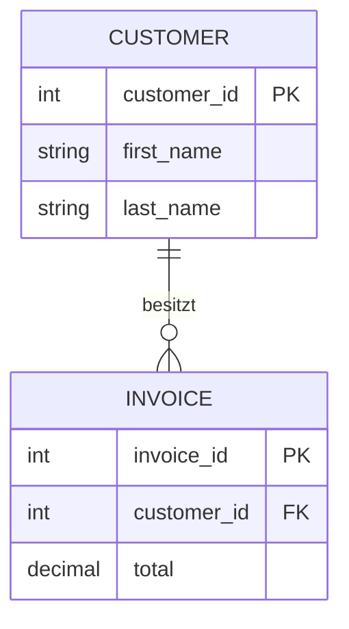
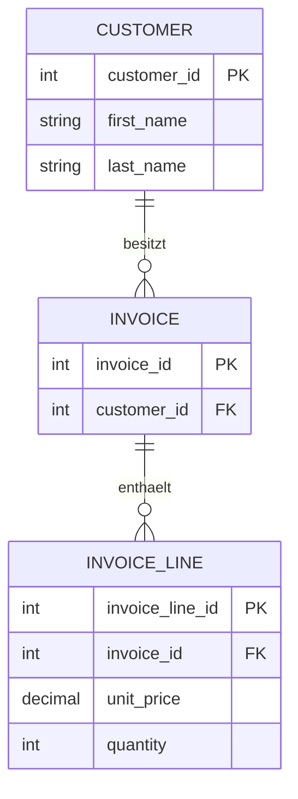

## Was macht ein JOIN?

Mit einem `JOIN` können Daten aus **mehreren Tabellen miteinander verbunden** werden.

Beispiel:

Wir haben:

```text
customer
```

und:

```text
invoice
```

Ein Kunde kann mehrere Rechnungen besitzen.

Die Verbindung entsteht über:

```text
customer.customer_id
        ↕
invoice.customer_id
```

---

# Warum brauchen wir JOIN?

Unsere Daten sind auf verschiedene Tabellen verteilt.

## customer

| customer_id | first_name | last_name |
|---|---|---|
| 1 | Max | Müller |
| 2 | Anna | Schmidt |

## invoice

| invoice_id | customer_id | total |
|---|---|---|
| 100 | 1 | 29.99 |
| 101 | 1 | 15.50 |
| 102 | 2 | 42.00 |

In `invoice` steht nur:

```text
customer_id = 1
```

Wir möchten aber vielleicht wissen:

> Wie heißt der Kunde zu dieser Rechnung?

Dafür verwenden wir einen `JOIN`.

---

# Verbindung der Tabellen



Dabei verbindet:

```text
customer.customer_id
```

die Tabelle mit:

```text
invoice.customer_id
```

---

# INNER JOIN

Der am häufigsten verwendete JOIN ist:

```sql
INNER JOIN
```

Beispiel:

```sql
SELECT customer.first_name,
       customer.last_name,
       invoice.total
FROM customer
INNER JOIN invoice
    ON customer.customer_id = invoice.customer_id;
```

---

# Wie liest man diesen JOIN?

Wir zerlegen ihn.

## 1. Was wollen wir sehen?

```sql
SELECT customer.first_name,
       customer.last_name,
       invoice.total
```

Wir wollen:

```text
Vorname
Nachname
Rechnungsbetrag
```

---

## 2. Wo starten wir?

```sql
FROM customer
```

Unsere erste Tabelle ist:

```text
customer
```

---

## 3. Welche Tabelle kommt dazu?

```sql
INNER JOIN invoice
```

Wir verbinden:

```text
invoice
```

mit `customer`.

---

## 4. Wie gehören die Tabellen zusammen?

Das bestimmt:

```sql
ON customer.customer_id = invoice.customer_id
```

Also:

```text
customer.customer_id
        =
invoice.customer_id
```

### Merksatz

> `ON` sagt SQL, **wie die Tabellen miteinander verbunden sind**.

---

# Ergebnis

Unsere Tabellen:

```text
customer

1 | Max  | Müller
2 | Anna | Schmidt
```

und:

```text
invoice

100 | 1 | 29.99
101 | 1 | 15.50
102 | 2 | 42.00
```

werden verbunden.

Ergebnis:

| first_name | last_name | total |
|---|---|---:|
| Max | Müller | 29.99 |
| Max | Müller | 15.50 |
| Anna | Schmidt | 42.00 |

Max erscheint zweimal, weil er zwei Rechnungen besitzt.

Das ist **kein doppelter Datensatz**.

Es sind zwei verschiedene Rechnungen.

---

# Die wichtigste JOIN-Regel

Bei einem JOIN musst du herausfinden:

> Welche Spalten verbinden die Tabellen?

Sehr häufig ist das:

```text
PRIMARY KEY
     ↕
FOREIGN KEY
```

Beispiel:

```text
customer.customer_id  PK
          ↕
invoice.customer_id   FK
```

Daraus entsteht:

```sql
ON customer.customer_id = invoice.customer_id
```

---

# Tabellen-Aliase

JOIN-Abfragen können schnell lang werden.

Statt:

```sql
SELECT customer.first_name,
       customer.last_name,
       invoice.total
FROM customer
INNER JOIN invoice
    ON customer.customer_id = invoice.customer_id;
```

können wir Aliase verwenden:

```sql
SELECT c.first_name,
       c.last_name,
       i.total
FROM customer AS c
INNER JOIN invoice AS i
    ON c.customer_id = i.customer_id;
```

Dabei bedeutet:

```text
c → customer
i → invoice
```

`AS` kann bei Tabellen-Aliasen häufig auch weggelassen werden:

```sql
FROM customer c
INNER JOIN invoice i
```

---

# Warum schreiben wir c.customer_id?

Angenommen, beide Tabellen besitzen:

```text
customer_id
```

Wenn wir nur schreiben:

```sql
SELECT customer_id
```

weiß SQL eventuell nicht eindeutig, welche Spalte gemeint ist.

Deshalb:

```sql
c.customer_id
```

oder:

```sql
i.customer_id
```

### Merksatz

> `tabelle.spalte` sagt eindeutig, aus welcher Tabelle die Spalte kommt.

---

# INNER JOIN

Ein `INNER JOIN` zeigt nur Datensätze, bei denen auf **beiden Seiten eine passende Verbindung existiert**.

Beispiel:

```text
CUSTOMER              INVOICE

Max ───────────────── Rechnung 100
 │
 └─────────────────── Rechnung 101

Anna ───────────────── Rechnung 102

Peter
```

Peter besitzt keine Rechnung.

Bei:

```sql
SELECT *
FROM customer c
INNER JOIN invoice i
    ON c.customer_id = i.customer_id;
```

erscheint Peter **nicht** im Ergebnis.

### Merksatz

> `INNER JOIN` = Nur Datensätze, die zusammenpassen.

---

# LEFT JOIN

Ein `LEFT JOIN` behält **alle Datensätze der linken Tabelle**.

```sql
SELECT c.first_name,
       c.last_name,
       i.total
FROM customer c
LEFT JOIN invoice i
    ON c.customer_id = i.customer_id;
```

Angenommen:

```text
Max   → hat Rechnungen
Anna  → hat Rechnung
Peter → hat keine Rechnung
```

Dann bekommen wir:

| first_name | last_name | total |
|---|---|---:|
| Max | Müller | 29.99 |
| Max | Müller | 15.50 |
| Anna | Schmidt | 42.00 |
| Peter | Meier | NULL |

Peter wird trotzdem angezeigt.

Da er keine Rechnung besitzt:

```text
total = NULL
```

---

# INNER JOIN vs LEFT JOIN

## INNER JOIN

```text
Zeige nur Kunden,
die eine passende Rechnung haben.
```

## LEFT JOIN

```text
Zeige ALLE Kunden,
auch wenn sie keine Rechnung haben.
```

Das ist der entscheidende Unterschied.

---

# LEFT JOIN + IS NULL

Das ist eine sehr nützliche Kombination.

Frage:

> Welche Kunden haben noch nie eine Rechnung erhalten?

```sql
SELECT c.first_name,
       c.last_name
FROM customer c
LEFT JOIN invoice i
    ON c.customer_id = i.customer_id
WHERE i.invoice_id IS NULL;
```

Warum?

Kunden ohne Rechnung bekommen durch den `LEFT JOIN`:

```text
invoice_id = NULL
```

Mit:

```sql
WHERE i.invoice_id IS NULL
```

filtern wir genau diese Kunden heraus.

---

# Mehrere Tabellen verbinden

JOINs können auch über mehrere Tabellen gehen.

Wir haben:

```text
customer
    ↓
invoice
    ↓
invoice_line
```



Die Verbindungen sind:

```text
customer.customer_id
        ↕
invoice.customer_id
```

und:

```text
invoice.invoice_id
        ↕
invoice_line.invoice_id
```

---

# JOIN über drei Tabellen

```sql
SELECT c.first_name,
       c.last_name,
       i.invoice_id,
       il.unit_price,
       il.quantity
FROM customer c
INNER JOIN invoice i
    ON c.customer_id = i.customer_id
INNER JOIN invoice_line il
    ON i.invoice_id = il.invoice_id;
```

Wir gehen also Schritt für Schritt:

```text
customer
   │
   │ customer_id
   ▼
invoice
   │
   │ invoice_id
   ▼
invoice_line
```

---

# JOIN mit WHERE

Nach dem JOIN können wir das Ergebnis mit `WHERE` filtern.

```sql
SELECT c.first_name,
       c.last_name,
       i.total
FROM customer c
INNER JOIN invoice i
    ON c.customer_id = i.customer_id
WHERE i.total > 20;
```

→ Nur Rechnungen über 20.

---

# JOIN mit ORDER BY

Natürlich können wir auch sortieren:

```sql
SELECT c.first_name,
       c.last_name,
       i.total
FROM customer c
INNER JOIN invoice i
    ON c.customer_id = i.customer_id
ORDER BY i.total DESC;
```

→ Höchste Rechnung zuerst.

---

# JOIN + WHERE + ORDER BY + LIMIT

Alles kann kombiniert werden:

```sql
SELECT c.first_name,
       c.last_name,
       i.total
FROM customer c
INNER JOIN invoice i
    ON c.customer_id = i.customer_id
WHERE i.total > 10
ORDER BY i.total DESC
LIMIT 5;
```

---

# Reihenfolge beim Schreiben

Eine typische Abfrage sieht so aus:

```sql
SELECT
FROM
JOIN
ON
WHERE
ORDER BY
LIMIT
```

Beispiel:

```sql
SELECT c.first_name, i.total
FROM customer c
INNER JOIN invoice i
    ON c.customer_id = i.customer_id
WHERE i.total > 10
ORDER BY i.total DESC
LIMIT 5;
```

---

# RIGHT JOIN

Es gibt außerdem:

```sql
RIGHT JOIN
```

Das Prinzip ist das Gegenstück zum `LEFT JOIN`.

```text
LEFT JOIN
→ alle Datensätze der linken Tabelle

RIGHT JOIN
→ alle Datensätze der rechten Tabelle
```

`RIGHT JOIN` wird allerdings nicht von jedem Datenbanksystem unterstützt und ist häufig vermeidbar, indem man die Reihenfolge der Tabellen umdreht.

Für den Anfang sind vor allem wichtig:

```text
INNER JOIN
LEFT JOIN
```

---

# FULL OUTER JOIN

Ein weiterer JOIN ist:

```sql
FULL OUTER JOIN
```

Er nimmt:

```text
alle Datensätze links
+
alle Datensätze rechts
```

auch wenn keine passende Verbindung existiert.

Auch dieser JOIN wird nicht von jedem Datenbanksystem unterstützt.

---

# JOIN-Typen im Überblick

| JOIN | Ergebnis |
|---|---|
| `INNER JOIN` | Nur passende Datensätze |
| `LEFT JOIN` | Alles links + passende rechts |
| `RIGHT JOIN` | Alles rechts + passende links |
| `FULL OUTER JOIN` | Alles von beiden Seiten |

Für unsere SQL-Aufgaben sind zunächst besonders wichtig:

> **INNER JOIN und LEFT JOIN**

---

# So löst du eine JOIN-Aufgabe

Wenn eine Aufgabe nach Daten aus mehreren Tabellen fragt, gehe Schritt für Schritt vor.

## 1. Welche Daten brauche ich?

Beispiel:

```text
Vorname
Nachname
Rechnungsbetrag
```

## 2. In welchen Tabellen stehen sie?

```text
first_name → customer
last_name  → customer
total      → invoice
```

## 3. Wie sind die Tabellen verbunden?

```text
customer.customer_id
        ↕
invoice.customer_id
```

## 4. JOIN schreiben

```sql
FROM customer c
INNER JOIN invoice i
    ON c.customer_id = i.customer_id
```

## 5. Gewünschte Spalten auswählen

```sql
SELECT c.first_name,
       c.last_name,
       i.total
```

Fertig:

```sql
SELECT c.first_name,
       c.last_name,
       i.total
FROM customer c
INNER JOIN invoice i
    ON c.customer_id = i.customer_id;
```

---

# Der häufigste Denkfehler

Nicht einfach überlegen:

> Welche IDs heißen gleich?

Sondern:

> **Welche Beziehung besteht zwischen den Tabellen?**

Dann suchst du:

```text
PK ↔ FK
```

Beispiel:

```text
customer.customer_id (PK)
          ↕
invoice.customer_id  (FK)
```

und daraus ergibt sich:

```sql
ON c.customer_id = i.customer_id
```

---

# Merksätze

> `JOIN` = Tabellen miteinander verbinden.

> `ON` = Wie gehören die Tabellen zusammen?

> Meistens verbinden wir **Primary Key ↔ Foreign Key**.

> `INNER JOIN` = Nur Datensätze mit passendem Partner.

> `LEFT JOIN` = Alles von links, auch ohne passenden Partner.

Und bei mehreren Tabellen:

> **Immer eine Verbindung nach der anderen verfolgen.**

```text
customer
   ↓
invoice
   ↓
invoice_line
```

wird:

```sql
FROM customer c

JOIN invoice i
    ON c.customer_id = i.customer_id

JOIN invoice_line il
    ON i.invoice_id = il.invoice_id
```

---

## Navigation

⬅️ [[11 Beziehungen 1 zu n und n zu m|Zurück zu Kapitel 11 – Beziehungen]]

➡️ [[13 Aggregatfunktionen|Weiter zu Kapitel 13 – Aggregatfunktionen]]