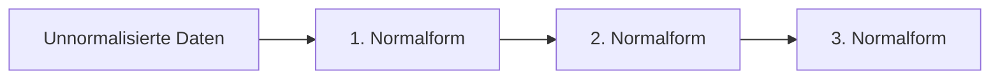
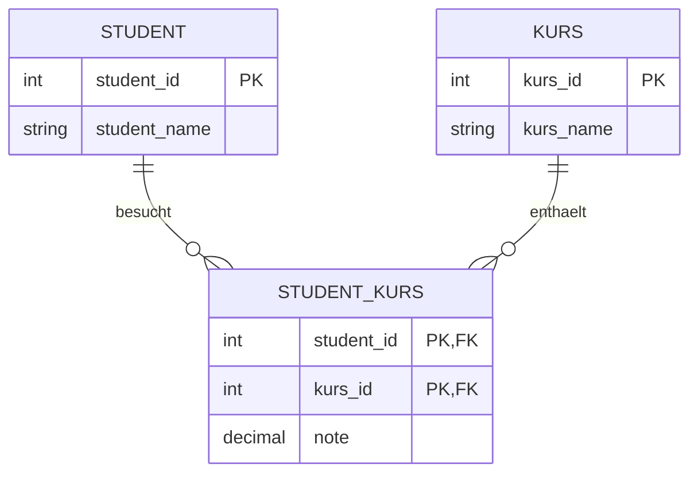
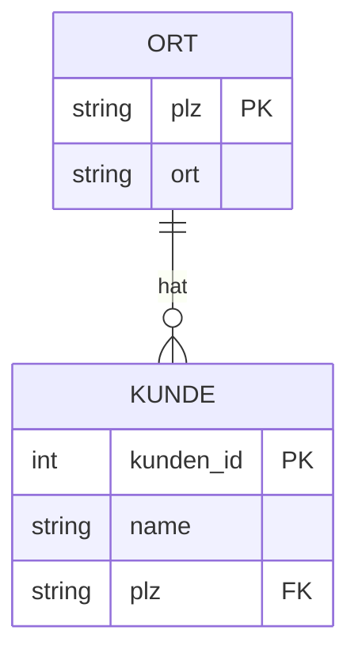
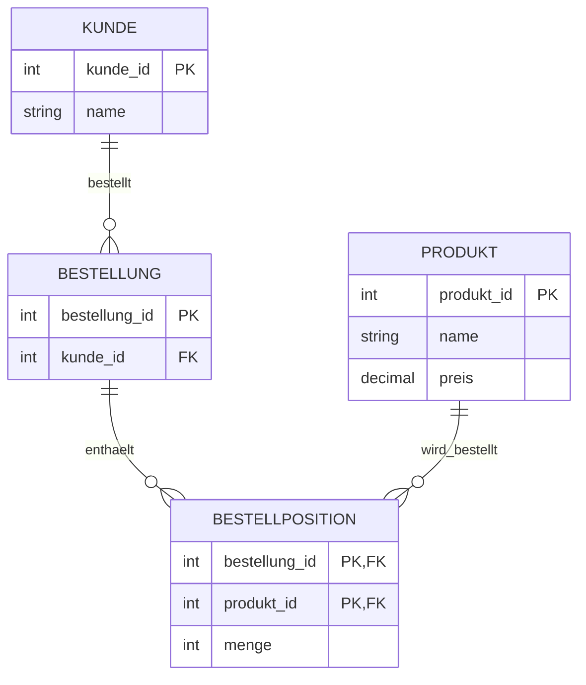

## Was sind Normalformen?

Normalformen sind Regeln für ein gutes **Datenbankdesign**.

Das Ziel ist:

- doppelte Daten vermeiden
- Änderungen vereinfachen
- Fehler vermeiden
- Daten sinnvoll auf Tabellen verteilen

Diesen Vorgang nennt man:

> **Normalisierung**

Die wichtigsten Normalformen sind:

```text
1. Normalform (1NF)
2. Normalform (2NF)
3. Normalform (3NF)
```

Sie bauen aufeinander auf:



Eine Tabelle in der 3. Normalform erfüllt also auch die Anforderungen der 1. und 2. Normalform.

---

# Warum normalisieren wir?

Angenommen, wir speichern Kunden so:

| kunden_id | name | plz | ort |
|---|---|---|---|
| 1 | Max | 86150 | Augsburg |
| 2 | Anna | 86150 | Augsburg |
| 3 | Peter | 86150 | Augsburg |
| 4 | Lisa | 80331 | München |

Hier steht:

```text
86150 → Augsburg
```

immer wieder in der Tabelle.

Wenn sich etwas an diesen Daten ändern müsste, müssten möglicherweise viele Datensätze geändert werden.

Das wollen wir vermeiden.

---

# 1. Normalform

Die wichtigste Regel der 1. Normalform:

> **Jedes Feld enthält genau einen atomaren Wert.**

**Atomar** bedeutet:

> Der Wert lässt sich für unsere Datenbank nicht sinnvoll weiter aufteilen.

---

# Beispiel: Hobbys

Diese Tabelle ist problematisch:

| kunde_id | name | hobbies |
|---|---|---|
| 1 | Max | Gaming, Fußball |
| 2 | Anna | Lesen |
| 3 | Peter | Gaming, Kochen |

Das Feld:

```text
Gaming, Fußball
```

enthält **mehrere Werte in einer Zelle**.

❌ Damit ist die Tabelle nicht in der 1. Normalform.

---

# Lösung

Wir könnten die Hobbys in eine eigene Tabelle auslagern.

```text
Kunde
```

| kunde_id | name |
|---|---|
| 1 | Max |
| 2 | Anna |
| 3 | Peter |

Und:

```text
Kunde_Hobby
```

| kunde_id | hobby |
|---|---|
| 1 | Gaming |
| 1 | Fußball |
| 2 | Lesen |
| 3 | Gaming |
| 3 | Kochen |

Jetzt enthält jedes Feld genau **einen Wert**.

---

## Falsch

```text
hobby
----------------
Gaming, Fußball
```

## Richtig

```text
hobby
--------
Gaming
Fußball
```

### Merksatz 1NF

> **1. Normalform = Ein Wert pro Feld.**

Oder noch kürzer:

> **1NF = atomar**

---

# 2. Normalform

Die 2. Normalform wird besonders interessant, wenn eine Tabelle einen **zusammengesetzten Primary Key** besitzt.

Ein zusammengesetzter Schlüssel besteht aus mehreren Spalten.

Beispiel:

```text
student_id + kurs_id
```

---

# Beispiel

Wir haben:

| student_id | kurs_id | student_name | kurs_name | note |
|---|---|---|---|---|
| 1 | 10 | Max | SQL | 1.7 |
| 1 | 20 | Max | Java | 2.0 |
| 2 | 10 | Anna | SQL | 1.3 |

Primary Key:

```text
student_id + kurs_id
```

Die Kombination identifiziert einen Datensatz.

---

# Wo liegt das Problem?

Schauen wir uns die Abhängigkeiten an.

```text
student_name
```

hängt nur von:

```text
student_id
```

ab.

Nicht von:

```text
student_id + kurs_id
```

Und:

```text
kurs_name
```

hängt nur von:

```text
kurs_id
```

ab.

Auch nicht vom gesamten Schlüssel.

Nur:

```text
note
```

hängt wirklich von:

```text
student_id + kurs_id
```

ab.

Denn die Note gehört zu:

> diesem Studenten in diesem Kurs.

---

# Lösung

Wir teilen die Daten auf.

## Student

| student_id | student_name |
|---|---|
| 1 | Max |
| 2 | Anna |

## Kurs

| kurs_id | kurs_name |
|---|---|
| 10 | SQL |
| 20 | Java |

## Student_Kurs

| student_id | kurs_id | note |
|---|---|---|
| 1 | 10 | 1.7 |
| 1 | 20 | 2.0 |
| 2 | 10 | 1.3 |

Jetzt hängt in `Student_Kurs`:

```text
note
```

vom **gesamten Primary Key** ab:

```text
student_id + kurs_id
```

---

# 2NF bildlich

Vorher:

```text
(student_id + kurs_id)
        │
        ├──── note ✅
        │
student_id ─── student_name ❌
        │
kurs_id ────── kurs_name ❌
```

Nach der Aufteilung:



---

# Merksatz 2NF

> **Jede Nicht-Schlüssel-Spalte muss vom gesamten Primary Key abhängen.**

Besonders relevant ist das bei:

> **zusammengesetzten Primärschlüsseln**

Kurz:

> **2NF = keine Abhängigkeit von nur einem Teil des Schlüssels.**

---

# 3. Normalform

Die 3. Normalform wirkt am Anfang komplizierter.

Die Grundidee ist aber:

> Eine Nicht-Schlüssel-Spalte soll nicht von einer anderen Nicht-Schlüssel-Spalte abhängen.

Schauen wir uns ein Beispiel an.

---

# Beispiel mit PLZ und Ort

Wir haben:

| kunden_id | name | plz | ort |
|---|---|---|---|
| 1 | Max | 86150 | Augsburg |
| 2 | Anna | 86150 | Augsburg |
| 3 | Peter | 86150 | Augsburg |
| 4 | Lisa | 80331 | München |

Primary Key:

```text
kunden_id
```

Jetzt schauen wir auf die Abhängigkeiten:

```text
kunden_id → plz
```

Aber gleichzeitig gilt in unserem vereinfachten Beispiel:

```text
plz → ort
```

Damit haben wir:

```text
kunden_id
    ↓
   plz
    ↓
   ort
```

`ort` hängt also **indirekt** von `kunden_id` ab.

---

# Transitive Abhängigkeit

Das nennt man:

> **Transitive Abhängigkeit**

Schema:

```text
A → B → C
```

Also:

```text
kunden_id → plz → ort
```

`ort` hängt nicht direkt vom Schlüssel ab, sondern über `plz`.

Das wollen wir in der 3. Normalform vermeiden.

---

# Lösung

Wir lagern die Information aus.

## Kunde

| kunden_id | name | plz |
|---|---|---|
| 1 | Max | 86150 |
| 2 | Anna | 86150 |
| 3 | Peter | 86150 |
| 4 | Lisa | 80331 |

## Ort

| plz | ort |
|---|---|
| 86150 | Augsburg |
| 80331 | München |

Jetzt speichern wir:

```text
86150 → Augsburg
```

nur noch einmal.

---

# Beziehung



Wenn wir den Ort zu:

```text
86150
```

benötigen, können wir die Tabellen über `plz` verbinden.

---

# Dein guter Hinweis beim Erkennen

Wenn du siehst:

> Ein Ort, Name oder eine andere Information kommt ständig wieder vor.

kann das ein **Hinweis** darauf sein, dass etwas ausgelagert werden sollte.

Aber:

> **Wiederholung allein bedeutet noch nicht automatisch, dass die 3NF verletzt ist.**

Entscheidend ist die **Abhängigkeit**.

Wir fragen:

```text
Hängt Spalte C von Spalte B ab,
obwohl B nicht der Primary Key ist?
```

Wenn ja, könnte eine transitive Abhängigkeit vorliegen.

---

# Noch ein Beispiel

Wir haben:

| mitarbeiter_id | name | abteilung_id | abteilung_name |
|---|---|---|---|
| 1 | Max | 10 | IT |
| 2 | Anna | 10 | IT |
| 3 | Peter | 20 | Marketing |
| 4 | Lisa | 10 | IT |

Abhängigkeiten:

```text
mitarbeiter_id → abteilung_id
```

und:

```text
abteilung_id → abteilung_name
```

Also:

```text
mitarbeiter_id
      ↓
abteilung_id
      ↓
abteilung_name
```

❌ Transitive Abhängigkeit.

---

# Lösung

## Mitarbeiter

| mitarbeiter_id | name | abteilung_id |
|---|---|---|
| 1 | Max | 10 |
| 2 | Anna | 10 |
| 3 | Peter | 20 |
| 4 | Lisa | 10 |

## Abteilung

| abteilung_id | abteilung_name |
|---|---|
| 10 | IT |
| 20 | Marketing |

Jetzt steht:

```text
10 → IT
```

nur einmal in `Abteilung`.

---

# Warum ist das besser?

Angenommen, die Abteilung:

```text
IT
```

wird umbenannt in:

```text
IT & Development
```

Vorher müssten wir möglicherweise viele Datensätze ändern:

```text
Max   → IT
Anna  → IT
Lisa  → IT
...
```

Nach der Normalisierung ändern wir nur:

```text
abteilung_id 10

IT
↓
IT & Development
```

ein einziges Mal.

Alle Mitarbeiter verweisen weiterhin auf:

```text
abteilung_id = 10
```

---

# Änderungsanomalie

Das vorherige Problem nennt man:

> **Änderungsanomalie**

Wenn dieselbe Information mehrfach gespeichert ist, müssen wir sie an mehreren Stellen ändern.

Dabei könnten Fehler entstehen.

Zum Beispiel:

```text
Max  → IT & Development
Anna → IT
Lisa → IT & Development
```

Jetzt widersprechen sich unsere Daten.

---

# Einfügeanomalie

Es gibt auch eine:

> **Einfügeanomalie**

Angenommen, Abteilungen werden nur zusammen mit Mitarbeitern gespeichert.

Wir möchten eine neue Abteilung:

```text
Cybersecurity
```

anlegen, obwohl dort noch niemand arbeitet.

Wenn Abteilungsdaten nur in der Mitarbeitertabelle stehen, könnte das schwierig sein.

Mit einer eigenen Tabelle:

```text
Abteilung
```

können wir einfach einen Datensatz hinzufügen.

---

# Löschanomalie

Und es gibt eine:

> **Löschanomalie**

Angenommen:

```text
Peter
```

ist der einzige Mitarbeiter in:

```text
Marketing
```

Wenn wir Peter löschen und die Abteilungsinformationen nur bei Mitarbeitern gespeichert werden:

```text
Peter | Marketing
```

verlieren wir gleichzeitig die Information:

> Die Abteilung Marketing existiert.

Mit einer eigenen Tabelle `Abteilung` passiert das nicht.

---

# Die drei Anomalien

| Anomalie | Problem |
|---|---|
| Änderungsanomalie | Information muss mehrfach geändert werden |
| Einfügeanomalie | Information kann nicht sinnvoll allein eingefügt werden |
| Löschanomalie | Beim Löschen gehen andere Informationen verloren |

Normalisierung hilft dabei, diese Probleme zu vermeiden.

---

# Die drei Normalformen vergleichen

## 1. Normalform

Frage:

> Enthält jedes Feld genau einen Wert?

Problem:

```text
Hobbys = Gaming, Fußball
```

Lösung:

```text
Gaming
Fußball
```

### Merksatz

> **1NF = atomare Werte**

---

## 2. Normalform

Frage:

> Hängt jede Nicht-Schlüssel-Spalte vom gesamten Primary Key ab?

Besonders wichtig bei zusammengesetzten Schlüsseln:

```text
student_id + kurs_id
```

Problem:

```text
student_name hängt nur von student_id ab
```

### Merksatz

> **2NF = vom ganzen Schlüssel abhängig**

---

## 3. Normalform

Frage:

> Hängt eine Nicht-Schlüssel-Spalte von einer anderen Nicht-Schlüssel-Spalte ab?

Problem:

```text
kunden_id → plz → ort
```

oder:

```text
mitarbeiter_id → abteilung_id → abteilung_name
```

### Merksatz

> **3NF = keine Abhängigkeit über eine andere Nicht-Schlüssel-Spalte**

---

# Die drei Fragen für Aufgaben

Wenn du eine Tabelle normalisieren sollst, geh der Reihe nach vor.

## 1NF

Frage:

> Gibt es mehrere Werte in einer Zelle?

Wenn ja:

```text
→ aufteilen
```

---

## 2NF

Frage:

> Habe ich einen zusammengesetzten Primary Key?

Wenn ja:

> Hängt eine Spalte nur von einem Teil dieses Schlüssels ab?

Wenn ja:

```text
→ auslagern
```

---

## 3NF

Frage:

> Hängt eine Nicht-Schlüssel-Spalte von einer anderen Nicht-Schlüssel-Spalte ab?

Wenn ja:

```text
→ auslagern
```

---

# Kurzbeispiel

Ausgangstabelle:

```text
Bestellung
------------------------------------------------
bestellung_id
kunde_name
kunde_plz
kunde_ort
produkt_id
produkt_name
produkt_preis
```

Hier steckt sehr viel unterschiedliche Information in einer Tabelle.

Beim Normalisieren könnten daraus beispielsweise werden:



Jetzt haben:

```text
Kunde
Bestellung
Produkt
Bestellposition
```

jeweils ihre eigene Aufgabe.

---

# Ein hilfreicher Merksatz

Ein klassischer Merksatz für die Normalformen lautet sinngemäß:

> **Die Information soll vom Schlüssel, vom ganzen Schlüssel und von nichts anderem als dem Schlüssel abhängen.**

Das kann man aufteilen:

```text
1NF → Werte atomar

2NF → vom GANZEN Schlüssel abhängig

3NF → nicht über eine andere Nicht-Schlüssel-Spalte abhängig
```

---

# Was du dir wirklich merken solltest

Für unsere Aufgaben reicht zunächst dieses Denkmodell:

```text
1NF
↓
Hat eine Zelle mehrere Werte?
→ Aufteilen


2NF
↓
Zusammengesetzter Schlüssel?
Hängt etwas nur von einem Teil davon ab?
→ Auslagern


3NF
↓
Hängt eine normale Spalte
von einer anderen normalen Spalte ab?
→ Auslagern
```

Besonders bei der **3NF**:

```text
ID → PLZ → Ort
```

oder:

```text
Mitarbeiter-ID → Abteilungs-ID → Abteilungsname
```

sollte bei dir die Alarmglocke klingeln:

> **Da steckt wahrscheinlich eine eigene Tabelle drin.**

---

## Navigation

⬅️ [[17 Constraints|Zurück zu Kapitel 17 – Constraints]]

➡️ [[19 Transaktionen|Weiter zu Kapitel 19 – Transaktionen]]