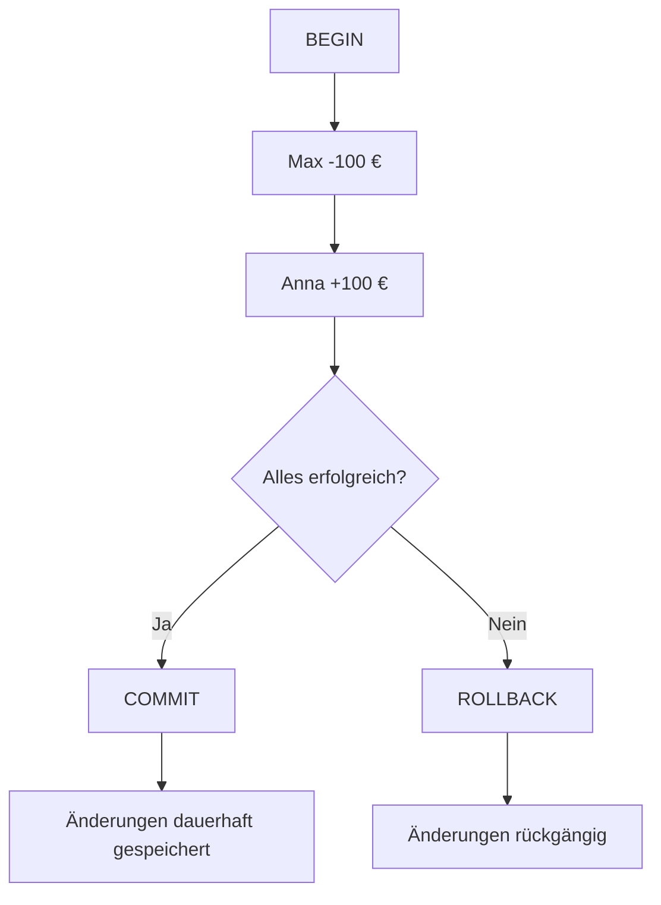

## Was ist eine Transaktion?

Eine **Transaktion** fasst mehrere SQL-Befehle zu einer gemeinsamen Einheit zusammen.

Das bedeutet:

> Entweder werden **alle Änderungen erfolgreich durchgeführt** oder keine davon.

Das ist besonders wichtig, wenn mehrere Änderungen zusammengehören.

---

# Beispiel: Banküberweisung

Max möchte Anna 100 € überweisen.

Dafür müssen zwei Dinge passieren:

```text
Max
- 100 €

Anna
+ 100 €
```

In SQL könnten das zwei `UPDATE`-Befehle sein:

```sql
UPDATE konto
SET kontostand = kontostand - 100
WHERE konto_id = 1;

UPDATE konto
SET kontostand = kontostand + 100
WHERE konto_id = 2;
```

Diese beiden Befehle gehören logisch zusammen.

---

# Das Problem

Stell dir vor:

```text
1. Max -100 €        ✅
2. Systemabsturz     💥
3. Anna +100 €       ❌
```

Dann wären bei Max 100 € verschwunden, ohne dass Anna sie bekommen hätte.

Genau solche Probleme sollen Transaktionen verhindern.

---

# BEGIN

Mit:

```sql
BEGIN;
```

starten wir eine Transaktion.

Je nach Datenbanksystem findet man auch:

```sql
BEGIN TRANSACTION;
```

Danach können mehrere SQL-Befehle ausgeführt werden.

```sql
BEGIN;

UPDATE konto
SET kontostand = kontostand - 100
WHERE konto_id = 1;

UPDATE konto
SET kontostand = kontostand + 100
WHERE konto_id = 2;
```

Die Änderungen gehören jetzt zu einer gemeinsamen Transaktion.

---

# COMMIT

Wenn alles erfolgreich war, verwenden wir:

```sql
COMMIT;
```

Damit werden die Änderungen **dauerhaft gespeichert**.

Komplett:

```sql
BEGIN;

UPDATE konto
SET kontostand = kontostand - 100
WHERE konto_id = 1;

UPDATE konto
SET kontostand = kontostand + 100
WHERE konto_id = 2;

COMMIT;
```

---

# Ablauf



---

# ROLLBACK

Wenn während einer Transaktion etwas schiefgeht, können wir:

```sql
ROLLBACK;
```

verwenden.

Damit werden die Änderungen der laufenden Transaktion rückgängig gemacht.

Beispiel:

```sql
BEGIN;

UPDATE konto
SET kontostand = kontostand - 100
WHERE konto_id = 1;

UPDATE konto
SET kontostand = kontostand + 100
WHERE konto_id = 999;
```

Angenommen:

```text
konto_id = 999
```

existiert nicht und wir stellen fest, dass die Überweisung nicht korrekt durchgeführt werden kann.

Dann:

```sql
ROLLBACK;
```

Die Änderung bei Konto 1 wird ebenfalls zurückgenommen.

---

# COMMIT vs ROLLBACK

```text
BEGIN
  │
  ├── SQL-Befehl
  ├── SQL-Befehl
  ├── SQL-Befehl
  │
  ▼
Entscheidung
```

Dann:

```text
COMMIT
   ↓
Änderungen behalten
```

oder:

```text
ROLLBACK
   ↓
Änderungen verwerfen
```

---

# Merksatz

> `BEGIN` → Transaktion starten

> `COMMIT` → Änderungen speichern

> `ROLLBACK` → Änderungen rückgängig machen

---

# Beispiel mit Bestellung

Transaktionen sind nicht nur bei Banken wichtig.

Angenommen, ein Kunde bestellt ein Produkt.

Dabei müssen mehrere Dinge passieren:

```text
1. Bestellung erstellen
2. Bestellposition erstellen
3. Lagerbestand reduzieren
```

SQL:

```sql
BEGIN;

INSERT INTO bestellung (
    bestellung_id,
    customer_id
)
VALUES (
    100,
    5
);

INSERT INTO bestellposition (
    bestellung_id,
    produkt_id,
    menge
)
VALUES (
    100,
    20,
    2
);

UPDATE produkt
SET lagerbestand = lagerbestand - 2
WHERE produkt_id = 20;

COMMIT;
```

Diese drei Änderungen gehören logisch zusammen.

---

# Was passiert bei einem Fehler?

Angenommen:

```text
Bestellung erstellen       ✅
Bestellposition erstellen  ✅
Lagerbestand ändern        ❌
```

Dann wollen wir normalerweise nicht:

```text
Bestellung vorhanden
aber Lagerbestand falsch
```

Stattdessen:

```sql
ROLLBACK;
```

Dann werden die Änderungen der Transaktion verworfen.

---

# ACID

Im Zusammenhang mit Transaktionen begegnet dir häufig:

> **ACID**

ACID beschreibt vier wichtige Eigenschaften zuverlässiger Transaktionen.

```text
A → Atomicity
C → Consistency
I → Isolation
D → Durability
```

---

# A – Atomicity

**Atomicity = Atomarität**

Eine Transaktion wird als **eine Einheit** betrachtet.

Das bedeutet:

> Alles oder nichts.

Bei unserer Überweisung:

```text
Max -100 €
UND
Anna +100 €
```

Entweder passiert beides:

```text
✅ ✅
```

oder nichts:

```text
❌ ❌
```

Nicht:

```text
✅ ❌
```

### Merksatz

> **Atomicity = Alles oder nichts.**

---

# C – Consistency

**Consistency = Konsistenz**

Die Datenbank soll nach einer Transaktion weiterhin in einem **gültigen Zustand** sein.

Regeln und Constraints sollen weiterhin eingehalten werden.

Beispielsweise:

```sql
CHECK (kontostand >= 0)
```

Wenn eine Transaktion gegen eine solche Regel verstößt, darf die Datenbank nicht einfach ungültige Daten speichern.

### Merksatz

> **Consistency = Daten bleiben gültig.**

---

# I – Isolation

**Isolation = Isolation**

Mehrere Transaktionen können gleichzeitig stattfinden.

Sie sollen sich dabei möglichst nicht gegenseitig falsch beeinflussen.

Beispiel:

```text
Transaktion A
Max kauft etwas für 100 €

gleichzeitig

Transaktion B
Max überweist 200 €
```

Beide greifen möglicherweise gleichzeitig auf denselben Kontostand zu.

Die Datenbank muss damit kontrolliert umgehen.

### Merksatz

> **Isolation = Gleichzeitige Transaktionen sollen sich nicht unkontrolliert beeinflussen.**

---

# D – Durability

**Durability = Dauerhaftigkeit**

Nach:

```sql
COMMIT;
```

sollen die Änderungen dauerhaft gespeichert sein.

Auch wenn kurz danach beispielsweise:

```text
Serverabsturz
Stromausfall
Programmabsturz
```

auftritt.

### Merksatz

> **Durability = COMMIT bedeutet dauerhaft gespeichert.**

---

# ACID zusammengefasst

| Buchstabe | Bedeutung | Merksatz |
|---|---|---|
| A | Atomicity | Alles oder nichts |
| C | Consistency | Daten bleiben gültig |
| I | Isolation | Transaktionen stören sich nicht unkontrolliert |
| D | Durability | Gespeichert bleibt gespeichert |

---

# ACID am Bankbeispiel

Wir überweisen:

```text
100 €
```

von Max zu Anna.

## Atomicity

```text
Max -100 €
Anna +100 €
```

→ Beides oder nichts.

---

## Consistency

Die Regeln der Datenbank bleiben gültig.

Zum Beispiel darf kein verbotener Kontostand entstehen.

---

## Isolation

Eine andere gleichzeitige Überweisung soll unsere Transaktion nicht unkontrolliert beeinflussen.

---

## Durability

Nach:

```sql
COMMIT;
```

ist die Überweisung dauerhaft gespeichert.

---

# Transaktionen und DELETE

Auch mehrere Löschbefehle können in einer Transaktion ausgeführt werden.

Angenommen:

```text
customer
    ↓
invoice
    ↓
invoice_line
```

Wir möchten einen Kunden und seine abhängigen Daten löschen.

```sql
BEGIN;

DELETE FROM invoice_line
WHERE invoice_id IN (
    SELECT invoice_id
    FROM invoice
    WHERE customer_id = 5
);

DELETE FROM invoice
WHERE customer_id = 5;

DELETE FROM customer
WHERE customer_id = 5;

COMMIT;
```

Wenn etwas schiefgeht, können wir vor dem Commit:

```sql
ROLLBACK;
```

verwenden.

---

# SAVEPOINT

Innerhalb einer Transaktion können je nach Datenbanksystem auch Zwischenpunkte gesetzt werden.

Dafür gibt es:

```sql
SAVEPOINT
```

Beispiel:

```sql
BEGIN;

UPDATE konto
SET kontostand = kontostand - 100
WHERE konto_id = 1;

SAVEPOINT nach_abbuchung;

UPDATE konto
SET kontostand = kontostand + 100
WHERE konto_id = 2;
```

---

# Zu einem SAVEPOINT zurückkehren

Je nach Datenbanksystem kann beispielsweise verwendet werden:

```sql
ROLLBACK TO nach_abbuchung;
```

Damit wird nicht unbedingt die komplette Transaktion zurückgesetzt, sondern bis zu diesem Zwischenpunkt.

Für den Anfang sind allerdings deutlich wichtiger:

```text
BEGIN
COMMIT
ROLLBACK
```

---

# Autocommit

Viele Datenbanksysteme oder Datenbankprogramme verwenden standardmäßig:

> **Autocommit**

Das bedeutet vereinfacht:

> Ein SQL-Befehl wird automatisch gespeichert, wenn er erfolgreich ausgeführt wurde.

Dann kann beispielsweise:

```sql
UPDATE customer
SET first_name = 'Max'
WHERE customer_id = 1;
```

direkt dauerhaft übernommen werden.

Deshalb ist wichtig zu wissen, wie das verwendete Datenbanksystem bzw. Programm mit Transaktionen umgeht.

---

# Wann brauche ich eine Transaktion?

Besonders wenn mehrere Änderungen:

> **logisch zusammengehören**

Beispiele:

```text
Banküberweisung

Bestellung + Bestellposition + Lagerbestand

Kunde + Rechnungen + Rechnungspositionen löschen

Buchung mehrerer zusammengehöriger Daten
```

Die Frage ist:

> Wäre es ein Problem, wenn nur die Hälfte der SQL-Befehle ausgeführt würde?

Wenn die Antwort:

```text
Ja
```

ist, ist eine Transaktion wahrscheinlich sinnvoll.

---

# Typischer Aufbau

```sql
BEGIN;

-- Änderung 1

-- Änderung 2

-- Änderung 3

COMMIT;
```

Wenn ein Problem auftritt:

```sql
ROLLBACK;
```

---

# Wichtig

Nach einem:

```sql
COMMIT;
```

kann man nicht einfach davon ausgehen, dass ein normales:

```sql
ROLLBACK;
```

die bereits abgeschlossene Transaktion wieder rückgängig macht.

`COMMIT` beendet die Transaktion und bestätigt die Änderungen.

Deshalb:

> **Vor COMMIT prüfen, ob alles korrekt ist.**

---

# Die drei wichtigsten Befehle

```sql
BEGIN;
```

> Transaktion starten.

```sql
COMMIT;
```

> Änderungen bestätigen und speichern.

```sql
ROLLBACK;
```

> Änderungen der laufenden Transaktion verwerfen.

---

# Merksätze

> **Transaktion = mehrere SQL-Befehle als eine gemeinsame Einheit.**

Das wichtigste Prinzip:

> **Entweder alles oder nichts.**

Die Befehle:

```text
BEGIN    → Start
COMMIT   → Speichern
ROLLBACK → Rückgängig
```

Und:

```text
ACID

A → Atomicity   → Alles oder nichts
C → Consistency → Daten bleiben gültig
I → Isolation   → Transaktionen beeinflussen sich nicht unkontrolliert
D → Durability  → Änderungen bleiben dauerhaft gespeichert
```

Wenn du dich fragst, ob eine Transaktion sinnvoll ist:

> **„Was passiert, wenn nach der Hälfte meiner SQL-Befehle das Programm abstürzt?“**

Wenn dadurch inkonsistente Daten entstehen würden:

> **Transaktion verwenden.**

---

## Navigation

⬅️ [[18 Normalformen|Zurück zu Kapitel 18 – Normalformen]]

🏁 **Ende der SQL-Grundlagen**

⬅️ [[01 SQL Grundlagen|Zurück zu Kapitel 01 – SQL Grundlagen]]

