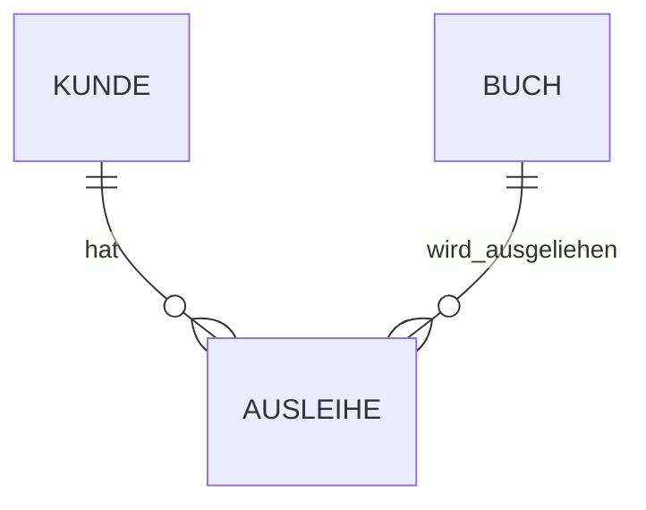

Datenbankdesign beschreibt den Prozess, wie aus einer **Idee oder einem realen Problem** eine funktionierende Datenbank entsteht.

> [!info] Grundidee  
> Wir erstellen nicht sofort irgendwelche Tabellen.  
> Zuerst überlegen wir, **welche Daten wir benötigen und wie diese zusammenhängen**.

---

##  Die Phasen des Datenbankdesigns

Eine Datenbank entsteht schrittweise:

```text
Reale Welt
    ↓
Konzeptuelles Modell
    ↓
Logisches Modell
    ↓
Physisches Schema
    ↓
Datenbanksystem
```

---

# Reale Welt

Am Anfang steht ein reales Problem oder eine Anforderung.

### Beispiel: Bibliothek

Eine Bibliothek möchte speichern:

- Bücher
    
- Kunden
    
- Autoren
    
- Ausleihen
    

Außerdem gibt es Regeln:

- Ein Kunde kann mehrere Bücher ausleihen.
    
- Ein Buch kann von verschiedenen Kunden ausgeliehen werden.
    
- Ein Buch kann mehrere Autoren haben.
    

In dieser Phase überlegen wir also:

> **Welche Informationen muss unsere Datenbank überhaupt speichern?**

---

# Konzeptuelles Modell

Jetzt werden die wichtigen **Entitäten und ihre Beziehungen** bestimmt.

Typische Entitäten unseres Beispiels:

```text
Buch
Kunde
Autor
Ausleihe
```

Daraus kann beispielsweise ein ER-Modell entstehen:



Hier geht es zunächst hauptsächlich darum:

- Welche Entitäten gibt es?
    
- Welche Eigenschaften besitzen sie?
    
- Wie hängen sie zusammen?
    

> [!tip]  
> Das konzeptuelle Modell beschreibt die Datenbank noch relativ unabhängig von einem bestimmten Datenbanksystem.

---

# Logisches Modell

Jetzt wird aus dem Modell eine konkrete **Tabellenstruktur**.

Beispiel:

### Kunde

|kunde_id|name|email|
|---|---|---|
|1|Nobu|[nobu@example.com](mailto:nobu@example.com)|
|2|Bob|[bob@example.com](mailto:bob@example.com)|

### Buch

|buch_id|titel|isbn|
|---|---|---|
|1|Der Hobbit|123456|
|2|Dune|987654|

Jetzt werden auch Beziehungen mithilfe von **Primär- und Fremdschlüsseln** umgesetzt.

```text
Kunde
------
kunde_id PK
name
email

        ↓

Ausleihe
--------
ausleihe_id PK
kunde_id    FK
buch_id     FK
ausleihdatum

        ↑

Buch
----
buch_id PK
titel
isbn
```

Hier spielen also unsere bereits bekannten Themen eine große Rolle:

- [[10 PRIMARY KEY und FOREIGN KEY | PRIMARY KEY und FOREIGN KEY]]
    
- [[11 BEZIEHUNGEN | Beziehungen]]
    
- [[18 Normalformen | Normalformen]]
    

---

# Physisches Schema

Jetzt legen wir fest, **wie die Tabellen tatsächlich in unserem Datenbanksystem umgesetzt werden**.

Dazu gehören beispielsweise:

- konkrete Datentypen
    
- PRIMARY KEY
    
- FOREIGN KEY
    
- NOT NULL
    
- UNIQUE
    
- DEFAULT
    
- Indizes
    

Beispiel:

```sql
CREATE TABLE kunde (
    kunde_id INTEGER PRIMARY KEY,
    name TEXT NOT NULL,
    email TEXT UNIQUE
);
```

Hier wird unser bisher theoretisches Modell zu echtem SQL.

---

# Datenbanksystem

Zum Schluss wird die Datenbank tatsächlich in einem **DBMS** umgesetzt und verwendet.

DBMS bedeutet:

**Database Management System**

Beispiele:

- PostgreSQL
    
- MySQL
    
- MariaDB
    
- SQLite
    
- Microsoft SQL Server
    

Das DBMS übernimmt unter anderem:

- Daten speichern
    
- Daten abfragen
    
- Daten verändern
    
- Benutzerzugriffe verwalten
    
- Datenintegrität sicherstellen
    
- Transaktionen durchführen
    

---

# Vom Problem zur SQL-Tabelle

Ein kleines Gesamtbeispiel:

### Anforderung

> Wir wollen Kunden speichern.

↓

### Entität

```text
Kunde
```

↓

### Attribute

```text
Kunde
├── kunde_id
├── name
└── email
```

↓

### Schlüssel bestimmen

```text
kunde_id → PRIMARY KEY
```

↓

### SQL

```sql
CREATE TABLE kunde (
    kunde_id INTEGER PRIMARY KEY,
    name TEXT NOT NULL,
    email TEXT UNIQUE
);
```

So wird aus einer **Idee Schritt für Schritt eine Datenbank**.

---

# Warum ist gutes Datenbankdesign wichtig?

Schlechtes Datenbankdesign kann zu Problemen führen:

- Daten werden mehrfach gespeichert
    
- Daten widersprechen sich
    
- Änderungen werden schwierig
    
- Abfragen werden unnötig kompliziert
    
- Beziehungen zwischen Daten fehlen
    
- Daten können verloren gehen oder falsch zugeordnet werden
    

Deshalb gehören auch die [[18 Normalformen | Normalformen]] zum Datenbankdesign.

Sie helfen dabei, **Redundanzen und Anomalien zu vermeiden**.

---

# Merksatz

> **Erst verstehen, dann modellieren, dann Tabellen bauen, dann SQL schreiben.**

```text
Problem verstehen
       ↓
Daten modellieren
       ↓
Tabellen entwickeln
       ↓
Schlüssel & Beziehungen festlegen
       ↓
Normalisieren
       ↓
SQL implementieren
```

---

## 🔗 Navigation

← [[19 Transaktionen]] | [[21 ER-Modell & Datenmodelle]] →