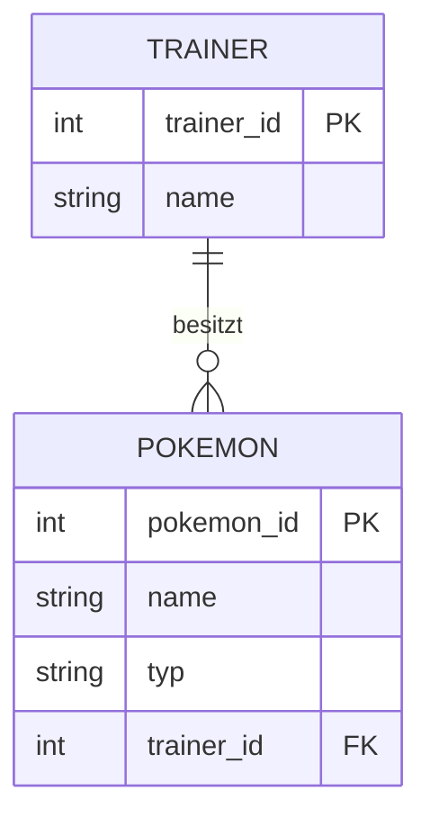
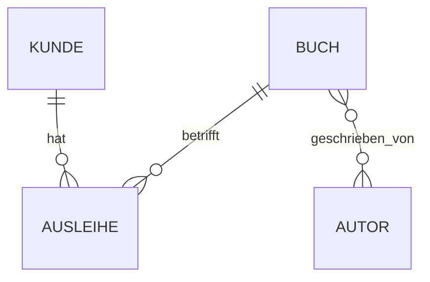

Ein **Datenmodell** beschreibt, welche Daten gespeichert werden und wie diese Daten miteinander zusammenhängen.

Ein wichtiges Werkzeug dafür ist das **ER-Modell**.

**ER** steht für:

> **Entity Relationship** – Entitäten und ihre Beziehungen.

Das ER-Modell wird normalerweise erstellt, **bevor die eigentlichen SQL-Tabellen angelegt werden**.

---

# Was ist eine Entität?

Eine **Entität (Entity)** ist ein Objekt oder eine Sache aus der realen Welt, über die wir Daten speichern möchten.

Beispiele:

```text
Kunde
Buch
Autor
Produkt
Mitarbeiter
Pokemon
Trainer
```

In einer relationalen Datenbank wird aus einer Entität später meistens eine **Tabelle**.

Beispiel:

```text
Entität
Kunde

   ↓

Tabelle
kunde
```

---

# Was ist ein Attribut?

Ein **Attribut** beschreibt eine Eigenschaft einer Entität.

Beispiel:

```text
Kunde
│
├── kunde_id
├── name
├── email
└── geburtsdatum
```

Hier ist `Kunde` die Entität.

`kunde_id`, `name`, `email` und `geburtsdatum` sind die Attribute.

In einer Tabelle werden die Attribute normalerweise zu **Spalten**.

|kunde_id|name|email|geburtsdatum|
|---|---|---|---|
|1|Nobu|[nobu@example.com](mailto:nobu@example.com)|01.01.2000|
|2|Bob|[bob@example.com](mailto:bob@example.com)|15.05.1995|

---

# Arten von Attributen

Attribute können unterschiedliche Formen haben.

### Einfaches Attribut

Enthält einen einzelnen Wert.

```text
name = "Nobu"
```

### Zusammengesetztes Attribut

Kann in mehrere Bestandteile zerlegt werden.

Beispiel:

```text
Adresse
│
├── Straße
├── Hausnummer
├── PLZ
└── Ort
```

### Mehrwertiges Attribut

Kann mehrere Werte besitzen.

Beispiel:

```text
Telefonnummern
├── 012345
└── 067890
```

In einer relationalen Datenbank sollte man solche Werte normalerweise nicht einfach zusammen in eine Spalte schreiben.

Das hängt mit der [[18 Normalformen|1. Normalform]] zusammen.

### Abgeleitetes Attribut

Wird aus anderen Daten berechnet.

Beispiel:

```text
Geburtsdatum
     ↓
    Alter
```

Das Alter kann aus dem Geburtsdatum berechnet werden und muss deshalb nicht unbedingt gespeichert werden.

---

# Schlüsselattribute

Ein **Schlüsselattribut** identifiziert eine Entität eindeutig.

Beispiel:

```text
Kunde

kunde_id = 42
```

Die `kunde_id` kann als [[10 PRIMARY KEY und FOREIGN KEY|Primary Key]] verwendet werden.

```sql
CREATE TABLE kunde (
    kunde_id INTEGER PRIMARY KEY,
    name TEXT
);
```

⚠️ Ein Primärschlüssel muss einen Datensatz eindeutig identifizieren.

---

# Beziehungen

Entitäten können miteinander in Beziehung stehen.

Beispiel:

```text
Kunde ---- bestellt ---- Produkt
```

Oder:

```text
Trainer ---- besitzt ---- Pokemon
```

Wie viele Objekte auf beiden Seiten miteinander verbunden werden können, beschreibt die **Kardinalität**.

---

# Kardinalitäten

Die wichtigsten Kardinalitäten sind:

```text
1:1
1:n
n:m
```

## 1:1 – Eins zu Eins

Ein Datensatz gehört genau zu einem anderen Datensatz.

Beispiel:

```text
Person 1 ───── 1 Personalausweis
```

Eine Person besitzt einen Personalausweis und ein Personalausweis gehört zu einer Person.

---

## 1:n – Eins zu Viele

Ein Datensatz kann mit mehreren anderen Datensätzen verbunden sein.

Beispiel:

```text
Trainer 1 ───── n Pokemon
```

Ein Trainer kann mehrere Pokemon besitzen.

Ein Pokemon gehört in diesem Modell aber nur zu einem Trainer.

In Tabellen könnte das so aussehen:

```text
Trainer
-------
trainer_id PK
name


Pokemon
-------
pokemon_id PK
name
trainer_id FK
```

Der Fremdschlüssel liegt dabei auf der **n-Seite**.

> [!important]  
> Bei einer 1:n-Beziehung kommt der Fremdschlüssel normalerweise in die Tabelle auf der **n-Seite**.

---

# n:m – Viele zu Viele

Auf beiden Seiten können mehrere Datensätze miteinander verbunden sein.

Beispiel:

```text
Student n ───── m Kurs
```

Ein Student besucht mehrere Kurse.

Ein Kurs wird von mehreren Studenten besucht.

Eine n:m-Beziehung kann nicht einfach mit einem einzigen Fremdschlüssel umgesetzt werden.

Wir benötigen eine **Zwischentabelle**.

```text
Student
-------
student_id PK
name


Student_Kurs
------------
student_id FK
kurs_id    FK


Kurs
----
kurs_id PK
name
```

Die ursprüngliche n:m-Beziehung wird dadurch zu:

```text
Student 1 ─── n Student_Kurs n ─── 1 Kurs
```

---

# ER-Diagramm

Ein ER-Diagramm stellt Entitäten, Attribute und Beziehungen grafisch dar.

Beispiel:



Wir erkennen:

```text
Trainer
   │
   │ 1:n
   ↓
Pokemon
```

Ein Trainer kann mehrere Pokemon besitzen.

---

# Vom ER-Modell zur Datenbank

Das ER-Modell muss anschließend in ein relationales Modell übertragen werden.

Dabei gelten einige grundlegende Regeln.

### Entität

wird zu:

```text
Tabelle
```

### Attribut

wird zu:

```text
Spalte
```

### Schlüsselattribut

wird zu:

```text
PRIMARY KEY
```

### 1:n-Beziehung

wird normalerweise umgesetzt durch:

```text
FOREIGN KEY auf der n-Seite
```

### n:m-Beziehung

wird umgesetzt durch:

```text
Zwischentabelle
```

---

# Beispiel: Bibliothek

Wir wollen Bücher, Autoren, Kunden und Ausleihen verwalten.



Beim Übertragen in Tabellen müssen wir beachten:

```text
Kunde 1:n Ausleihe
→ kunde_id als FK in Ausleihe

Buch 1:n Ausleihe
→ buch_id als FK in Ausleihe

Buch n:m Autor
→ Zwischentabelle Buch_Autor
```

Das relationale Modell könnte anschließend so aussehen:

```text
Kunde
------
kunde_id PK
name
email


Buch
----
buch_id PK
titel
isbn


Autor
-----
autor_id PK
name


Buch_Autor
----------
buch_id  FK
autor_id FK


Ausleihe
--------
ausleihe_id PK
kunde_id    FK
buch_id     FK
ausleihdatum
rueckgabedatum
```

---

# ER-Modell vs. relationales Modell

|ER-Modell|Relationales Modell|
|---|---|
|Entität|Tabelle|
|Attribut|Spalte|
|Entitätsinstanz|Datensatz / Zeile|
|Schlüsselattribut|Primary Key|
|Beziehung|Foreign Key / Zwischentabelle|
|Kardinalität|bestimmt die Umsetzung der Beziehung|

Das **ER-Modell beschreibt die Struktur zunächst fachlich**.

Das **relationale Modell beschreibt, wie diese Struktur mit Tabellen umgesetzt wird**.

---

# Zusammenhang mit Datenbankdesign

Das ER-Modell ist ein Teil des [[20 Datenbankdesign|Datenbankdesigns]].

```text
Reale Welt
    ↓
Anforderungen
    ↓
ER-Modell
    ↓
Relationales Modell
    ↓
Normalisierung
    ↓
SQL-Tabellen
```

Deshalb sollte man nicht direkt mit `CREATE TABLE` anfangen.

Zuerst wird überlegt:

1. Welche Entitäten gibt es?
    
2. Welche Attribute besitzen sie?
    
3. Welche Schlüssel benötigen wir?
    
4. Welche Beziehungen bestehen?
    
5. Welche Kardinalitäten haben die Beziehungen?
    
6. Wie werden diese Beziehungen in Tabellen umgesetzt?
    

---

# Merksätze

> **Entität → Tabelle**

> **Attribut → Spalte**

> **Schlüsselattribut → Primary Key**

> **1:n → Foreign Key auf die n-Seite**

> **n:m → Zwischentabelle**

Diese Regeln sind besonders wichtig, wenn aus einem ER-Diagramm später SQL-Tabellen erstellt werden sollen.

---

## Navigation

← [[20 Datenbankdesign]] | [[22 Indexierung]] →