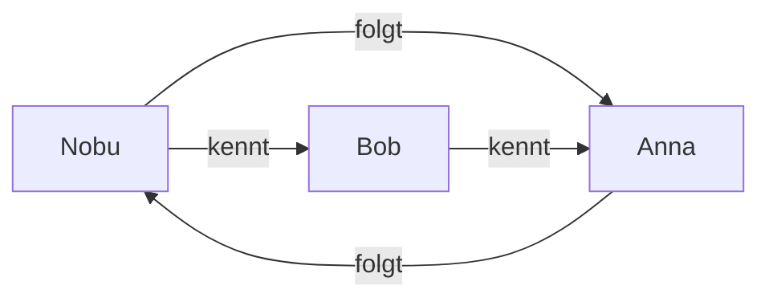

**NoSQL** bezeichnet Datenbanken, die Daten nicht ausschließlich nach dem klassischen relationalen Tabellenmodell speichern.

NoSQL wird häufig übersetzt als:

> **Not Only SQL**

Das bedeutet nicht, dass SQL-Datenbanken schlecht oder veraltet sind. NoSQL-Datenbanken sind für bestimmte Arten von Daten und Anwendungen besonders geeignet.

---

# Relationale Datenbank

Bisher haben wir hauptsächlich mit relationalen Datenbanken gearbeitet.

Beispiel:

### Kunde

|kunde_id|name|email|
|--:|---|---|
|1|Nobu|[nobu@example.com](mailto:nobu@example.com)|
|2|Bob|[bob@example.com](mailto:bob@example.com)|

Die Struktur ist klar vorgegeben:

```text
Tabelle
  ↓
Zeilen
  ↓
Spalten
```

Beziehungen werden beispielsweise über [[Primary Key und Foreign Key]] hergestellt.

Typische relationale Datenbanksysteme sind:

```text
PostgreSQL
MySQL
MariaDB
SQLite
Microsoft SQL Server
```

---

# Was ist NoSQL?

NoSQL-Datenbanken können Daten auf andere Weise speichern.

Zum Beispiel:

```text
Dokumente
Schlüssel-Wert-Paare
Graphen
Spalten
```

Dadurch können sie für bestimmte Anwendungsfälle flexibler oder besser skalierbar sein.

Die vier wichtigen NoSQL-Typen sind:

```text
NoSQL
│
├── Dokumentenorientiert
│
├── Key-Value
│
├── Graph
│
└── Wide-Column
```

---

# 1. Dokumentenorientierte Datenbanken

Dokumentenorientierte Datenbanken speichern zusammengehörige Daten in **Dokumenten**.

Ein bekanntes Beispiel ist:

**MongoDB**

Die Daten sehen häufig ähnlich wie JSON aus:

```json
{
    "kunde_id": 1,
    "name": "Nobu",
    "email": "nobu@example.com",
    "adresse": {
        "ort": "Augsburg",
        "plz": "86150"
    }
}
```

Bei einer relationalen Datenbank könnten diese Informationen auf mehrere Tabellen verteilt sein.

Bei einer Dokumentendatenbank können zusammengehörige Informationen gemeinsam in einem Dokument gespeichert werden.

---

# Flexibles Schema

Dokumente müssen nicht zwingend exakt dieselben Felder besitzen.

Beispiel:

```json
{
    "name": "Nobu",
    "email": "nobu@example.com"
}
```

Ein anderes Dokument könnte zusätzliche Informationen enthalten:

```json
{
    "name": "Bob",
    "email": "bob@example.com",
    "telefon": "0123456789"
}
```

Das bezeichnet man als ein **flexibles Schema**.

Das kann praktisch sein, wenn sich die Struktur der Daten häufig verändert.

---

# Einsatzgebiete von Dokumentendatenbanken

Typische Einsatzgebiete sind:

- Content-Management-Systeme
    
- Webanwendungen
    
- Mobile Apps
    
- Produktkataloge
    
- Anwendungen mit flexiblen Datenstrukturen
    

Beispiele:

```text
MongoDB
CouchDB
```

---

# 2. Key-Value-Datenbanken

Eine Key-Value-Datenbank funktioniert ähnlich wie eine große Map bzw. ein Dictionary.

Jeder Wert besitzt einen eindeutigen **Key**.

```text
Key                 Value
---------------------------------
user:1              Nobu
user:2              Bob
session:abc123      angemeldet
```

Ein bekanntes Beispiel ist:

**Redis**

---

# Beispiel Key-Value

Wir speichern:

```text
user:42 → Nobu
```

Wenn wir später `user:42` abfragen, bekommen wir direkt:

```text
Nobu
```

Das Prinzip kennst du aus Java ungefähr von einer:

```java
HashMap<String, String>
```

Zum Beispiel:

```java
users.put("user:42", "Nobu");
```

Der Zugriff erfolgt anschließend über den Schlüssel:

```java
users.get("user:42");
```

---

# Einsatzgebiete von Key-Value-Datenbanken

Key-Value-Datenbanken eignen sich besonders für schnelle Zugriffe.

Typische Beispiele:

- Cache
    
- Sessions
    
- Warenkörbe
    
- temporäre Daten
    
- Echtzeitanwendungen
    

Beispiel:

```text
session:7F82A
      ↓
Benutzer Nobu ist angemeldet
```

---

# 3. Graphdatenbanken

Graphdatenbanken sind besonders gut geeignet, wenn **Beziehungen zwischen Daten** im Mittelpunkt stehen.

Die Daten bestehen vereinfacht aus:

```text
Knoten
+
Beziehungen
```

Beispiel eines sozialen Netzwerks:

```text
Nobu ── kennt ── Bob
 │
 │ folgt
 ↓
Anna
```

Die Personen sind **Knoten**.

`kennt` und `folgt` sind **Beziehungen**.

---

# Beispiel Graph



Eine Graphdatenbank kann solche Beziehungen sehr effizient durchsuchen.

Ein bekanntes Beispiel ist:

**Neo4j**

---

# Einsatzgebiete von Graphdatenbanken

Graphdatenbanken eignen sich beispielsweise für:

- soziale Netzwerke
    
- Empfehlungssysteme
    
- Betrugserkennung
    
- Netzwerkstrukturen
    
- Routenplanung
    
- stark miteinander verbundene Daten
    

Beispiel:

```text
Nobu spielt Monster Hunter
Bob spielt Monster Hunter
Bob spielt Elden Ring

                ↓

Empfehlung für Nobu:
Elden Ring
```

Hier können Beziehungen zwischen Benutzern, Spielen und Interessen ausgewertet werden.

---

# 4. Wide-Column-Datenbanken

Wide-Column-Datenbanken speichern Daten spaltenorientiert bzw. in sogenannten **Column Families**.

Die Struktur kann von Datensatz zu Datensatz unterschiedlich sein.

Vereinfacht:

```text
Kunde 101
├── name: Nobu
├── email: nobu@example.com
└── ort: Augsburg


Kunde 102
├── name: Bob
├── email: bob@example.com
├── telefon: 012345
└── alter: 30
```

Nicht jeder Datensatz muss exakt dieselben Spalten besitzen.

Bekannte Beispiele sind:

```text
Apache Cassandra
HBase
Google Bigtable
```

---

# Einsatzgebiete von Wide-Column-Datenbanken

Sie werden häufig eingesetzt bei:

- sehr großen Datenmengen
    
- verteilten Systemen
    
- vielen Schreibzugriffen
    
- Anwendungen mit hoher Skalierbarkeit
    

---

# Übersicht der NoSQL-Typen

|Typ|Prinzip|Beispiel|Typischer Einsatz|
|---|---|---|---|
|Dokument|JSON-ähnliche Dokumente|MongoDB|Webapps, CMS|
|Key-Value|Schlüssel → Wert|Redis|Cache, Sessions|
|Graph|Knoten + Beziehungen|Neo4j|soziale Netzwerke|
|Wide-Column|flexible Spaltenstruktur|Cassandra|große verteilte Datenmengen|

---

# SQL vs. NoSQL

|SQL|NoSQL|
|---|---|
|Tabellen|unterschiedliche Datenmodelle|
|festes Schema|häufig flexibleres Schema|
|Beziehungen über Schlüssel|abhängig vom NoSQL-Typ|
|JOINs|häufig anders modelliert|
|starke Datenkonsistenz wichtig|häufig Skalierbarkeit/Flexibilität wichtig|
|PostgreSQL, MySQL|MongoDB, Redis, Neo4j, Cassandra|

⚠️ NoSQL ist nicht automatisch besser oder schneller als SQL.

Die passende Datenbank hängt vom jeweiligen Problem ab.

---

# Wann SQL?

Eine relationale Datenbank eignet sich besonders, wenn:

- Daten klar strukturiert sind
    
- Beziehungen wichtig sind
    
- Datenkonsistenz sehr wichtig ist
    
- Transaktionen benötigt werden
    
- komplexe Abfragen durchgeführt werden
    

Beispielsweise:

```text
Bank
Onlineshop
Buchhaltung
Kundenverwaltung
```

---

# Wann NoSQL?

NoSQL kann sinnvoll sein, wenn:

- die Datenstruktur sehr flexibel ist
    
- riesige Datenmengen verarbeitet werden
    
- ein System stark verteilt werden soll
    
- extrem schnelle einfache Zugriffe benötigt werden
    
- Beziehungen als Graph im Mittelpunkt stehen
    

Beispielsweise:

```text
Social Media
Caching
Sessions
Empfehlungssysteme
große verteilte Systeme
```

---

# ACID und BASE

Bei relationalen Datenbanken spielt [[19 Transaktionen|ACID]] eine wichtige Rolle.

```text
A → Atomicity
C → Consistency
I → Isolation
D → Durability
```

Ein anderes Konzept, das häufig im Zusammenhang mit NoSQL genannt wird, ist **BASE**.

```text
B  → Basically Available
S  → Soft State
E  → Eventually Consistent
```

Vereinfacht bedeutet **Eventually Consistent**:

> Die Daten müssen nicht auf jedem Server sofort identisch sein, werden aber nach einer gewissen Zeit wieder konsistent.

Beispiel:

```text
Server A
Likes: 101

Server B
Likes: 100

      ↓ kurze Zeit später

Server A
Likes: 101

Server B
Likes: 101
```

Das kann bei bestimmten Anwendungen akzeptabel sein.

Bei einer Bank wäre so etwas bei einem Kontostand dagegen problematisch.

---

# CAP-Theorem

Das **CAP-Theorem** beschäftigt sich mit verteilten Datenbanksystemen.

CAP steht für:

```text
C → Consistency
A → Availability
P → Partition Tolerance
```

### Consistency

Alle Teilnehmer sehen konsistente Daten.

### Availability

Das System beantwortet Anfragen weiterhin.

### Partition Tolerance

Das System funktioniert auch weiter, wenn die Netzwerkverbindung zwischen Teilen des Systems ausfällt.

Vereinfacht:

```text
           CAP
          / | \
         /  |  \
        C   A   P
```

Bei einer Netzwerkpartition kann ein verteiltes System nicht gleichzeitig vollständige **Consistency** und vollständige **Availability** garantieren.

Deshalb müssen Datenbanksysteme je nach Anwendungsfall unterschiedliche Prioritäten setzen.

---

# NoSQL bedeutet nicht „keine Beziehungen“

Auch NoSQL-Daten können miteinander zusammenhängen.

Der Unterschied liegt darin, **wie diese Beziehungen gespeichert und verarbeitet werden**.

Bei SQL:

```text
Kunde
  ↓ FK
Bestellung
```

Bei einer Dokumentendatenbank könnten Bestellungen beispielsweise direkt in einem Kundendokument eingebettet sein:

```json
{
    "name": "Nobu",
    "bestellungen": [
        {
            "produkt": "Tastatur",
            "preis": 120
        },
        {
            "produkt": "Monitor",
            "preis": 500
        }
    ]
}
```

---

# Merksätze

> **SQL → Tabellen und Beziehungen**

> **Document → Dokumente / JSON**

> **Key-Value → Schlüssel und Wert**

> **Graph → Beziehungen stehen im Mittelpunkt**

> **Wide-Column → große, flexible und verteilte Datenstrukturen**

Und besonders wichtig:

> [!important]  
> **SQL und NoSQL sind Werkzeuge für unterschiedliche Probleme. Es gibt nicht grundsätzlich „besser“ oder „schlechter“.**

---

## Navigation

← [[22 Indexierung]] | [[24 Datenbanktypen]] →