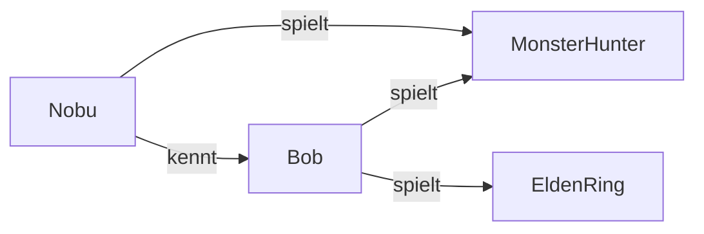

Es gibt verschiedene Arten von Datenbanken, die für unterschiedliche Anwendungsfälle entwickelt wurden.

Nicht jede Anwendung benötigt dieselbe Art von Datenbank.

Zum Beispiel:

```text
Onlineshop        → Relationale Datenbank
Cache             → Key-Value
Social Network    → Graph
Sensordaten       → Time Series
Suchmaschine      → Search Engine
KI-Ähnlichkeit    → Vector Database
```

> [!important]  
> Die Wahl einer Datenbank hängt davon ab, **welche Daten gespeichert werden und wie auf diese Daten zugegriffen wird**.

---

# 1. Relationale Datenbanken

Relationale Datenbanken speichern Daten in **Tabellen**.

Beispiel:

|kunde_id|name|email|
|--:|---|---|
|1|Nobu|[nobu@example.com](mailto:nobu@example.com)|
|2|Bob|[bob@example.com](mailto:bob@example.com)|

Tabellen können über [[10 PRIMARY KEY und FOREIGN KEY]] miteinander verbunden werden.

```text
Kunde
  │
  │ 1:n
  ↓
Bestellung
```

Die Daten werden normalerweise mit **SQL** abgefragt.

```sql
SELECT *
FROM kunde
WHERE name = 'Nobu';
```

Bekannte Systeme:

```text
PostgreSQL
MySQL
MariaDB
SQLite
Microsoft SQL Server
```

### Geeignet für

- Geschäftsanwendungen
    
- Onlineshops
    
- Buchhaltung
    
- Kundendaten
    
- Warenwirtschaft
    
- Anwendungen mit vielen Beziehungen
    

### Stärke

Relationale Datenbanken bieten eine klare Struktur, starke Datenintegrität und gute Unterstützung für [[19 Transaktionen]].

---

# 2. Key-Value-Datenbanken

Key-Value-Datenbanken speichern Daten als:

```text
Schlüssel → Wert
```

Beispiel:

```text
user:42       → Nobu
session:abc   → angemeldet
score:nobu    → 850
```

Das Prinzip ähnelt einer `HashMap` in Java:

```java
HashMap<String, String> users = new HashMap<>();

users.put("user:42", "Nobu");
```

Bekannte Systeme:

```text
Redis
Valkey
DynamoDB
```

### Geeignet für

- Caching
    
- Sessions
    
- Warenkörbe
    
- schnelle Zugriffe
    
- temporäre Daten
    

### Stärke

Sehr schnelle Zugriffe über einen bekannten Schlüssel.

---

# 3. Dokumentendatenbanken

Dokumentendatenbanken speichern Daten in **Dokumenten**.

Diese sehen häufig ähnlich wie JSON aus.

```json
{
    "id": 42,
    "name": "Nobu",
    "adresse": {
        "ort": "Augsburg",
        "plz": "86150"
    }
}
```

Dokumente können komplexe Datenstrukturen direkt enthalten.

Bekannte Systeme:

```text
MongoDB
CouchDB
```

### Geeignet für

- Webanwendungen
    
- Mobile Apps
    
- Content-Management-Systeme
    
- Produktkataloge
    
- flexible Datenstrukturen
    

### Stärke

Die Datenstruktur kann flexibler sein als bei klassischen relationalen Tabellen.

Mehr dazu unter [[23 NoSQL]].

---

# 4. Wide-Column-Datenbanken

Wide-Column-Datenbanken speichern große Datenmengen in einer flexiblen spaltenorientierten Struktur.

Beispiel:

```text
Kunde 101
├── name: Nobu
├── email: nobu@example.com
└── ort: Augsburg

Kunde 102
├── name: Bob
├── email: bob@example.com
├── telefon: 012345
└── alter: 30
```

Nicht jeder Datensatz muss exakt dieselben Spalten besitzen.

Bekannte Systeme:

```text
Apache Cassandra
HBase
Google Bigtable
```

### Geeignet für

- sehr große Datenmengen
    
- verteilte Systeme
    
- hohe Schreiblast
    
- skalierbare Anwendungen
    

---

# 5. Graphdatenbanken

Graphdatenbanken speichern Daten als **Knoten und Beziehungen**.

Beispiel:



Die Beziehungen zwischen den Daten stehen hier im Mittelpunkt.

Bekanntes System:

```text
Neo4j
```

### Geeignet für

- soziale Netzwerke
    
- Empfehlungssysteme
    
- Betrugserkennung
    
- Netzwerkstrukturen
    
- stark miteinander verbundene Daten
    

### Stärke

Komplexe Beziehungen zwischen Daten können effizient untersucht werden.

---

# 6. Time-Series-Datenbanken

Time-Series-Datenbanken sind auf Daten spezialisiert, die mit einem **Zeitstempel** gespeichert werden.

Beispiel:

```text
10:00 → CPU 35 %
10:01 → CPU 42 %
10:02 → CPU 38 %
10:03 → CPU 61 %
```

Oder:

```text
27.07.2026 10:00 → Temperatur 21,4 °C
27.07.2026 10:05 → Temperatur 21,7 °C
27.07.2026 10:10 → Temperatur 22,1 °C
```

Bekannte Systeme:

```text
InfluxDB
TimescaleDB
```

### Geeignet für

- Sensoren
    
- IoT
    
- Server-Monitoring
    
- Messwerte
    
- Börsenkurse
    
- Systemmetriken
    

### Stärke

Sehr viele zeitbasierte Daten können effizient gespeichert und ausgewertet werden.

---

# 7. Columnar / analytische Datenbanken

Analytische Datenbanken sind auf die Auswertung **sehr großer Datenmengen** spezialisiert.

Während klassische relationale Systeme häufig komplette Datensätze betrachten, können spaltenorientierte Systeme bestimmte Spalten besonders effizient auswerten.

Angenommen, wir haben:

```text
verkauf_id
produkt
kunde
preis
datum
land
```

Wir wollen nur wissen:

```sql
SELECT AVG(preis)
FROM verkaeufe;
```

Für eine solche Analyse ist hauptsächlich die Spalte `preis` interessant.

Bekannte Systeme:

```text
ClickHouse
Google BigQuery
```

### Geeignet für

- Business Intelligence
    
- Statistiken
    
- Reporting
    
- Data Warehouses
    
- große Datenanalysen
    

### Stärke

Sehr schnelle analytische Abfragen über große Datenmengen.

---

# 8. Search Engines

Search Engines sind Systeme, die speziell für die **Suche in großen Textmengen** optimiert sind.

Ein bekanntes System ist:

```text
Elasticsearch
```

Beispiel:

Wir besitzen einen Onlineshop mit einer Million Produkten.

Ein Benutzer sucht:

```text
gaming notebook 32gb
```

Eine Search Engine kann dabei unter anderem:

- Volltextsuche durchführen
    
- ähnliche Begriffe finden
    
- Ergebnisse nach Relevanz sortieren
    
- Tippfehler berücksichtigen
    

### Geeignet für

- Webseiten-Suche
    
- Produktsuche
    
- Log-Analyse
    
- Dokumentensuche
    
- große Textsammlungen
    

### Stärke

Schnelle und intelligente Volltextsuche.

---

# 9. Vector Databases

Vector Databases werden vor allem im Zusammenhang mit **KI und Machine Learning** eingesetzt.

Dabei werden Informationen als sogenannte **Vektoren bzw. Embeddings** gespeichert.

Vereinfacht kann man sich ein Embedding als eine mathematische Darstellung der Bedeutung von Informationen vorstellen.

Beispiel:

```text
"Java Vererbung"
        ↓
[0.21, 0.82, 0.14, 0.67, ...]
```

Auch eine andere Information wird in einen Vektor umgewandelt:

```text
"OOP extends Klasse"
        ↓
[0.23, 0.79, 0.18, 0.65, ...]
```

Die Vektoren liegen nah beieinander, weil die Inhalte eine ähnliche Bedeutung haben.

---

# Ähnlichkeitssuche

Eine klassische Suche sucht beispielsweise nach exakt passenden Wörtern.

```text
Suche:
"Java Vererbung"

Text:
"Java Vererbung"

→ Treffer
```

Eine Vektorsuche kann dagegen auch **inhaltliche Ähnlichkeit** erkennen.

```text
Suche:
"Wie funktioniert Vererbung in Java?"

          ↓

ähnliche Inhalte

          ↓

"Kindklassen können Eigenschaften
einer Elternklasse mit extends übernehmen."
```

Die Wörter müssen also nicht exakt identisch sein.

Bekannte Systeme bzw. Lösungen:

```text
pgvector
Pinecone
Milvus
```

### Geeignet für

- KI-Anwendungen
    
- semantische Suche
    
- Empfehlungssysteme
    
- Ähnlichkeitssuche
    
- RAG-Systeme
    

---

# Beispiel FoxTrainer

Für unseren FoxTrainer könnte das später beispielsweise interessant werden.

Angenommen, deine Obsidian-Notizen enthalten:

```text
Java
├── Klassen
├── Vererbung
├── Interfaces
└── Polymorphie

SQL
├── SELECT
├── JOIN
├── Normalformen
└── Transaktionen
```

Eine KI könnte eine Frage stellen:

```text
Wie funktioniert eine 1:n-Beziehung?
```

Über eine Ähnlichkeitssuche könnten passende Abschnitte aus deinen Notizen gefunden werden.

```text
Frage
  ↓
Embedding
  ↓
Vector Search
  ↓
passende Obsidian-Notizen
  ↓
KI
  ↓
Antwort / neue Quizfrage
```

Das ist ein typischer Anwendungsfall für Vektorsuche.

---

# Übersicht

|Datenbanktyp|Stärke|Beispiel|
|---|---|---|
|Relational|strukturierte Daten & Beziehungen|PostgreSQL|
|Key-Value|sehr schneller Schlüsselzugriff|Redis|
|Document|flexible Dokumente|MongoDB|
|Wide-Column|große verteilte Datenmengen|Cassandra|
|Graph|Beziehungen|Neo4j|
|Time Series|Zeitreihen|InfluxDB|
|Columnar / Analytical|Datenanalyse|ClickHouse|
|Search Engine|Volltextsuche|Elasticsearch|
|Vector|Ähnlichkeit / KI|pgvector|

---

# Muss eine Anwendung nur eine Datenbank verwenden?

Nein.

Eine größere Anwendung kann verschiedene Systeme miteinander kombinieren.

Beispiel eines Onlineshops:

```text
                 Onlineshop
                     │
        ┌────────────┼────────────┐
        ↓            ↓            ↓

   PostgreSQL      Redis     Elasticsearch
        │            │            │
   Kunden und      Cache       Produktsuche
   Bestellungen    Sessions
```

Dabei wird jedes System für die Aufgabe eingesetzt, für die es besonders geeignet ist.

Allerdings erhöht jedes zusätzliche System auch die Komplexität einer Anwendung.

> [!important]  
> Man sollte nicht für jedes Problem sofort eine neue Datenbanktechnologie einsetzen. Oft kann ein vorhandenes Datenbanksystem mehrere Aufgaben übernehmen.

---

# Zusammenhang mit SQL und NoSQL

Die Datenbanktypen lassen sich nicht einfach nur in:

```text
SQL
vs.
NoSQL
```

aufteilen.

Viel wichtiger ist die Frage:

> **Welche Art von Daten habe ich und was möchte ich damit machen?**

Beispiele:

```text
strukturierte Geschäftsdaten
→ Relationale Datenbank

Cache
→ Key-Value

stark vernetzte Daten
→ Graph

Messwerte über Zeit
→ Time Series

Volltextsuche
→ Search Engine

KI-Ähnlichkeitssuche
→ Vector
```

---

# Merksätze

> **Relational → Tabellen**

> **Key-Value → Schlüssel und Wert**

> **Document → flexible Dokumente**

> **Graph → Beziehungen**

> **Time Series → Zeitstempel**

> **Analytical → große Auswertungen**

> **Search → Volltextsuche**

> **Vector → Ähnlichkeit und KI**

> [!important]  
> Nicht die „modernste“ Datenbank ist automatisch die beste. Entscheidend ist, **welche Daten und Anforderungen eine Anwendung hat**.

---

## Navigation

← [[23 NoSQL]] | [[25 Datenschutz & Datensicherheit]] →