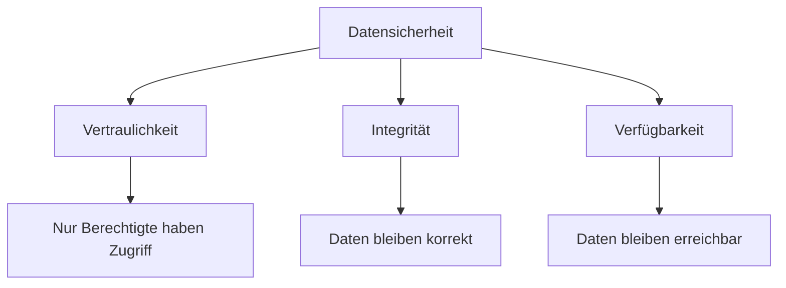

**Datenschutz** und **Datensicherheit** hängen eng zusammen, bedeuten aber nicht dasselbe.

Vereinfacht:

```text
Datenschutz
    ↓
Schutz personenbezogener Daten

Datensicherheit
    ↓
Schutz aller Daten
```

> [!important]  
> **Datenschutz fragt:** Wer darf personenbezogene Daten verwenden?
> 
> **Datensicherheit fragt:** Wie schützen wir Daten vor Verlust, Manipulation und unbefugtem Zugriff?

---

# Datenschutz

Datenschutz beschäftigt sich mit dem Schutz **personenbezogener Daten**.

Personenbezogene Daten sind Informationen, mit denen eine Person direkt oder indirekt identifiziert werden kann.

Beispiele:

```text
Name
Adresse
E-Mail-Adresse
Geburtsdatum
Telefonnummer
IP-Adresse
Kontonummer
```

Es gibt außerdem besonders sensible personenbezogene Daten, beispielsweise Informationen über:

```text
Gesundheit
Religion
sexuelle Orientierung
```

---

# DSGVO

Die **DSGVO** ist die:

> **Datenschutz-Grundverordnung**

Sie regelt den Umgang mit personenbezogenen Daten innerhalb der Europäischen Union.

Unternehmen und Organisationen dürfen personenbezogene Daten nicht einfach beliebig sammeln, speichern und verwenden.

---

# Grundprinzipien der DSGVO

Beim Umgang mit personenbezogenen Daten gelten wichtige Grundprinzipien.

## Rechtmäßigkeit

Personenbezogene Daten dürfen nur verarbeitet werden, wenn dafür eine rechtliche Grundlage besteht.

Zum Beispiel:

```text
Einwilligung
Vertrag
gesetzliche Verpflichtung
berechtigtes Interesse
```

---

## Zweckbindung

Daten dürfen nur für den festgelegten Zweck verwendet werden.

Beispiel:

Ein Kunde gibt seine Adresse für eine Bestellung an.

```text
Adresse
   ↓
Versand der Bestellung
```

Die Adresse darf nicht automatisch für völlig andere Zwecke verwendet werden.

---

## Datenminimierung

Es sollen nur die Daten gespeichert werden, die tatsächlich benötigt werden.

Beispiel:

Für einen Newsletter benötigen wir normalerweise:

```text
E-Mail-Adresse
```

Wir brauchen dafür nicht unbedingt:

```text
Geburtsdatum
Adresse
Kontonummer
```

> [!important]  
> **So viele Daten wie nötig, so wenige wie möglich.**

---

# Richtigkeit

Gespeicherte personenbezogene Daten sollen korrekt und aktuell sein.

Falsche Daten müssen gegebenenfalls korrigiert werden.

---

# Speicherbegrenzung

Personenbezogene Daten sollen nicht unbegrenzt gespeichert werden.

Wenn sie für ihren ursprünglichen Zweck nicht mehr benötigt werden, müssen sie abhängig von gesetzlichen Aufbewahrungspflichten gelöscht oder anonymisiert werden.

---

# Integrität und Vertraulichkeit

Personenbezogene Daten müssen angemessen geschützt werden.

Zum Beispiel vor:

```text
unbefugtem Zugriff
Manipulation
Verlust
Diebstahl
```

Hier überschneiden sich Datenschutz und Datensicherheit.

---

# Betroffenenrechte

Personen besitzen verschiedene Rechte bezüglich ihrer personenbezogenen Daten.

## Recht auf Auskunft

Eine Person kann erfahren:

> Welche Daten sind über mich gespeichert?

---

## Recht auf Berichtigung

Falsche personenbezogene Daten können korrigiert werden.

Beispiel:

```text
falsch:
Wohnort = München

richtig:
Wohnort = Augsburg
```

---

## Recht auf Löschung

Unter bestimmten Voraussetzungen kann eine Person verlangen, dass personenbezogene Daten gelöscht werden.

Dies wird häufig als:

> **Recht auf Vergessenwerden**

bezeichnet.

---

## Recht auf Datenübertragbarkeit

Personen können unter bestimmten Voraussetzungen verlangen, ihre Daten in einem geeigneten maschinenlesbaren Format zu erhalten.

---

## Recht auf Widerspruch

Unter bestimmten Voraussetzungen kann einer Verarbeitung personenbezogener Daten widersprochen werden.

---

# Datenschutz in einer Datenbank

Angenommen, wir besitzen folgende Tabelle:

```text
Kunde
----------------
kunde_id
name
email
adresse
geburtsdatum
```

Dann müssen wir uns unter anderem fragen:

```text
Warum speichern wir diese Daten?

Wer darf darauf zugreifen?

Wie lange werden sie gespeichert?

Wie werden sie geschützt?

Wie können sie korrigiert oder gelöscht werden?
```

Datenschutz beginnt deshalb bereits beim [[20 Datenbankdesign]].

---

# Datensicherheit

Datensicherheit beschäftigt sich mit dem Schutz **aller Daten**.

Dabei spielt es keine Rolle, ob es personenbezogene Daten sind.

Beispiele:

```text
Kundendaten
Quellcode
Produktdaten
Passwörter
Backups
Geschäftsdokumente
Konfigurationsdateien
```

Die drei klassischen Schutzziele sind:

```text
Vertraulichkeit
Integrität
Verfügbarkeit
```

---

# Vertraulichkeit

**Vertraulichkeit** bedeutet:

> Nur berechtigte Personen dürfen auf bestimmte Daten zugreifen.

Beispiel:

```text
Datenbank
    ↓
Login erforderlich
    ↓
Benutzer besitzt Berechtigung?
    ↓
JA → Zugriff
NEIN → Zugriff verweigert
```

Mögliche Maßnahmen:

```text
Passwörter
Zugriffsrechte
Verschlüsselung
2FA
Rollen
```

---

# Integrität

**Integrität** bedeutet:

> Daten sind korrekt und wurden nicht unbefugt verändert.

Beispiel:

Ein Kontostand beträgt:

```text
1500 €
```

Ein Angreifer darf ihn nicht einfach verändern zu:

```text
15000 €
```

Zur Sicherung der Integrität können beispielsweise beitragen:

```text
Berechtigungen
Constraints
Transaktionen
Prüfsummen
Protokollierung
```

Auch unsere SQL-Themen helfen also bei der Datensicherheit:

- [[17 Constraints]]
    
- [[10 PRIMARY KEY und FOREIGN KEY]]
    
- [[19 Transaktionen]]
    

---

# Verfügbarkeit

**Verfügbarkeit** bedeutet:

> Daten und Systeme stehen zur Verfügung, wenn sie benötigt werden.

Ein perfekt geschütztes System bringt wenig, wenn niemand darauf zugreifen kann.

Mögliche Maßnahmen:

```text
Backups
redundante Server
Notfallpläne
Monitoring
unterbrechungsfreie Stromversorgung
```

---

# Die drei Schutzziele



Diese drei Ziele werden häufig auch als **CIA-Triade** bezeichnet:

```text
C → Confidentiality → Vertraulichkeit
I → Integrity       → Integrität
A → Availability    → Verfügbarkeit
```

---

# Schutzbedarfsfeststellung

Nicht alle Daten benötigen exakt denselben Schutz.

Deshalb kann zunächst festgestellt werden, wie schützenswert bestimmte Informationen sind.

Vereinfacht:

```text
Daten identifizieren
        ↓
Daten klassifizieren
        ↓
möglichen Schaden bewerten
        ↓
Schutzmaßnahmen bestimmen
        ↓
Schutzbedarf festlegen
```

Beispiel:

```text
öffentliche Produktbeschreibung
→ geringer Schutzbedarf

interne Geschäftsdaten
→ höherer Schutzbedarf

Gesundheitsdaten
→ sehr hoher Schutzbedarf
```

Je größer der mögliche Schaden bei Verlust, Manipulation oder Offenlegung ist, desto stärker sollten die Schutzmaßnahmen sein.

---

# Technische Schutzmaßnahmen

Daten können durch verschiedene technische Maßnahmen geschützt werden.

## Verschlüsselung

Daten werden so umgewandelt, dass sie ohne den passenden Schlüssel nicht gelesen werden können.

```text
Original:
Mein Passwort

        ↓ Verschlüsselung

verschlüsselte Daten
```

Verschlüsselung kann eingesetzt werden:

```text
bei der Übertragung
        +
bei der Speicherung
```

---

# Authentifizierung

Authentifizierung beantwortet die Frage:

> **Wer bist du?**

Beispiele:

```text
Passwort
2FA
Biometrie
Sicherheitsschlüssel
```

---

# Autorisierung

Autorisierung beantwortet dagegen:

> **Was darfst du?**

Beispiel:

```text
Benutzer
   ↓
darf Daten lesen


Mitarbeiter
   ↓
darf Daten lesen und ändern


Administrator
   ↓
darf Daten verwalten
```

Das wird häufig über **Rollen und Berechtigungen** umgesetzt.

---

# Authentifizierung vs. Autorisierung

Die beiden Begriffe sollte man auseinanderhalten.

```text
Authentifizierung
       ↓
"Wer bist du?"


Autorisierung
       ↓
"Was darfst du?"
```

Beispiel:

```text
Login mit Benutzername + Passwort
            ↓
     Authentifizierung
            ↓
Benutzer erfolgreich erkannt
            ↓
Welche Rechte besitzt der Benutzer?
            ↓
       Autorisierung
```

---

# Backups

Backups schützen Daten vor Verlust.

Beispielsweise bei:

```text
Festplattendefekt
Fehlbedienung
Softwarefehler
Cyberangriff
versehentlichem Löschen
```

Ein Backup sollte nicht nur erstellt werden.

Es muss auch überprüft werden, ob es tatsächlich wiederhergestellt werden kann.

> [!important]  
> Ein Backup, das sich nicht wiederherstellen lässt, hilft im Ernstfall nicht.

---

# Datenschutz vs. Datensicherheit

|Datenschutz|Datensicherheit|
|---|---|
|personenbezogene Daten|alle Daten|
|rechtlicher Schwerpunkt|technischer/organisatorischer Schwerpunkt|
|DSGVO|Sicherheitsmaßnahmen|
|Rechte von Personen|Schutz von Informationen|
|Zweckbindung|Vertraulichkeit|
|Datenminimierung|Integrität|
|Löschung/Auskunft|Verfügbarkeit|

Beide Bereiche überschneiden sich.

Beispiel:

```text
Kundendaten
     ↓
personenbezogen
     ↓
Datenschutz erforderlich
     +
Datensicherheit erforderlich
```

---

# Beispiel Onlineshop

Ein Onlineshop speichert:

```text
Name
Adresse
E-Mail
Bestellungen
Passwort
Zahlungsinformationen
```

### Datenschutz

Wir fragen:

```text
Warum speichern wir die Daten?

Dürfen wir sie speichern?

Wie lange dürfen wir sie speichern?

Kann der Kunde Auskunft verlangen?

Kann der Kunde eine Löschung verlangen?
```

### Datensicherheit

Wir fragen:

```text
Sind die Daten verschlüsselt?

Wer darf darauf zugreifen?

Gibt es Backups?

Gibt es verschiedene Benutzerrollen?

Was passiert bei einem Serverausfall?
```

---

# Zusammenhang mit Datenbanken

Viele unserer bisherigen Datenbankthemen tragen zur Datenqualität oder Datensicherheit bei.

```text
PRIMARY KEY
    ↓
eindeutige Datensätze

FOREIGN KEY
    ↓
gültige Beziehungen

CONSTRAINTS
    ↓
gültige Daten

TRANSAKTIONEN
    ↓
konsistente Änderungen

BACKUPS
    ↓
Schutz vor Datenverlust

BERECHTIGUNGEN
    ↓
Schutz vor unbefugtem Zugriff
```

Datenschutz und Datensicherheit sind deshalb kein komplett getrenntes Thema.

Sie begleiten eine Datenbank von der Planung bis zum Betrieb.

---

# Merksätze

> **Datenschutz schützt personenbezogene Daten.**

> **Datensicherheit schützt alle Daten.**

> **Vertraulichkeit → Wer darf die Daten sehen?**

> **Integrität → Sind die Daten korrekt und unverändert?**

> **Verfügbarkeit → Sind die Daten erreichbar?**

> **Authentifizierung → Wer bist du?**

> **Autorisierung → Was darfst du?**

> [!important]  
> Datenschutz bestimmt unter anderem, **ob und wofür personenbezogene Daten verarbeitet werden dürfen**. Datensicherheit sorgt mit technischen und organisatorischen Maßnahmen dafür, dass Daten angemessen geschützt werden.

---

## Navigation

← [[24 Datenbanktypen]]


🏁 **Ende der SQL-Grundlagen**

⬅️ [[01 SQL Grundlagen|Zurück zu Kapitel 01 – SQL Grundlagen]]
