# oder Class Diagram

> [!info]
> Beschreibt die Struktur eines Programms mit Klassen, Attributen, Methoden und deren Beziehungen.

---
![[Klassendiagramm.png]]

# Definition

Ein Klassendiagramm zeigt:

- welche Klassen existieren
- welche Attribute sie besitzen
- welche Methoden sie enthalten
- wie die Klassen miteinander verbunden sind

Es ist der Bauplan eines objektorientierten Programms.

---

# Aufbau einer Klasse

Eine Klasse besteht aus drei Bereichen:

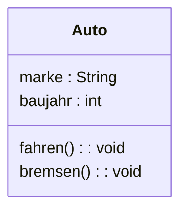

---

## Klassenname

Der obere Bereich enthält den Namen der Klasse.

Beispiel:

```text
Auto
```

---

## Attribute

Der mittlere Bereich enthält die Eigenschaften der Klasse.

```text
marke : String
baujahr : int
```

Java:

```java
private String marke;
private int baujahr;
```

---

## Methoden

Der untere Bereich enthält die Funktionen der Klasse.

```text
fahren() : void
bremsen() : void
```

Java:

```java
public void fahren() {

}

public void bremsen() {

}
```

---

# Sichtbarkeiten

| Symbol | Bedeutung |
|----------|----------|
| + | public |
| - | private |
| # | protected |

Beispiel:

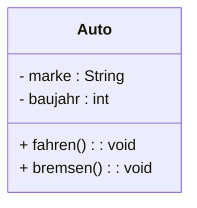

---

# Beziehungen

## Assoziation

Eine Klasse kennt eine andere Klasse.

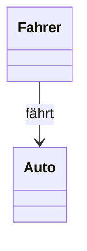

Java:

```java
class Auto {
    Fahrer fahrer;
}
```

---

## Vererbung

Eine Klasse erbt von einer anderen.

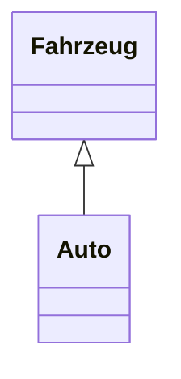

Java:

```java
class Fahrzeug {

}

class Auto extends Fahrzeug {

}
```

---

## Aggregation

Schwache "Hat-ein"-Beziehung.

Ein Team hat Spieler.

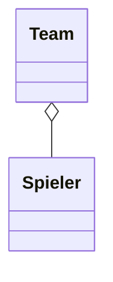

Die Spieler können auch ohne Team existieren.

---

## Komposition

Starke "Hat-eine"-Beziehung.

Ein Haus hat Räume.

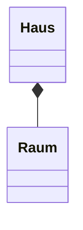

Wird das Haus gelöscht, existieren die Räume nicht mehr.

---

# Multiplizitäten

Zeigen an, wie viele Objekte beteiligt sind.

---

## Eins zu Eins

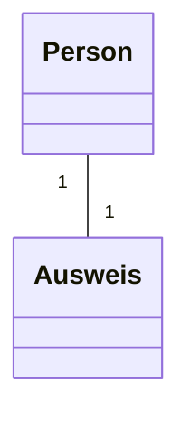

Eine Person besitzt genau einen Ausweis.

---

## Eins zu Viele

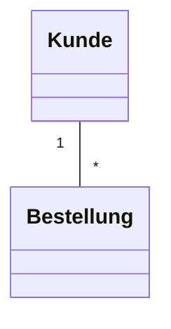

Ein Kunde kann mehrere Bestellungen haben.

---

## Viele zu Viele

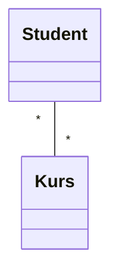

Ein Student kann mehrere Kurse besuchen.

Ein Kurs kann mehrere Studenten enthalten.

---

# Beispiel: Immobilie

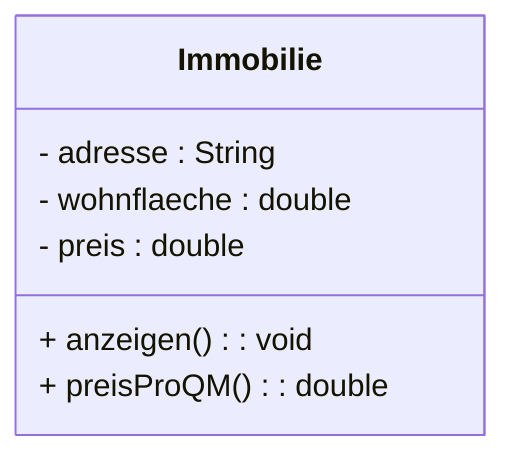

---

# Beispiel: Vererbung

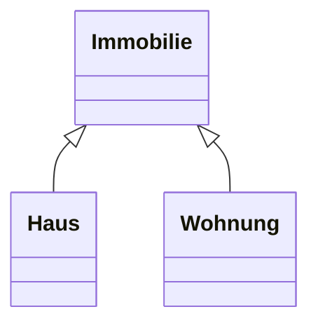

Java:

```java
class Immobilie {

}

class Haus extends Immobilie {

}

class Wohnung extends Immobilie {

}
```

---

# Beispiel: Eigentümer und Immobilie

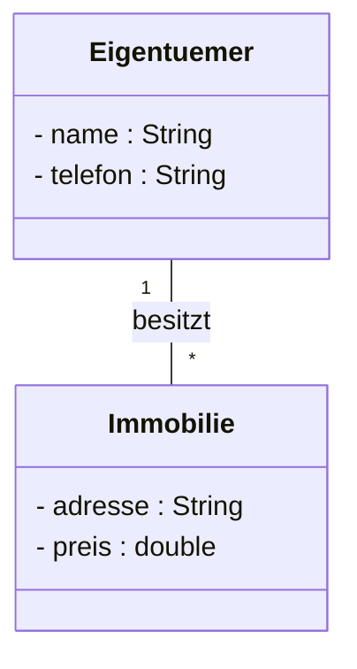

Bedeutung:

- Ein Eigentümer kann mehrere Immobilien besitzen.
- Eine Immobilie gehört genau einem Eigentümer.

---

# Vorteile

- Übersicht über die Programmstruktur
- Grundlage für die Implementierung
- Hilft bei Planung und Dokumentation
- Zeigt Beziehungen zwischen Klassen

---

# Merksatz

> Das Klassendiagramm beschreibt die Struktur eines Programms mit Klassen, Attributen, Methoden und Beziehungen.

Es beantwortet die Frage:

**Welche Klassen gibt es und wie hängen sie zusammen?**

---

# Fragen

## Was beschreibt ein Klassendiagramm?

> [!spoiler]- Lösung anzeigen
> Die Struktur eines Programms mit Klassen, Attributen, Methoden und Beziehungen.

---

## Welche drei Bereiche besitzt eine Klasse?

> [!spoiler]- Lösung anzeigen
> Klassenname, Attribute und Methoden.

---

## Wofür steht das Symbol "+"?

> [!spoiler]- Lösung anzeigen
> public

---

## Was bedeutet Vererbung?

> [!spoiler]- Lösung anzeigen
> Eine Klasse übernimmt Eigenschaften und Methoden einer anderen Klasse.

---

## Was ist eine Assoziation?

> [!spoiler]- Lösung anzeigen
> Eine Klasse kennt oder verwendet eine andere Klasse.

---

## Was ist der Unterschied zwischen Aggregation und Komposition?

> [!spoiler]- Lösung anzeigen
> Bei der Aggregation können Objekte unabhängig existieren, bei der Komposition nicht.

---

## Was bedeutet die Multiplizität "1..*"?

> [!spoiler]- Lösung anzeigen
> Ein Objekt ist mit mindestens einem oder mehreren anderen Objekten verbunden.