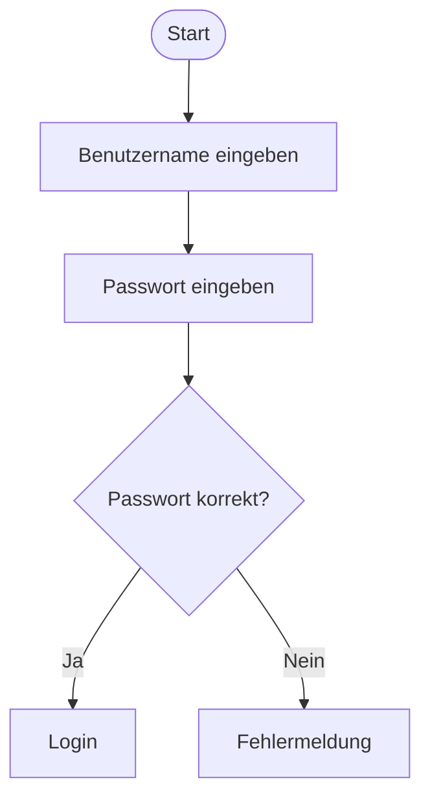
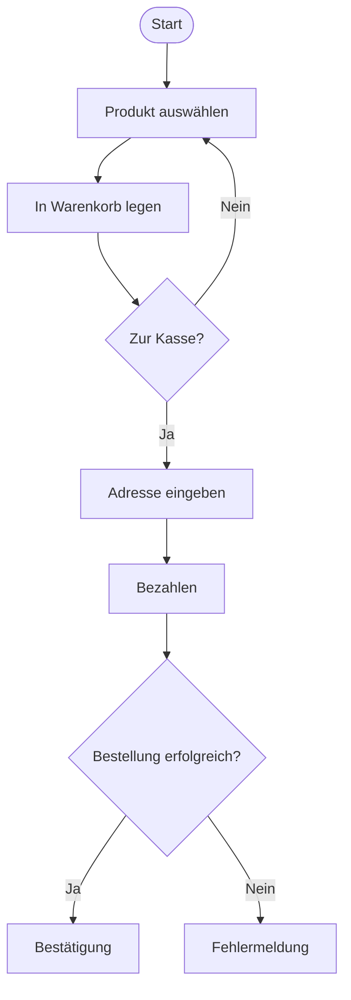
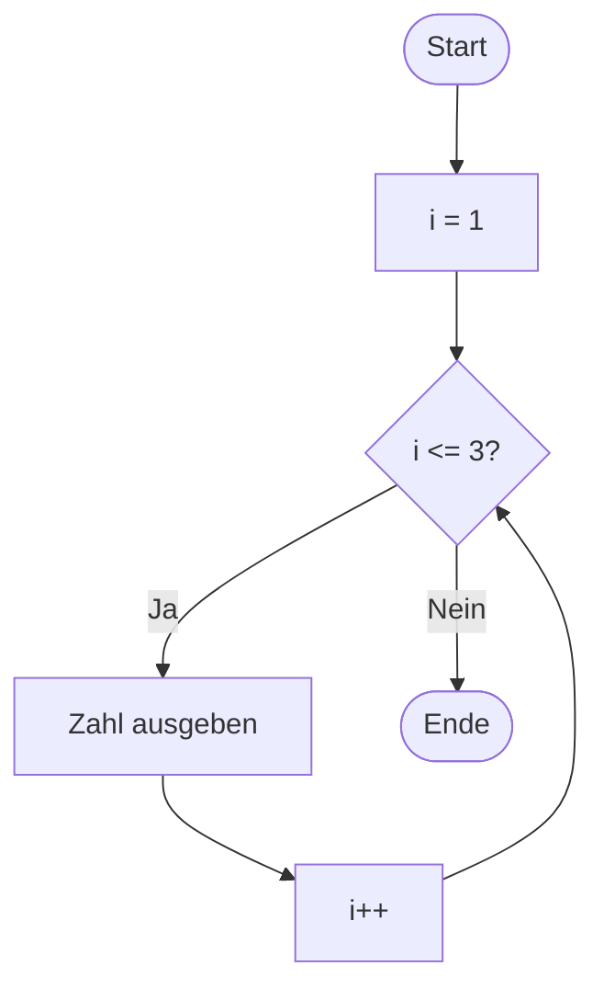
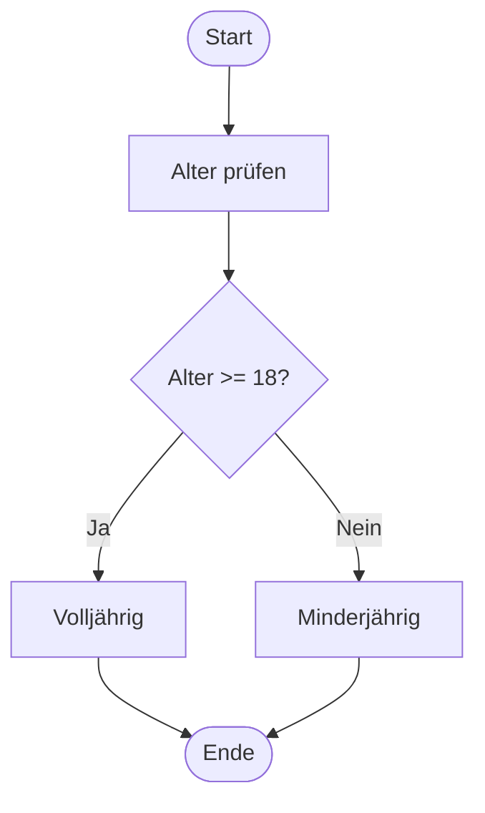
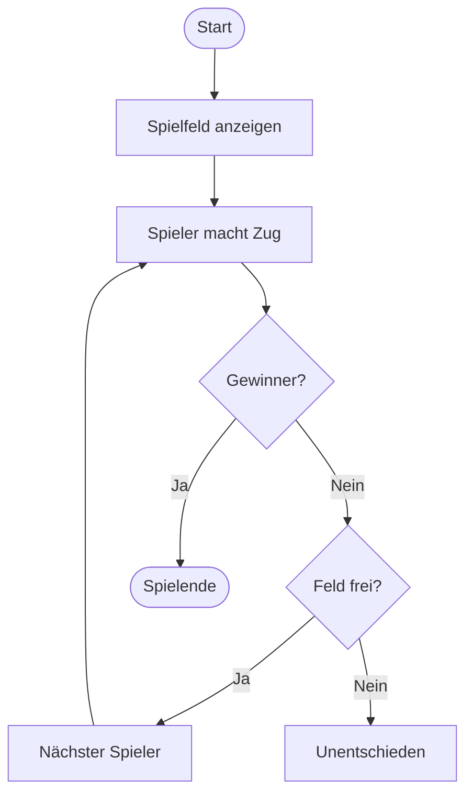

# oder Activity Diagram

> [!info]
> Beschreibt den Ablauf eines Prozesses mit Aktivitäten, Entscheidungen und Schleifen.

---
![[Aktivitaetsdiagramm.png]]
# Definition

Ein Aktivitätsdiagramm zeigt:

- welche Aktivitäten ausgeführt werden
- in welcher Reihenfolge sie ablaufen
- wo Entscheidungen getroffen werden
- wo Schleifen entstehen
- wann ein Prozess beginnt und endet

Es ähnelt einem Flussdiagramm und wird zur Darstellung von Abläufen und Prozessen verwendet.

---

# Wichtige Symbole

## Start

Der Startpunkt eines Prozesses.

```text
●
```

---

## Aktivität

Eine auszuführende Aktion.

```text
+------------------+
| Passwort prüfen  |
+------------------+
```

---

## Entscheidung

Eine Bedingung wird geprüft.

```text
      ◇
     / \
   Ja  Nein
```

---

## Kontrollfluss (Control Flow)

Zeigt die Reihenfolge der Aktivitäten.

```text
Aktivität A
     |
     v
Aktivität B
```

---

## Ende

Der Prozess ist abgeschlossen.

```text
◉
```

---

# Einfaches Beispiel

Login-Vorgang:


---

# Beispiel mit mehreren Entscheidungen

Online-Shop:



---

# Schleifen

Aktivitätsdiagramme können Wiederholungen darstellen.

Java:

```java
for (int i = 1; i <= 3; i++) {
    System.out.println(i);
}
```

Diagramm:



---

# Beispiel aus Java

Code:

```java
if (alter >= 18) {
    System.out.println("Volljährig");
} else {
    System.out.println("Minderjährig");
}
```

Diagramm:



---

# Beispiel TicTacToe



---

# Parallelität

Aktivitäten können gleichzeitig ausgeführt werden.  
Hierfür werden Synchronisationsbalken verwendet.
![[ParalleleAblaefe.png]]
Danach werden die Abläufe wieder zusammengeführt.

---

# Vorteile

- leicht verständlich
- ideal zur Prozessdarstellung
- zeigt Entscheidungen und Schleifen
- hilft bei der Planung von Programmlogik

---

# Unterschied zu anderen UML-Diagrammen

## Anwendungsfalldiagramm

Zeigt:

- Wer nutzt das System?
- Welche Funktionen gibt es?

---

## Klassendiagramm

Zeigt:

- Welche Klassen existieren?
- Welche Attribute und Methoden besitzen sie?

---

## Aktivitätsdiagramm

Zeigt:

- Wie läuft ein Prozess Schritt für Schritt ab?

---

# Merksatz

> Das Aktivitätsdiagramm beschreibt den Ablauf eines Prozesses mit Aktivitäten, Entscheidungen, Schleifen sowie Start- und Endpunkten.

Es beantwortet die Frage:

**Wie läuft ein Vorgang ab?**

---

# Fragen

## Was beschreibt ein Aktivitätsdiagramm?

> [!spoiler]- Lösung anzeigen
> Den Ablauf eines Prozesses mit Aktivitäten, Entscheidungen und Schleifen.

---

## Welches Symbol kennzeichnet den Start?

> [!spoiler]- Lösung anzeigen
> Ein ausgefüllter Kreis (●).

---

## Welches Symbol kennzeichnet eine Entscheidung?

> [!spoiler]- Lösung anzeigen
> Eine Raute (◇).

---

## Wozu dienen Aktivitätsdiagramme?

> [!spoiler]- Lösung anzeigen
> Zur Darstellung von Prozessen und Abläufen.

---

## Welches Symbol kennzeichnet das Ende?

> [!spoiler]- Lösung anzeigen
> Ein Kreis mit Rand (◉).

---

## Können Schleifen dargestellt werden?

> [!spoiler]- Lösung anzeigen
> Ja, durch Rücksprünge zu vorherigen Aktivitäten oder Bedingungen.