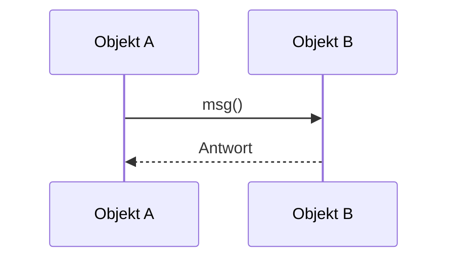
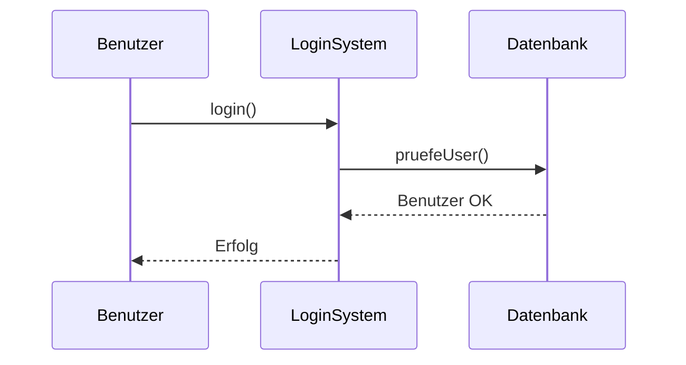
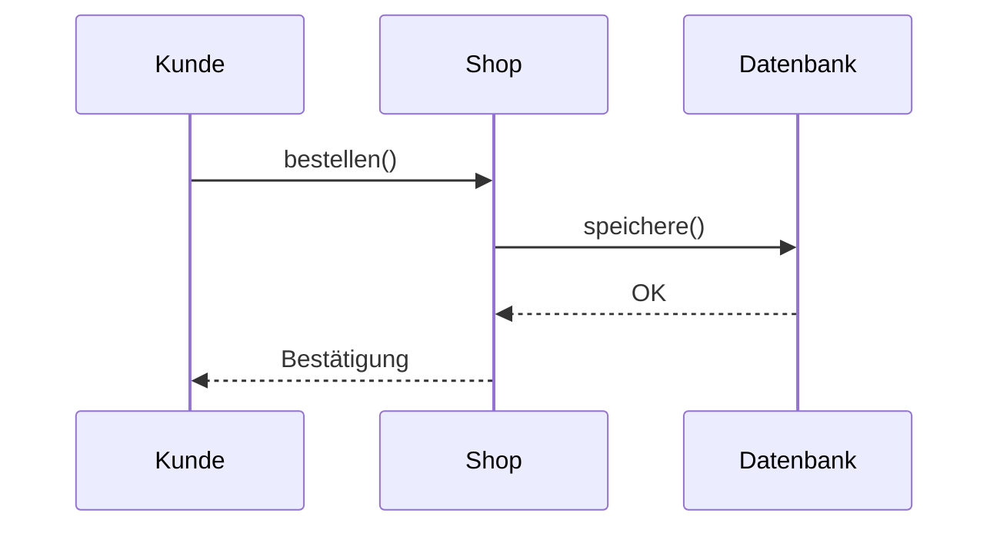
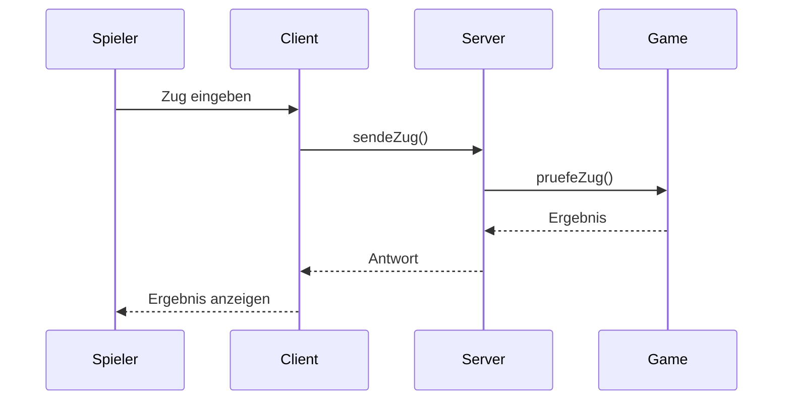
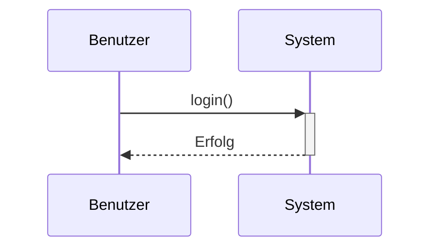
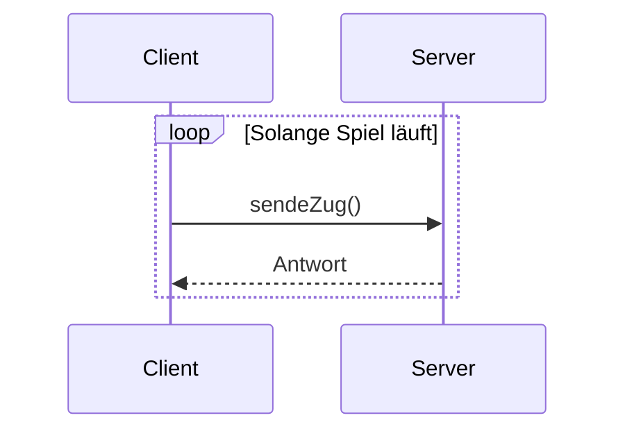
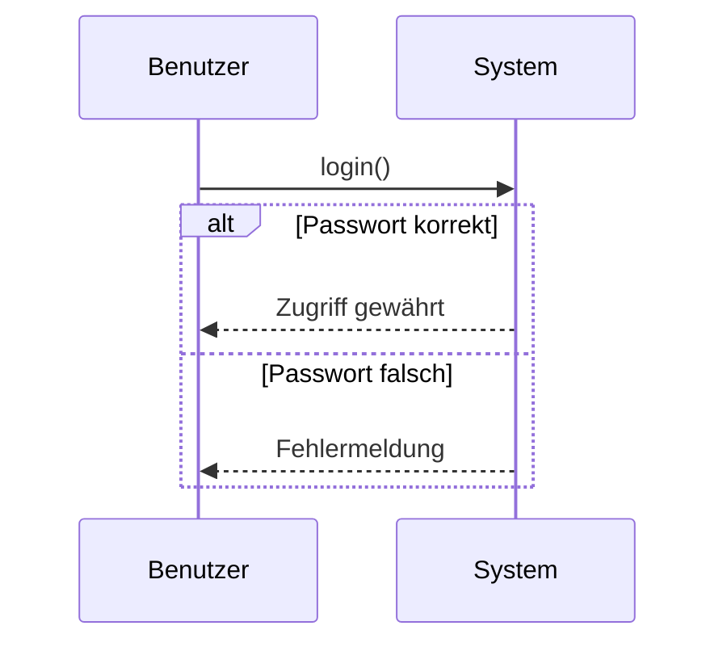

# oder Sequence Diagram

> [!info]
> Beschreibt die zeitliche Reihenfolge von Nachrichten und Methodenaufrufen zwischen Objekten.

---

# Definition

Ein Sequenzdiagramm zeigt:

- welche Objekte beteiligt sind
- welche Nachrichten ausgetauscht werden
- in welcher Reihenfolge Methoden aufgerufen werden
- wie Objekte zusammenarbeiten

Es beschreibt die Kommunikation zwischen Objekten über die Zeit.

---

# Wichtige Symbole

## Objekt

Objekte werden oben dargestellt.

Beispiel:

```text
Benutzer
LoginSystem
Datenbank
```

---

## Lebenslinie

Die gestrichelte Linie zeigt die Existenz eines Objekts während des Ablaufs.

```text
Benutzer
    |
    |
    |
```

---

## Nachricht

Eine Nachricht bzw. ein Methodenaufruf wird durch einen Pfeil dargestellt.

```text
Benutzer -----> System
```

---

## Rückgabe

Eine Rückgabe wird oft als gestrichelter Pfeil dargestellt.

```text
System - - - -> Benutzer
```

---

# Grundprinzip

Die Zeit läuft von oben nach unten.



---

# Beispiel: Login



---

# Beispiel: Online-Shop



---

# Beispiel: TicTacToe



---

# Aktivierungsbalken

Zeigen, wann ein Objekt aktiv arbeitet.



---

# Schleifen

Wiederholungen können dargestellt werden.



---

# Bedingungen

Alternative Abläufe können dargestellt werden.



---

# Unterschied zu anderen UML-Diagrammen

## Klassendiagramm

Zeigt:

- Klassen
- Attribute
- Methoden

Frage:

> Welche Klassen existieren?

---

## Aktivitätsdiagramm

Zeigt:

- Abläufe
- Prozesse

Frage:

> Wie läuft ein Prozess ab?

---

## Sequenzdiagramm

Zeigt:

- Kommunikation
- Methodenaufrufe

Frage:

> Wer ruft wann welche Methode auf?

---

# Vorteile

- zeigt die Zusammenarbeit von Objekten
- gut für OOP geeignet
- leicht in Java-Code übertragbar
- hilfreich bei der Analyse von Abläufen

---

# Merksatz

> Das Sequenzdiagramm beschreibt die zeitliche Reihenfolge von Nachrichten und Methodenaufrufen zwischen Objekten.

Es beantwortet die Frage:

**Wer kommuniziert wann mit wem?**

---

# Fragen

## Was beschreibt ein Sequenzdiagramm?

> [!spoiler]- Lösung anzeigen
> Die zeitliche Reihenfolge von Nachrichten und Methodenaufrufen zwischen Objekten.

---

## In welche Richtung läuft die Zeit?

> [!spoiler]- Lösung anzeigen
> Von oben nach unten.

---

## Was stellt eine Lebenslinie dar?

> [!spoiler]- Lösung anzeigen
> Die Existenz eines Objekts während des Ablaufs.

---

## Was stellt ein Pfeil dar?

> [!spoiler]- Lösung anzeigen
> Einen Methodenaufruf oder eine Nachricht.

---

## Wofür eignet sich ein Sequenzdiagramm besonders?

> [!spoiler]- Lösung anzeigen
> Zur Darstellung der Kommunikation zwischen Objekten.

---

## Welche Frage beantwortet ein Sequenzdiagramm?

> [!spoiler]- Lösung anzeigen
> Wer kommuniziert wann mit wem?