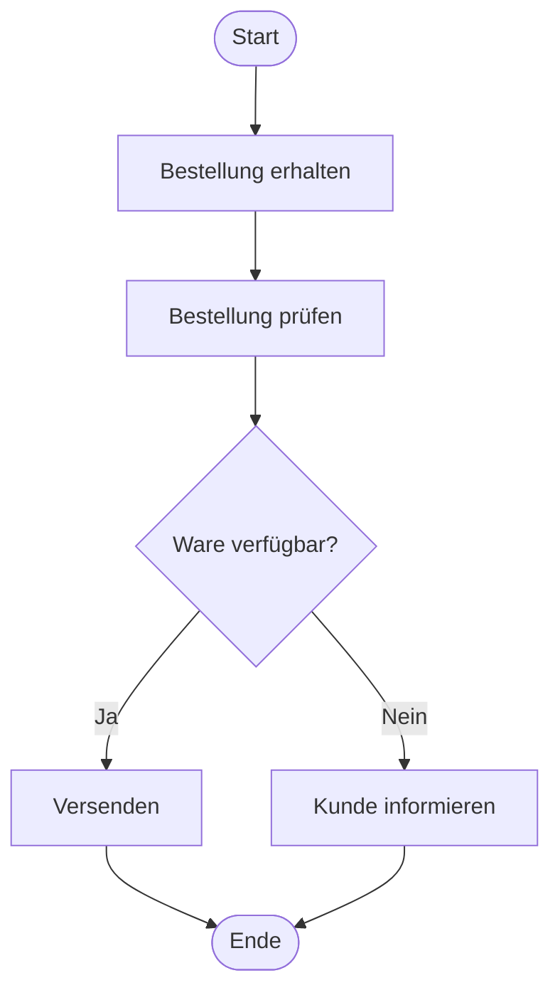
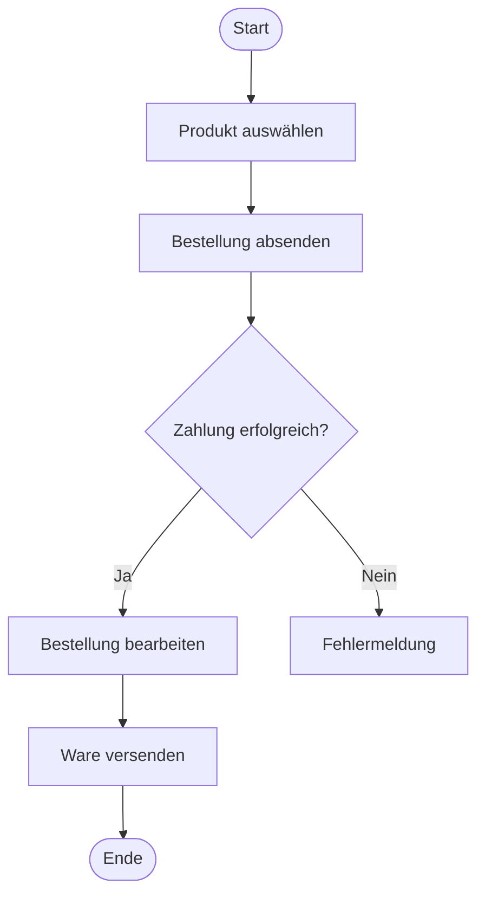

# oder Business Process Model and Notation Diagram

> [!info]
> BPMN dient zur Modellierung von Geschäftsprozessen und Arbeitsabläufen.

---

# Definition

BPMN steht für:

**Business Process Model and Notation**

Mit BPMN werden Geschäftsprozesse grafisch dargestellt.

Typische Anwendungsgebiete:

- Unternehmen
- Behörden
- IT-Projekte
- Qualitätsmanagement
- Prozessdokumentation

---

# Unterschied zu UML

## UML-Aktivitätsdiagramm

Beschreibt hauptsächlich Programmabläufe.

Beispiel:

- Login
- Bestellung
- TicTacToe-Spielablauf

---

## BPMN

Beschreibt Geschäftsprozesse.

Beispiel:

- Urlaubsantrag
- Bewerbung
- Bestellung im Online-Shop
- Rechnungsfreigabe

---

# Wichtige Symbole

## Startereignis

Beginn eines Prozesses.

```text
(Start)
```

Darstellung:

○

---

## Aktivität

Eine Aufgabe oder Tätigkeit.

```text
+------------------+
| Rechnung prüfen  |
+------------------+
```

---

## Gateway

Entscheidungspunkt.

```text
      ◇
     / \
   Ja  Nein
```

---

## Endereignis

Ende des Prozesses.

```text
(Ende)
```

Darstellung:

◉

---

# Einfaches Beispiel

Bestellung bearbeiten:



---

# Pools

Pools stellen Teilnehmer eines Prozesses dar.

Beispiel:

```text
+--------------------------------+
| Kunde                          |
|--------------------------------|
| Bestellung absenden            |
+--------------------------------+

+--------------------------------+
| Online-Shop                    |
|--------------------------------|
| Bestellung bearbeiten          |
+--------------------------------+
```

Jeder Pool repräsentiert einen Teilnehmer.

---

# Lanes

Lanes unterteilen einen Pool.

Beispiel Unternehmen:

```text
+--------------------------------------+
| Firma                                |
|--------------------------------------|
| Vertrieb | Lager | Buchhaltung       |
|--------------------------------------|
| Auftrag  | Ware  | Rechnung          |
+--------------------------------------+
```

---

# Nachrichtenfluss

Kommunikation zwischen Pools.

```text
Kunde  - - - - - >  Shop
```

Gestrichelte Linie.

Bedeutung:

Eine Nachricht wird ausgetauscht.

---

# Sequenzfluss

Reihenfolge von Aktivitäten.

```text
Aktivität A
      |
      v
Aktivität B
```

Durchgezogene Linie.

---

# Beispiel: Online-Bestellung



---

# Beispiel: Urlaubsantrag

```mermaid
flowchart TD
    Start([Start])
    Antrag[Urlaubsantrag erstellen]
    Prüfen[Vorgesetzter prüft Antrag]
    Genehmigung{Genehmigen?}
    Urlaub[Urlaub eintragen]
    Ablehnung[Ablehnung senden]
    Ende([Ende])

    Start --> Antrag
    Antrag --> Prüfen
    Prüfen --> Genehmigung

    Genehmigung -->|Ja| Urlaub
    Genehmigung -->|Nein| Ablehnung

    Urlaub --> Ende
    Ablehnung --> Ende
``````

---

## XOR-Gateway

Genau ein Pfad wird gewählt.

Beispiel:

Genehmigt?
→ Ja oder Nein

---

## AND-Gateway

Mehrere Pfade werden gleichzeitig ausgeführt.

Beispiel:

- E-Mail senden
- Logeintrag schreiben

beides parallel

---

## OR-Gateway

Ein oder mehrere Pfade können gewählt werden.
---
# Vorteile

- Standard für Geschäftsprozesse
- leicht verständlich
- zeigt Verantwortlichkeiten
- ideal für Dokumentation
- häufig in Unternehmen verwendet

---

# Merksatz

> BPMN beschreibt Geschäftsprozesse und Arbeitsabläufe zwischen Personen, Abteilungen oder Systemen.

Es beantwortet die Frage:

**Wie läuft ein Geschäftsprozess ab und wer ist daran beteiligt?**

---

# Vergleich

| Diagramm | Zweck |
|-----------|--------|
| Anwendungsfalldiagramm | Wer nutzt welche Funktion? |
| Klassendiagramm | Welche Klassen gibt es? |
| Aktivitätsdiagramm | Wie läuft ein Prozess ab? |
| BPMN | Wie läuft ein Geschäftsprozess ab? |

---

# Fragen

## Wofür steht BPMN?

> [!spoiler]- Lösung anzeigen
> Business Process Model and Notation.

---

## Wofür wird BPMN verwendet?

> [!spoiler]- Lösung anzeigen
> Zur Modellierung von Geschäftsprozessen.

---

## Was ist ein Pool?

> [!spoiler]- Lösung anzeigen
> Ein Teilnehmer eines Prozesses, z. B. Kunde oder Unternehmen.

---

## Was ist eine Lane?

> [!spoiler]- Lösung anzeigen
> Eine Unterteilung innerhalb eines Pools, z. B. Abteilungen.

---

## Was ist ein Gateway?

> [!spoiler]- Lösung anzeigen
> Ein Entscheidungspunkt im Prozess.

---

## Was ist der Unterschied zwischen BPMN und UML-Aktivitätsdiagrammen?

> [!spoiler]- Lösung anzeigen
> BPMN beschreibt Geschäftsprozesse, Aktivitätsdiagramme eher Programm- und Systemabläufe.